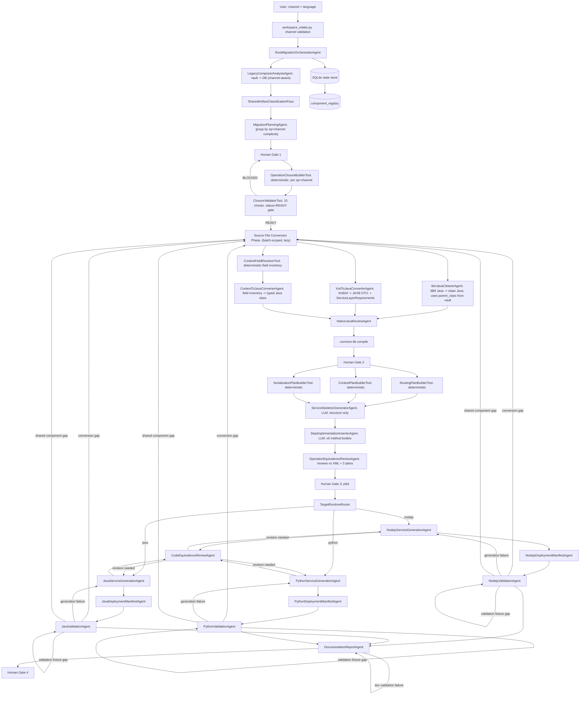

# WSBCC Migration Implementation Plan V8

---

## Table of Contents

1. [Project Overview](#1-project-overview)
2. [System Architecture](#2-system-architecture)
3. [Composer-Mapper Analysis Utility](#3-composer-mapper-analysis-utility)
   - [RunConfig](#runconfig)
4. [Channel as First-Class Scope](#4-channel-as-first-class-scope)
   - [Why channel matters](#why-channel-matters)
   - [Channel scope in constants](#channel-scope-in-constants)
   - [Channel in every task key](#channel-in-every-task-key)
5. [The Pipeline](#5-the-pipeline)
   - [Phase 0 - Startup](#phase-0---startup-deterministic-no-llm)
   - [Phase 1 - Inventory](#phase-1---inventory-deterministic-no-llm)
   - [Phase 2 - Operation Dependency Closure](#phase-2---operation-dependency-closure-deterministic-no-llm)
     - [`OperationClosureBuilderTool`](#operationclosurebuildertool)
     - [Sub-tools called by `OperationClosureBuilderTool`](#sub-tools-called-by-operationclosurebuildertool)
     - [`ClosureValidatorTool`](#closurevalidatortool)
     - [Closure storage](#closure-storage)
     - [How Phase 3 uses the closure](#how-phase-3-uses-the-closure)
     - [How Phase 4 uses the closure](#how-phase-4-uses-the-closure)
   - [Phase 3 - Source File Conversion to Native Java](#phase-3---source-file-conversion-to-native-java-closure-driven-per-batch)
     - [IBM Java implClasses -> clean Java](#ibm-java-implclasses---clean-java-ibmjavacleaneragent)
     - [XML fmtDef definitions -> JAXB DTOs](#xml-fmtdef-definitions---jaxb-dtos-xmltojavaconverteragent)
     - [XML context definitions -> field inventory](#xml-context-definitions---field-inventory-contexthierarchyresolvertool--contextfieldresolvertool)
     - [Operation channel filtering](#operation-channel-filtering-channelfiltertool)
     - [Code review and compile](#code-review-and-compile)
   - [Phase 4 - Operation Assembly](#phase-4---operation-assembly-tools--llm-sub-agents-per-operation-per-channel)
     - [Sub-unit 1: `RoutingPlanBuilderTool`](#sub-unit-1-routingplanbuildertool-deterministic)
     - [Sub-unit 2: `ContextPlanBuilderTool`](#sub-unit-2-contextplanbuildertool-deterministic)
     - [Sub-unit 3: `SerializationPlanBuilderTool`](#sub-unit-3-serializationplanbuildertool-deterministic)
     - [Sub-unit 4: `ServiceSkeletonGeneratorAgent`](#sub-unit-4-serviceskeletongeneratoragent-llm)
     - [Sub-unit 5: `StepImplementationInserterAgent`](#sub-unit-5-stepimplementationinserteragent-llm-once-per-responsibility)
     - [Sub-unit 6: `OperationEquivalenceReviewAgent`](#sub-unit-6-operationequivalencereviewagent-llm)
   - [Phase 5 - Target Language Generation](#phase-5---target-language-generation-llm-per-operation-per-language)
   - [Phase 6 - Validation](#phase-6---validation)
     - [Runtime Equivalence Trace](#runtime-equivalence-trace-step-5---the-critical-test)
   - [Phase 7 - Deployment Manifests](#phase-7---deployment-manifests)
   - [Phase 8 - Documentation](#phase-8---documentation)
6. [Agent Roster](#6-agent-roster)
   - [Agents](#agents)
   - [Tools](#tools)
7. [Control Flow](#7-control-flow)
8. [Data Models](#8-data-models)
   - [`composer_models/`](#composer_models)
   - [`conversion_models/`](#conversion_models)
9. [Failure and Status Taxonomy](#9-failure-and-status-taxonomy)
   - [Task Lifecycle Status](#task-lifecycle-status-taskstatus)
   - [Conversion Status](#conversion-status-conversionstatus)
   - [Blocking Reason](#blocking-reason-blockingreason)
   - [Validation Report `failure_class`](#validation-report-failure_class)
   - [How the taxonomy is used together](#how-the-taxonomy-is-used-together)
   - [Where each status lives in the DB](#where-each-status-lives-in-the-db)
10. [Source-Hash Invalidation Rules](#10-source-hash-invalidation-rules)
    - [Hash comparison point](#hash-comparison-point)
    - [Invalidation cascade rules](#invalidation-cascade-rules)
    - [What is NOT invalidated](#what-is-not-invalidated)
    - [Invalidation in the state store](#invalidation-in-the-state-store)
    - [DB additions for invalidation](#db-additions-for-invalidation)
11. [Tools](#11-tools)
    - [`conversion_tools/`](#conversion_tools)
    - [`composer_mapper_tools/`](#composer_mapper_tools)
12. [Skills](#12-skills)
    - [`skills/conversion_rules_skill.md`](#skillsconversion_rules_skillmd)
    - [`skills/xml_to_java_skills/fmtdef_to_jaxb.md`](#skillsxml_to_java_skillsfmtdef_to_jaxbmd)
13. [Constants and .env](#13-constants-and-env)
    - [`.env` to `constants.py` Mapping](#env-to-constantspy-mapping)
14. [Folder Layout](#14-folder-layout)
15. [Build Order](#15-build-order)
    - [Stage 1 - Foundation](#stage-1---foundation)
    - [Stage 2 - Intake and Inventory](#stage-2---intake-and-inventory)
    - [Stage 3 - Conversion Tools](#stage-3---conversion-tools)
    - [Stage 4 - Source Conversion Agents](#stage-4---source-conversion-agents)
    - [Stage 5 - Operation Assembly](#stage-5---operation-assembly)
    - [Stage 6 - Target Language Generation](#stage-6---target-language-generation)
    - [Stage 7 - Validation](#stage-7---validation)
    - [Stage 8 - Documentation and Pilot](#stage-8---documentation-and-pilot)
16. [Future Enhancement: Replay Validation System](#16-future-enhancement-replay-validation-system)
    - [Replay Validation Goals](#replay-validation-goals)
    - [Deterministic Simulation Requirement](#deterministic-simulation-requirement)
    - [What Must Be Implemented](#what-must-be-implemented)

---

## 1. Project Overview

This document defines the first implementation plan for an offline ADK-based
multi-agent migration system. The product being built is a local workstation tool
that helps migrate a Java IBM WSBCC/Composer monolith into generated
microservices while preserving behavior, XML contracts, routing decisions, context
mutations, error handling, and deployment structure.

The system runs entirely inside an offline enterprise development environment. It
uses local disk as its working area, SQLite for durable state, Git only for
versioning and storage, and ADK as the multi-agent orchestration framework. Model
access is provided through a local OpenAI-compatible API wrapper for Gemini 2.5
Pro. Package access is available through enterprise Artifactory proxies for pip
and npm.

The user chooses the generated target runtime through `TARGET_LANGUAGES`. A run
may generate Java/Spring Boot, Node.js, Python, or multiple target runtimes when
the corresponding target-specific generation, validation, and deployment agents
are implemented. The source analysis pipeline remains shared across targets.

The migration must be resumable, batch-oriented, and evidence-driven. It must not
try to convert the entire monolith in one pass. Instead, it inventories the
Composer workspace, classifies shared artifacts, builds dependency closures for
small operation batches, converts only the required source artifacts, validates
generated services against legacy behavior, and records enough state to stop,
resume, retry, or escalate to human review.

Primary goals:

- Convert WSBCC operations into native microservices without IBM Composer or
  WebSphere runtime dependencies.
- Preserve request and reply XML behavior, including shared headers, common reply
  structures, error formats, context updates, routing paths, and backend calls.
- Generate documented source code, deployment manifests, and migration reports.
- Validate generated services using compile/build checks, IBM dependency guards,
  golden XML tests, runtime trace comparison, and behavioral equivalence checks.
- Track source hashes and generated artifact reuse so shared files are converted
  once, reused safely, and invalidated when their source changes.

This plan is written as an implementation guide for a developer or AI coding agent.
It describes the intended architecture, build order, durable state models, agent
responsibilities, validation gates, and future replay-validation extension.

---

## 2. System Architecture

The WSBCC XML is a declarative program. The generated microservice must be the
result of evaluating that program - not a reimplementation of its evaluation engine.

The pipeline has three clearly separated parts:

**Part 1 - Understand:** Run composer-mapper to produce a vault. Read the vault into
the DB. Know what every file is, what it connects to, which files belong to each
operation, and which channel each operation belongs to. No LLM.

**Part 2 - Convert:** For each operation scoped to its channel, convert source
artifacts directly into a clean, IBM-free intermediate representation. IBM Java
logic becomes native service logic, XML formats become structured request/reply
models, contexts become typed context models, and XML operations become executable
operation plans.

**Part 3 - Generate:** Generate the selected target runtimes from the validated
intermediate representation. Java target generation may emit Spring Boot services
and JAXB DTOs. Node.js target generation may emit TypeScript or JavaScript service
modules and XML parser/serializer code. Python target generation may emit FastAPI
service modules, typed models, and XML parser/serializer code. The LLM always
works from actual source content and validated intermediate artifacts, never from a
loose description of the legacy system.

The system is a source-first ADK multi-agent migration pipeline. It converts the
legacy Composer workspace by first building a deterministic inventory of the source
system, then converting and validating small operation batches with durable state
between every major step.

The architecture has four layers:

1. **Startup and configuration** - `workspace_intake.py` reads `.env`, applies
   `constants.py` fallbacks, runs composer-mapper, validates the vault, creates
   the SQLite state store, writes `RunConfig`, and starts the ADK orchestrator.
2. **Deterministic analysis and planning tools** - parser, resolver, classifier,
   closure, routing, context, serialization, dependency, and validation tools read
   local files and SQLite records. They do not use LLM reasoning.
3. **Focused ADK agents** - LLM agents perform bounded conversion, generation,
   review, documentation, and validation orchestration tasks after deterministic
   tools have prepared explicit inputs.
4. **State, gates, and validation** - SQLite tracks run status, task status,
   source hashes, generated artifacts, invalidation events, validation results,
   and human-review decisions so the process can stop, resume, retry, and audit
   every generated service.

Use a deterministic tool when the task can be expressed as parsing, graph walking,
hash comparison, schema validation, file inspection, routing resolution, or other
repeatable logic. Tools are preferred for anything that must be exact, cheap,
testable, and replayable.

Use an ADK agent when the task requires code transformation, code generation,
equivalence review, documentation synthesis, or other judgment-heavy work that
benefits from LLM reasoning. Agents must receive bounded inputs produced by tools
and must write structured outputs back to the state store.

The high-level flow is:

1. Load `.env` and build `RunConfig`.
2. Run composer-mapper and import the markdown vault.
3. Classify shared artifacts and build channel-scoped operation inventory.
4. Plan a small batch of operations.
5. Build and validate an operation dependency closure before conversion starts.
6. Convert required source artifacts to native intermediate code and shared models.
7. Assemble operation services from deterministic routing, context, and
   serialization plans.
8. Generate the selected target runtimes from `TARGET_LANGUAGES`.
9. Generate deployment manifests and documentation.
10. Validate build output, IBM dependency removal, XML equivalence, runtime traces,
    and behavioral equivalence.
11. Persist results, reports, reusable artifacts, and any human-review tasks.

---

## 3. Composer-Mapper Analysis Utility

`composer-mapper` is a deterministic source-analysis utility that reads the legacy
WSBCC/Composer workspace and emits a markdown vault describing operations, opSteps,
formats, contexts, Java classes, channel mappings, and unresolved references.

The updated composer-mapper (v1.2+) is invoked by `workspace_intake.py` before any
ADK agent starts. `workspace_intake.py` runs it as part of startup validation and
vault preparation, then launches the ADK pipeline only after the required vault
outputs exist.

`workspace_intake.py` is the deterministic startup entrypoint for a migration run.
It reads the project `.env` file to determine what kind of run the operator is
requesting:

[Read more on `Constants and .env`](#13-constants-and-env)

```text
RUN_MODE=single_channel
TARGET_CHANNELS=INTERNET

RUN_MODE=multi_channel
TARGET_CHANNELS=INTERNET,IVR,MOBILE

RUN_MODE=full_inventory
```

The `--channel` switch passed to composer-mapper is derived by
`workspace_intake.py` from the `.env` values:

| Intake run mode | Required `.env` values | composer-mapper invocation | ADK behavior |
|---|---|---|---|
| `single_channel` | `RUN_MODE=single_channel`, `TARGET_CHANNELS=<CHANNEL>` | pass `--channel <CHANNEL>` | migrate only that channel |
| `multi_channel` | `RUN_MODE=multi_channel`, `TARGET_CHANNELS=<A,B,C>` | omit `--channel` unless the mapper must be run once per channel | process configured channels sequentially |
| `full_inventory` | no target channel required | omit `--channel` | build inventory only or prepare state for later scoped runs |


### RunConfig

`RunConfig` is the durable configuration artifact produced by `workspace_intake.py`.
Implement it as a validated Python/Pydantic model and persist it as both a JSON
file under the run directory and a row in the SQLite `runs` table. It is not a
script and it does not run anything by itself.

`workspace_intake.py` builds `RunConfig` from two input sources, in this order:

1. A project `.env` file in the ADK project root
2. Code defaults from `constants.py` for optional values missing from `.env`

The resolved values are written into `RunConfig` before any ADK agent starts.
After `workspace_intake.py` finishes successfully, `RootMigrationOrchestratorAgent`
reads the persisted `RunConfig` and uses it as read-only input for the ADK run.

`RunConfig` captures the operator's requested run mode after `workspace_intake.py`
has validated it. The orchestrator treats this record as read-only input for the
rest of the run.

```python
class RunMode(str, Enum):
 single_channel = "single_channel"
 multi_channel = "multi_channel"
 full_inventory = "full_inventory"

class RunConfig:
 run_id: str
 run_mode: RunMode
 source_root: str
 vault_root: str
 output_root: str
 db_path: str
 env_file: str | None
 target_channels: list[str] # one item for single_channel, multiple for multi_channel
 composer_mapper_channel_filter: str | None # value passed to composer-mapper --channel
 target_languages: list[TargetLanguage] # one item for Java V1, multiple when more targets are enabled
 enable_git: bool
 artifact_schema_version: str
 max_agent_task_retries: int
 max_parallel_conversion_workers: int
 max_parallel_llm_tasks: int
 max_parallel_build_tasks: int
 max_operations_per_batch: int
 model_name: str
 model_base_url: str
 auto_rerun_impacted_operations: bool
 include_operations: list[str] | None  # if set, only these operations are migrated
 exclude_operations: list[str] | None  # if set, these operations are skipped
 schema_version: str = "v1"
```

Persistence requirements:
- Write `RunConfig` to `<output_root>/runs/<run_id>/run_config.json`.
- Insert the same values into the SQLite `runs` table.
- Do not mutate `RunConfig` after ADK starts. Runtime progress belongs in state
  tables such as `runs.current_phase`, `agent_tasks`, and artifact registries.


**What the vault contains:**

- One `.md` per entity: operation, opStep, format, context, Java class
- Frontmatter: `entity_id`, `source_file`, `source_hash`, `shared`, `used_by_*`,
 `channel`, `onlyFor`, `parent_class`, `interfaces`
- Body sections: `## Parameters`, `## Transitions`, `## Return Body Switches`,
 `## Structure` (format tree with decorator chains), `## Database Lookups`,
 `## Serialization Notes`, `## Return Codes`, `## IBM Dependency Warning`,
 `## Inheritance`
- `channels/{CHANNEL}.md` - per-channel operation list, import chain summary
- `analysis/channel-operation-registry.md` - master table: operation -> channel -> XML file path
- `analysis/unresolved-references.md`

**What the vault does NOT contain and is NOT asked to provide:**

- Behavioral meaning of source files
- XML wire contracts
- Any generated code
- dse.ini merging - this is done by composer-mapper internally; the vault already
 contains the merged result. The ADK pipeline reads from the vault, not from dse.ini.

**The composer-mapper is the only component that reads dse.ini files.** The ADK
pipeline never reads dse.ini directly.

[Read more on composer-mapper](../composer-mapper/README.md)

---

## 4. Channel as First-Class Scope

**Every operation in WSBCC belongs to a specific channel.** Treat channel as a
first-class migration scope throughout the pipeline.

### Why channel matters

- The same operation XML can appear in multiple channel `selfDefOper` registries
- Each channel may apply different `onlyFor` filtering, producing different opStep sets
- Each channel has its own tag->class mappings (merged from its dse.ini import chain)
- Same operation name in two channels -> two separate microservices:
 `GetClientLinksOp` in INTERNET -> `GetClientLinksService` (internet package)
 `GetClientLinksOp` in IVR -> `GetClientLinksService` (ivr package)

### Channel scope in constants

```python
TARGET_CHANNELS = ["INTERNET"] # single-channel run
# TARGET_CHANNELS = ["INTERNET", "IVR"] # multi-channel run (runs sequentially per channel)
```

### Channel in every task key

All state store task keys include the channel dimension:

```
{run_id}:{agent_name}:{scope_type}:{scope_id}:{channel}:{target_language}:{schema_version}
```

Examples:
```
run_001:OperationAssemblerAgent:op:GetClientLinksOp:INTERNET:any:v1
run_001:JavaServiceGenerationAgent:op:GetClientLinksOp:INTERNET:java:v1
run_001:IbmJavaCleanerAgent:class:db.GetClientLinksSP:INTERNET:any:v1
```

---

## 5. The Pipeline

### Phase 0 - Startup (deterministic, no LLM)

`workspace_intake.py` runs before any ADK agent. It is started by the operator or
an enterprise automation wrapper, not by an LLM agent. It reads the project `.env`,
applies `constants.py` fallbacks for optional missing values, validates the
workspace, invokes composer-mapper, writes `RunConfig`, and then starts or hands
off to `RootMigrationOrchestratorAgent`.

Required `.env` values:

```text
COMPOSER_ROOT=C:/wsbcc/source
VAULT_ROOT=C:/wsbcc/vault
OUTPUT_ROOT=C:/migration/generated
DB_PATH=C:/migration/state/migration.db
RUN_MODE=<single_channel|multi_channel|full_inventory>
```

Conditionally required `.env` values:

| Run mode | Required channel values |
|---|---|
| `single_channel` | `TARGET_CHANNELS=<CHANNEL>` |
| `multi_channel` | `TARGET_CHANNELS=<CHANNEL_A,CHANNEL_B,...>` |
| `full_inventory` | no channel value required |

Optional `.env` values are all keys that have safe defaults in `constants.py`.
They may be supplied by the operator when a run needs values different from the
defaults:

```text
APP_NAME
TARGET_LANGUAGES
ENABLE_GIT
NATIVE_JAVA_ROOT
TEMPLATES_ROOT
GOLDEN_TESTS_ROOT
LEGACY_SERVICE_BASE_URL
AGENT_MODEL
LITELLM_BASE_URL
LITELLM_API_KEY
MAX_AGENT_TASK_RETRIES
MAX_PARALLEL_CONVERSION_WORKERS
MAX_PARALLEL_LLM_TASKS
MAX_PARALLEL_BUILD_TASKS
MAX_OPERATIONS_PER_BATCH
MAX_SOURCE_CHARS_PER_CONVERSION
MAX_CONTEXT_CHARS_PER_CONVERSION
RUNNER_HEARTBEAT_TIMEOUT_SECONDS
INTER_BATCH_DELAY_SECS
COMMON_LIB_GROUP_ID
COMMON_LIB_ARTIFACT_ID
JAVA_PACKAGE_BASE
SPRING_BOOT_VERSION
JAVA_VERSION
ARTIFACT_SCHEMA_VERSION
FORBIDDEN_DEPENDENCIES
INCLUDE_OPERATIONS
EXCLUDE_OPERATIONS
```

Missing optional values fall back to `constants.py`. The full default-value table
is defined in [Constants and `.env`](#13-constants-and-env). Do not implement
alternate runtime configuration sources for V1; one run should have one visible
operator-facing configuration source.

Validation responsibilities:

1. `composer_root` exists and contains XML files
2. Requested `run_mode` is one of `single_channel`, `multi_channel`, or `full_inventory`
3. `single_channel` includes exactly one value in `target_channels`
4. `multi_channel` includes one or more values in `target_channels`
5. `full_inventory` does not require a target channel
6. every value in `target_languages` is supported
7. composer-mapper runs successfully with the derived `--channel` behavior
8. `vault_root` exists and has required subdirectories including `channels/` and `analysis/`
9. `analysis/channel-operation-registry.md` exists
10. Requested target channels are present in the registry when the run mode requires them
11. Model endpoint reachable (warning only, not blocking)
12. Git state (optional, configurable)
13. DB: create tables, run reconcile_on_startup
14. Prior run resume or new run

Produces and persists `RunConfig`. ADK starts only after all blocking checks pass.

### Phase 1 - Inventory (deterministic, no LLM)

`LegacyComposerAnalysisAgent` reads the composer-mapper vault via
`composer_mapper_tools` and populates the DB. No re-scanning of WSBCC source files.
No reading of dse.ini files.

**What gets populated:**

**`source_artifacts` table** — one row per entity, populated by reading every `.md`
file in the vault. The `kind` column identifies the entity type. Key frontmatter
fields read per kind:

| Vault path | `kind` | Key fields read |
|---|---|---|
| `operations/*.md` | `operation` | `entity_id`, `source_file`, `source_hash`, `channel`, `entry_step`, `host_key`, `operation_fields`, `ini_values`, `conversion_status`. Body: `## Steps`, `## Request Format`, `## Reply Format`, `## Other Formats` |
| `opsteps/*.md` | `opStep` | `entity_id`, `source_file`, `source_hash`, `onlyFor`, `used_by_operations`, `conversion_status`. Body: `## Parameters`, `## Transitions`, `## Return Body Switches` |
| `formats/*.md` | `format` | `entity_id`, `source_file`, `source_hash`, `shared`, `used_by_operations`, `conversion_status`. Body: `## Structure` (decorator chains), `## Database Lookups`, `## Serialization Notes` |
| `contexts/*.md` | `context` | `entity_id`, `source_file`, `source_hash`, `used_by_operations`, `conversion_status`. Body: `## Details` (parent, type) |
| `classes/**/*.md` | `java_class` | `entity_id` (FQCN), `source_file`, `source_hash`, `shared`, `used_by_steps`, `parent_class`, `interfaces`, `conversion_status`. Body: `## Behavior Type`, `## Return Codes`, `## Setter Methods`, `## IBM Dependency Warning` |

**`channel_operations` table** — populated by reading
`analysis/channel-operation-registry.md`. Each row in the markdown table becomes
one DB row: `(operation_name, channel, xml_file_path)`.

**`tag_registry` table** — populated by reading each `channels/{CHANNEL}.md` note.
The tag→FQCN mappings section in each channel note (merged from that channel's
dse.ini import chain) produces one row per mapping:
`(tag_name, fqcn, channel, source_dse_ini)`.

**`operations` table** — populated from `channel_operations` filtered by the
configured `target_channels`. This gives the complete list of operations whose
XML files are registered in that channel's `selfDefOper`. The operations table
represents the full set of operations to migrate for this channel run.

If `include_operations` is set in `RunConfig`, only those named operations are
retained in the `operations` table — all others are excluded before batch planning
begins. If `exclude_operations` is set, those named operations are removed from
the table. If both are set, `include_operations` is applied first, then
`exclude_operations` removes any overlap. Both filters are applied after channel
scoping and before `MigrationPlanningAgent` runs.

Note on `onlyFor`: `onlyFor` is an **opStep-level** attribute, not an operation-level
attribute. An operation that appears in the INTERNET channel's `selfDefOper` may
contain individual opSteps tagged `onlyFor="IVR"`. Those specific opSteps are
excluded from the INTERNET conversion by `ChannelFilterTool` during closure building
— they do not appear in the generated service. The operation itself is always in scope
for the channel it is registered in; only certain of its opSteps may be excluded.

**`ContextHierarchyResolverTool`** (deterministic tool) runs immediately after
inventory:
- Reads all context entities from `source_artifacts`
- Follows `parent` links recursively for every context until `parent = nil`
- Stores each chain in `context_hierarchies` table
- Detects and flags circular parent references as `needs_human_review`
- Precondition: blocks if `INVENTORY_COMPLETE` not set
- Must complete before any context field resolution or operation assembly

**`SharedArtifactClassificationPass`** (deterministic tool) runs after hierarchy
resolution:
- Reads pre-populated `shared` flags and `used_by_*` lists from vault frontmatter
- Identifies shared XML contract candidates by name pattern and usage count
- Writes classification results to DB
- Precondition: blocks if `INVENTORY_COMPLETE` not set -> **Human Gate 1:** Operator reviews operation count for target channel, shared
artifact counts, unresolved references, IBM dependency count. Approves pilot batch.

### Phase 2 - Operation Dependency Closure (deterministic, no LLM)

**The most important rule in the entire pipeline:**

```
No conversion starts until closure.status == READY
No artifact is converted unless reachable from a READY closure in the current batch
```

Before any LLM is invoked for any operation, a complete dependency closure must
exist for that operation in that channel. The closure is a verified, structured
package that answers precisely: "what source artifacts are needed to convert this
operation correctly?" Without it, the LLM receives partial context and guesses.
With it, the LLM receives the exact required files and converts only what matters.

This phase runs after Human Gate 1 and before Phase 3. It is entirely deterministic.
It does not generate code. It does not call any LLM. It builds packages and validates
them. Operations with `closure.status != READY` are blocked from entering Phase 3.

Gate 1 now includes a closure status summary: how many operations are READY, how
many are BLOCKED and why (grouped by ClosureStatus value).

#### `OperationClosureBuilderTool`

The orchestrating tool. For each operation in the target channel, runs sub-tools
in order and assembles their outputs into an `OperationClosure` record.

```python
class OperationClosure:
 operation_id: str
 channel: str
 run_id: str
 status: ClosureStatus
 blocking_issues: list[ClosureBlockingIssue]
 # Section 1: Operation XML facts
 source_xml_path: str
 operation_fields: str | None
 ini_values: list[str]
 host_key: str | None
 ref_formats: dict[str, str] # role -> format_id
 return_body_switches: dict[str, str] # "stepId:RC" -> format_name
 # Section 2: Channel-filtered opSteps
 included_opstep_ids: list[str] # in execution order
 excluded_opsteps: list[ExcludedOpStep]
 routing_graph: dict[str, dict] # step_id -> {RC: next_step_id}
 # Section 3: opStep Java classes
 java_classes: list[JavaClassRef]
 # Section 4+5: Formats and their dependencies
 formats: FormatSet
 # Section 6: Context
 context_id: str
 context_chain: list[str]
 context_fields: list[ContextField]
 # Section 7: Shared artifact flags
 shared_formats: list[str]
 shared_java_classes: list[str]
 # Section 8: Blocking issues (empty when status=READY)
 source_hash_composite: str
 schema_version: str = "v1"

class ClosureStatus(str, Enum):
 ready = "READY"
 blocked_missing_format = "BLOCKED_MISSING_FORMAT"
 blocked_missing_impl_class = "BLOCKED_MISSING_IMPL_CLASS"
 blocked_unknown_tag = "BLOCKED_UNKNOWN_TAG"
 blocked_unresolved_reference = "BLOCKED_UNRESOLVED_REFERENCE"
 needs_human_mapping = "NEEDS_HUMAN_MAPPING"

class ExcludedOpStep:
 id: str
 reason: str # e.g. "onlyFor=IVR"

class JavaClassRef:
 fqcn: str
 source_file: str
 parent_class: str | None
 interfaces: list[str]
 has_ibm_dependency: bool
 ibm_imports: list[str]
 return_codes: dict[str, list[str]]
 shared: bool

class FormatSet:
 request_format_id: str | None
 reply_format_id: str | None
 error_reply_format_id: str | None
 all_format_ids: list[str]
 formatter_tags: list[str]
 decorator_chains: dict[str, list] # formatter_node_id -> [decorator_tags]
 transparent_ccxml_nodes: list[str]
 db_lookups: list[DbLookupRequirement]
 unresolved_format_refs: list[str]

class ClosureBlockingIssue:
 kind: ClosureStatus
 entity_id: str
 detail: str
```

**Example closure output:**

```json
{
 "operation_id": "GetClientLinksOp",
 "channel": "INTERNET",
 "status": "READY",
 "source_xml_path": "Xml Definition/Channel/INTERNET/selfDefOper/GetClientLinks.xml",
 "host_key": "GCLN",
 "ref_formats": {
 "csRequestFormat": "GetClientLinksRQFmt",
 "csReplyFormat": "GetClientLinksRSFmt",
 "csErrorReplyFormat": "StandardErrorFmt"
 },
 "return_body_switches": {"GetClientLinksSP:4": "ErrorBody"},
 "included_opstep_ids": ["ValidateClient", "GetClientLinksSP", "MapError"],
 "excluded_opsteps": [{"id": "IvrOnlyStep", "reason": "onlyFor=IVR"}],
 "routing_graph": {
 "ValidateClient": {"0": "GetClientLinksSP", "other": "MapError"},
 "GetClientLinksSP": {"0": "end", "4": "MapError", "8": "MapError", "other": "MapError"},
 "MapError": {"0": "end", "other": "end"}
 },
 "java_classes": [
 {
 "fqcn": "com.bank.operations.GetClientLinksSP",
 "source_file": "src/.../GetClientLinksSP.java",
 "parent_class": "com.ibm.dse.base.CCOperationStep",
 "interfaces": ["com.ibm.dse.base.OperationStepInterface"],
 "has_ibm_dependency": true,
 "return_codes": {"0": ["success"], "4": ["not found"], "8": ["db error"]},
 "shared": false
 }
 ],
 "formats": {
 "request_format_id": "GetClientLinksRQFmt",
 "reply_format_id": "GetClientLinksRSFmt",
 "error_reply_format_id": "StandardErrorFmt",
 "all_format_ids": ["GetClientLinksRQFmt", "GetClientLinksRSFmt", "StandardErrorFmt"],
 "formatter_tags": ["CCXML", "CCString", "CCDate", "CCIColl"],
 "decorator_chains": {
 "ClientId/CCString": ["nilDecorator"],
 "RequestDate/CCDate": ["RemoveLeadingZerosDecorator", "CCPadding"]
 },
 "transparent_ccxml_nodes": ["GetClientLinksResponse"],
 "db_lookups": [
 {"field_name": "LinkDescription", "from_table": "LINK_TYPES",
 "from_column": "DESCRIPTION", "key_value_field": "LinkId"}
 ],
 "unresolved_format_refs": []
 },
 "context_id": "GetClientLinksCtxt",
 "context_chain": ["GetClientLinksCtxt", "InternetBaseCtxt", "BaseOpCtxt"],
 "context_fields": [
 {"name": "ClientId", "java_type": "String", "context_level": "GetClientLinksCtxt", "inherited": false},
 {"name": "CHANNEL_NAME", "java_type": "String", "context_level": "InternetBaseCtxt", "inherited": true}
 ],
 "shared_formats": ["StandardErrorFmt"],
 "shared_java_classes": [],
 "blocking_issues": []
}
```

#### Sub-tools called by `OperationClosureBuilderTool`

**`ChannelFilterTool`** (already defined) - produces `included_opstep_ids` and
`excluded_opsteps`.

**`FormatDependencyResolverTool`** - for each format referenced by the
operation, recursively resolves all nested `refFmt` references and inline `fmtDef`
elements. Collects all formatter tags, decorator chains, transparent CCXML flags,
and CCTableFormat DB lookups. Resolves each tag name through `tag_registry`.

```
resolve_format_dependencies(conn, format_ids, run_id) -> FormatSet
 - Walk all format references recursively (refFmt chains)
 - For each format: read vault Structure section for formatter/decorator tree
 - Flag any tag not in tag_registry: BLOCKED_UNKNOWN_TAG
 - Flag any refFmt id not in source_artifacts: BLOCKED_MISSING_FORMAT
```

**`JavaImplResolverTool`** - for each opStep in `included_opstep_ids`,
resolves the implClass FQCN (from `implClass` attribute or `tag_registry` fallback),
finds the Java source file, and reads the vault note.

```
resolve_java_impls(conn, opstep_ids, run_id) -> list[JavaClassRef]
 - Read implClass FQCN from source_artifacts
 - If absent: look up opStep tag name in tag_registry
 - If still absent: BLOCKED_MISSING_IMPL_CLASS
 - Read parent_class, interfaces, ibm_imports, return_codes from vault note
```

**`ContextHierarchyResolverTool`** - reads pre-built chain from
`context_hierarchies`. No re-computation.

**`ContextFieldResolverTool`** - reads pre-built `ContextFieldInventory` from
`context_field_inventories`. No re-computation.

#### `ClosureValidatorTool`

Final deterministic pass after assembly. Sets `closure.status = READY` only if
all ten checks pass. Otherwise sets the most severe blocking status.

| # | Check | Blocking reason if fails |
|---|---|---|
| 1 | All included opSteps have a JavaClassRef | `BLOCKED_MISSING_IMPL_CLASS` |
| 2 | All JavaClassRef source files exist on disk | `BLOCKED_MISSING_IMPL_CLASS` |
| 3 | All format_ids exist in source_artifacts | `BLOCKED_MISSING_FORMAT` |
| 4 | All formatter_tags are in tag_registry | `BLOCKED_UNKNOWN_TAG` |
| 5 | All decorator tags are in tag_registry | `BLOCKED_UNKNOWN_TAG` |
| 6 | context_chain terminates at parent=nil (no cycle) | `BLOCKED_UNRESOLVED_REFERENCE` |
| 7 | csErrorReplyFormat defined if any opStep has return_body_switches | `BLOCKED_MISSING_FORMAT` |
| 8 | formats.unresolved_format_refs is empty | `BLOCKED_MISSING_FORMAT` |
| 9 | blocking_issues list is empty | most severe issue kind |
| 10 | routing_graph covers all RC values from all JavaClassRef.return_codes | `BLOCKED_UNRESOLVED_REFERENCE` |

**Check 10 is the most important:** it compares the return codes the Java class
actually emits against the routing rules in the operation XML. If an implClass can
return `8` but the XML has no `on8Do`, that is a latent routing gap - it produces
incorrect behavior in production but will not cause a compile error. The closure
catches it before any LLM sees it.

#### Closure storage

```sql
CREATE TABLE IF NOT EXISTS operation_closures (
 operation_id TEXT NOT NULL,
 channel TEXT NOT NULL,
 run_id TEXT NOT NULL,
 status TEXT NOT NULL DEFAULT 'BLOCKED_UNRESOLVED_REFERENCE',
 closure_json TEXT,
 blocking_issues_json TEXT,
 source_hash_composite TEXT,
 created_at TEXT NOT NULL,
 updated_at TEXT NOT NULL,
 PRIMARY KEY (operation_id, channel, run_id)
);
```

`source_hash_composite` is a hash of all contributing `source_hash` values.
When any contributing hash changes (detected by Phase 1 invalidation), the closure
is invalidated and rebuilt before Phase 3 runs.

#### How Phase 3 uses the closure

Every Phase 3 conversion agent checks the closure before starting:

```python
closure = get_operation_closure(conn, operation_id, channel, run_id)
assert closure.status == ClosureStatus.ready
```

The `ConversionTaskPacket` is built directly from the closure - not by re-querying
multiple tables. The closure is the single authoritative source of "what this
operation needs."

Phase 3 only converts source files that appear in at least one READY closure
for the current batch. Files appearing in future batch closures are not touched
until those batches run. Files already in the registry with a matching hash and
`status = validated` are reused immediately without reconverting.

#### How Phase 4 uses the closure

The three plan builder tools (`RoutingPlanBuilderTool`, `ContextPlanBuilderTool`,
`SerializationPlanBuilderTool`) read directly from the closure JSON. The routing
graph, context fields, format dependencies, and decorator chains are already
resolved and validated. Plan builders never hit an "entity not found" error - 
if something was missing, the closure would be BLOCKED and Phase 4 would never run.

### Phase 3 - Source File Conversion to Native Java (closure-driven, per batch)

Every unique source file reachable from at least one READY closure in the current
batch is converted once. Files not reachable from any READY closure in this batch
are not touched. Files already in the registry with a matching source hash and
`status = validated` are reused without reconverting.

**Why native Java as the intermediate:**
- Removes IBM/WAS dependencies in one well-defined step
- Produces a human-readable, compilable artifact reviewable before target-language
 generation
- Converting modern Java to Spring Boot / Node.js / Python is a narrower, more
 reliable task than converting IBM XML directly to those targets
- Shared components exist as reviewed, compiled Java classes before any service is built

#### IBM Java implClasses -> clean Java (`IbmJavaCleanerAgent`)

Input to LLM:
- Full Java source file content
- The class's `parent_class` and `interfaces` from the vault (determines which
 behavioral contract this class implements: `ccExecute()`, `addDecoration()` /
 `removeDecoration()`, `formatXmlAttributes()`, etc.)
- IBM import list from vault `## IBM Dependency Warning` section

Output: clean Java class. IBM imports removed. IBM framework calls replaced with
plain Java equivalents. Business logic preserved exactly.

The parent class determines which methods to preserve:
- Extends `CCOperationStep` or `OperationStepInterface` -> preserve `execute()`,
 setters for all XML attributes, context read/write patterns
- Extends `FormatDecoratorHolder` -> preserve `addDecoration(String)`,
 `removeDecoration(String)`, `initializeFrom(Tag)` -> rewrite without IBM Tag
- Extends `AttributeXmlFormatDecoratorImpl` -> preserve `formatXmlAttributes()`
 logic -> rewrite as a function that adds XML attributes conditionally

#### XML fmtDef definitions -> JAXB DTOs (`XmlToJavaConverterAgent`)

Input to LLM:
- Raw fmtDef XML
- The vault `## Structure` section - this shows the tag tree WITH decorator chains
 already resolved. Decorator nodes appear as `decorator: <tagName .../>` indented
 under their formatter node
- The vault `## Serialization Notes` section - transparent/unnamed CCXML flags
- The vault `## Database Lookups` section - CCTableFormat DB dependencies

**Decorator chain rule:** Any formatter node (CCString, CCDate, CCXML, CCIColl,
NumberFormat, or any other tag resolving to a formatter FQCN) can have one or more
decorator nodes following it. This is true for all formatter types without exception.
The vault structure section already shows the resolved chains - the converter reads
them directly.

Output 1: JAXB-annotated DTO class matching the exact XML wire format. The DTO is
a pure data carrier - no logic, no DB calls. Uses `@XmlRootElement`, `@XmlElement`,
`@XmlElementWrapper` as appropriate. Handles `transparent="true"` CCXML by omitting
the wrapper element from the JAXB mapping.

Output 2: A `ServiceLayerRequirements` structured note listing:
- For each decorator chain: (field name, format direction transformations, unformat
 direction transformations) - what the service layer must do to this field's value
 before serialization or after deserialization
- For each CCTableFormat node: (field name, fromTable, fromColumn, keyValue field) - 
 what DB lookup the service layer must perform and where to store the result

The `ServiceLayerRequirements` note is an input to Phase 4. It is not code - it is
a structured specification of what the service layer must implement. It prevents the
converter from putting logic in the DTO.

#### XML context definitions -> field inventory (`ContextHierarchyResolverTool` + `ContextFieldResolverTool`)

Context XML tags contain only `id`, `parent`, and `type` - no field declarations.
Fields are inferred from the relationship graph. Both tools are entirely deterministic
 - no LLM is involved in either step.

**Step 1 - `ContextHierarchyResolverTool`** (runs once in Phase 1 after inventory)

Builds the complete inheritance chain for every context:

```
GetClientLinksCtxt (parent: InternetCtxt)
 InternetCtxt (parent: BaseOpCtxt)
 BaseOpCtxt (parent: nil)
 nil <- stop
```

Rules from the WSBCC runtime model:
- An opStep or formatter in an operation using `GetClientLinksCtxt` can read and
 write fields in `GetClientLinksCtxt`, `InternetCtxt`, and `BaseOpCtxt`
- Sibling contexts are never accessible - only the direct ancestry chain
- The chain terminates at `parent: nil`
- Circular parent references are detected, flagged as `has_cycle=True`, and sent
 to `needs_human_review` - they cannot be resolved deterministically

Output: one `ContextHierarchy` record per context stored in `context_hierarchies`.
This runs once and all downstream tools read from it.

**Step 2 - `ContextFieldResolverTool`** (runs per context, after hierarchies are built)

Traverses the complete ancestry chain to assemble the full field set. For each
context in the chain - leaf, parent, grandparent, up to root - it collects fields
from operations using that level, from format `dataName` attributes, and from
implClass context read/write patterns. Each field is tagged with its `context_level`
(which ancestor owns it) and `inherited: True` when it comes from an ancestor.

Deduplication rule: if the same field name appears at multiple chain levels, the
deepest (most specific, closest to leaf) definition wins.

Output: a flat `ContextFieldInventory` - all fields from the entire ancestry chain
in one list, with `context_level` and `inherited` per field. Stored in DB.

The `ContextToJavaConverterAgent` (LLM) receives this inventory and produces a flat
typed Java class with a field per entry. The generated context class is flat - it
contains all fields from the entire ancestry chain. There is no Java inheritance in
the generated context class; the WSBCC context hierarchy is captured by the field
inventory, not by Java extends.

#### Operation channel filtering (`ChannelFilterTool`)

Deterministic Python tool. For a given operation and channel:
1. Reads the opStep list from DB
2. For each opStep: reads `onlyFor` from `source_artifacts`
3. Returns the filtered list: only opSteps where `onlyFor` is null, blank, or
 contains the target channel name (case-insensitive)

This tool is called before any opStep conversion work begins for an operation. The
conversion pipeline only converts opSteps that survive channel filtering.

**No opStep that does not belong to the target channel appears in any generated code.**

#### Code review and compile

Every converted artifact goes through:
1. `NativeJavaReviewAgent` (LLM) - reviews against source. Checks: no IBM imports,
 behavioral contract preserved (uses `parent_class` from vault to know what contract
 to check), return codes covered
2. Compile check - `javac` on the individual class. A class that does not compile
 never enters the registry as validated -> **Human Gate 2:** Sample review of converted files (one per type per structural
category), common-lib build result, any failed reviews.

### Phase 4 - Operation Assembly (tools + LLM sub-agents, per operation per channel)

Do not use one monolithic LLM agent to assemble an operation. Request parsing,
context initialization, opStep routing, CCTableFormat enrichment, response
serialization, and error body switching must be separated into deterministic plan
objects and focused generation/review steps.
Extract every responsibility that can be determined deterministically from the DB
and Phase 3 artifacts into a plan object. The LLM then generates code from a
complete, explicit, machine-verifiable spec - not from inference.

The assembly phase is a sequential pipeline of six sub-units:

```
RoutingPlanBuilderTool (deterministic)
ContextPlanBuilderTool (deterministic)
SerializationPlanBuilderTool (deterministic)
 => three plan objects
ServiceSkeletonGeneratorAgent (LLM - structure only)
StepImplementationInserterAgent (LLM - one method body per opStep)
OperationEquivalenceReviewAgent (LLM - reviews against original WSBCC XML)
```

#### Sub-unit 1: `RoutingPlanBuilderTool` (deterministic)

Reads the channel-filtered opStep list and all transition maps from DB.
Walks the routing graph and produces a `RoutingPlan`.

```python
class RoutingPlan:
 operation_id: str
 channel: str
 steps: list[RoutingStep]
 has_finally_step: bool # "End" named step exists
 schema_version: str = "v1"

class RoutingStep:
 step_id: str
 step_index: int
 impl_class: str
 parameters: dict[str, str] # XML attributes -> setter values
 transitions: dict[str, str] # RC value -> next step_id or "end"/"next"
 return_body_switches: dict[str, str] # RC -> error format name
 only_for: str | None # already filtered - present for audit only
```

The `transitions` map is fully resolved: `"0" -> "end"`, `"4" -> "ErrorDataNotFound"`,
`"other" -> "ErrorTechnical"`. Step names are resolved to their step_index so the
LLM never needs to look up a step by name. Terminal signals (`end`, `next`) are
explicit string constants. The tool detects and flags unreachable steps and
missing transition targets before any LLM work begins.

**Outputs:** `RoutingPlan` stored in DB. Blocking if any transition target is
unresolvable -> `BlockingReason.unresolved_reference`.

#### Sub-unit 2: `ContextPlanBuilderTool` (deterministic)

Reads the `ContextFieldInventory` (built during Phase 3) and `operationFields`/
`iniValues` from the operation vault note. Produces a `ContextPlan`.

```python
class ContextPlan:
 operation_id: str
 channel: str
 context_class: str # FQCN of the generated context class
 fields: list[ContextPlanField]
 init_sequence: list[InitEntry] # order in which fields are initialized
 schema_version: str = "v1"

class ContextPlanField:
 name: str
 java_type: str
 context_level: str # which ancestor context owns this field
 initialized_from: Literal["request_dto", "operation_fields",
 "ini_value", "opstep_write", "db_lookup"]
 initialized_by: str | None # step_id or format field name

class InitEntry:
 field_name: str
 source: str
 value_or_expression: str # e.g. "req.getClientId()" or ""INTERNET""
```

This gives the `ServiceSkeletonGeneratorAgent` a precise, ordered initialization
sequence for `initializeContext()`. No inference needed.

#### Sub-unit 3: `SerializationPlanBuilderTool` (deterministic)

Reads the JAXB DTO artifacts and `ServiceLayerRequirements` produced during
Phase 3. Produces a `SerializationPlan`.

```python
class SerializationPlan:
 operation_id: str
 channel: str
 request_parsing: list[ParseStep]
 response_building: list[BuildStep]
 error_response_building: list[BuildStep] # from csErrorReplyFormat
 db_lookups: list[DbLookupRequirement] # CCTableFormat -> enrichment calls
 schema_version: str = "v1"

class ParseStep:
 field_name: str
 xml_path: str # e.g. "GetClientLinks/ClientId"
 context_field: str # where to store in context
 decorator_chain: list[str] # removeDecoration calls in reverse order
 java_type: str

class BuildStep:
 field_name: str
 context_field: str # where to read from in context
 xml_element: str # output XML element name
 decorator_chain: list[str] # addDecoration calls in forward order
 nullable: bool # whether xsi:nil applies
```

The decorator chains are already resolved from the vault `## Structure` section by
`DecoratorChainResolverTool` in Phase 3. This tool simply reorganizes them into
the directional parse/build plans the LLM can execute mechanically.

**Three plans are now fully machine-readable.** The LLM receives them as structured
JSON, not as prose descriptions.

#### Sub-unit 4: `ServiceSkeletonGeneratorAgent` (LLM)

Receives all three plan objects. Generates the Java service class **structure only**:
- Class declaration and imports
- Field declarations (injected repositories, the context class)
- Method signatures for all six service methods
- Constructor with dependency injection
- Method stubs: `{ throw new UnsupportedOperationException("not yet implemented"); }`

No method bodies. Output is small, focused, and fully checkable: does the skeleton
compile? Does it have exactly the right method signatures? A compile check runs
immediately after generation.

```java
// Generated skeleton - no bodies yet
@Service
public class GetClientLinksService {
 private final LinkRepository linkRepository;
 private final LinkTypeRepository linkTypeRepository; // from db_lookups plan

 public GetClientLinksService(LinkRepository lr, LinkTypeRepository ltr) { ... }

 public GetClientLinksResponse execute(String requestXml) throws Exception {
 throw new UnsupportedOperationException("not yet implemented");
 }
 private GetClientLinksContext deserializeRequest(String xml) { ... stub }
 private void initializeContext(GetClientLinksContext ctx,
 GetClientLinksRequest req) { ... stub }
 private void enrichWithDbLookups(GetClientLinksContext ctx) { ... stub }
 private String serializeReply(GetClientLinksResponse reply) { ... stub }
 private String serializeErrorReply(ErrorResponse err) { ... stub }
}
```

#### Sub-unit 5: `StepImplementationInserterAgent` (LLM, once per responsibility)

Runs six times - once per method body. Each call receives:
- The skeleton (already compiled)
- The plan that governs this specific method
- The relevant cleaned Java implClass source (for step methods)

The LLM fills in one method body per call. After each insertion, the class is
recompiled. If compile fails, the insertion is retried in isolation without
affecting the other five methods.

| Pass | Method | Input plan | Input source |
|---|---|---|---|
| 1 | `deserializeRequest` | `SerializationPlan.request_parsing` | request JAXB DTO |
| 2 | `initializeContext` | `ContextPlan.init_sequence` | context class |
| 3 | `execute` | `RoutingPlan.steps` + `ContextPlan` | all cleaned implClass sources |
| 4 | `enrichWithDbLookups` | `SerializationPlan.db_lookups` | repository classes |
| 5 | `serializeReply` | `SerializationPlan.response_building` | response JAXB DTO |
| 6 | `serializeErrorReply` | `SerializationPlan.error_response_building` | error JAXB DTO |

The `execute` method (pass 3) is the most complex: it implements the full opStep
chain from `RoutingPlan`. Because the routing is fully resolved (step indices,
RC values, terminal signals), the LLM is doing a mechanical translation, not a
reasoning task.

After all six passes compile cleanly, the IBM dependency guard runs on the
complete class.

#### Sub-unit 6: `OperationEquivalenceReviewAgent` (LLM)

Reviews the fully assembled class against the original WSBCC operation XML and the
three plan objects. The reviewer now has four inputs to check against - not just
the XML - which makes the review more precise:

- Every step in `RoutingPlan.steps` must appear in `execute()`
- Every RC branch in `RoutingPlan` must appear in `execute()`
- Every `on{N}Return` switch must appear in `execute()`
- Every field in `ContextPlan.init_sequence` must appear in `initializeContext()`
- Every `ParseStep` in `SerializationPlan.request_parsing` must appear in
 `deserializeRequest()`
- Every `DbLookupRequirement` must appear in `enrichWithDbLookups()`

Issues are classified using `BlockingReason` - a missing RC branch is
`behavior_mismatch`, a missing DB lookup is `behavior_mismatch`, a missing
`on{N}Return` switch is `missing_error_format`. -> **Human Gate 3:** Pilot batch (3-5 simple operations) reviewed before full scale.

### Phase 5 - Target Language Generation (LLM, per operation per language)

Each assembled native Java service class is translated to the target language.
Input: the native Java class (source of truth) + target language skill.

Per target, following separation of concerns rules from skills:
- **Spring Boot:** `@RestController` wrapper + `@Service` class (reuses the Java
 service logic directly) + JAXB DTOs (already generated in Phase 3)
- **Node.js:** TypeScript Express router + async service module + xml2js/xmlbuilder2
 XML handling
- **Python:** FastAPI router + async service module + lxml XML handling + Pydantic
 models

`CodeEquivalenceReviewAgent` reviews target output against the native Java source.

### Phase 6 - Validation

For each generated service, in order:

1. **Compile/build** - `mvn compile`. Must pass before anything else.
2. **IBM dependency guard** - blocking scan. No IBM import survives.
3. **Code equivalence review** - LLM compares generated service against native Java.
4. **Golden XML tests** - known-good request XML, compare response XML.
5. **Runtime equivalence trace** - the critical test. See below.
6. **Behavioral equivalence** - same request to legacy WSBCC and generated service.
7. **Performance benchmark** - p50/p95 response time, reporting only.

#### Runtime Equivalence Trace (step 5 - the critical test)

Golden XML tests verify output. They cannot catch wrong routing that accidentally
produces correct output. A service could execute wrong opSteps in the wrong order,
skip an error path, mutate context incorrectly, or select the wrong reply format
and still produce XML that looks plausible to a diff tool.

The runtime equivalence trace captures what happened inside the service during
execution and compares it step-by-step against the legacy WSBCC system.

**What the trace captures:**

```python
class ExecutionTrace:
 operation_id: str
 channel: str
 scenario: str # "success" | "not_found" | "technical_error" | custom
 request_xml: str
 steps_executed: list[StepTrace]
 selected_reply_format: str # "csReplyFormat" or "csErrorReplyFormat"
 reply_format_switched: bool
 switch_triggered_by: str | None
 final_xml: str
 comparison: TraceComparisonResult | None
 schema_version: str = "v1"

class StepTrace:
 step_id: str
 step_index: int
 impl_class: str
 return_code: int
 context_reads: list[ContextAccess]
 context_writes: list[ContextAccess]
 next_step_id: str | None
 routing_rule_used: str # e.g. "on4Do" | "onOtherDo" | "end"

class ContextAccess:
 field_name: str
 value_before: str | None
 value_after: str | None
 context_level: str

class TraceComparisonResult:
 matched: bool
 step_sequence_match: bool
 rc_per_step_match: bool
 context_writes_match: bool
 reply_format_match: bool
 final_xml_match: bool
 step_sequence_diff: list[str]
 rc_mismatches: list[RcMismatch]
 context_write_mismatches: list[ContextWriteMismatch]
 reply_format_mismatch: str | None
 final_xml_diff: list[str]
 failure_class: ValidationFailureClass | None

class RcMismatch:
 step_id: str
 legacy_rc: int
 generated_rc: int

class ContextWriteMismatch:
 step_id: str
 field_name: str
 legacy_value: str | None
 generated_value: str | None
```

**How trace comparison works:**

The legacy WSBCC system is wrapped by a `TraceInterceptorServlet` that captures
the execution trace for a given request without modifying the system. The generated
service is instrumented by an `ExecutionTraceInterceptor` Spring AOP aspect that
records step execution without affecting business logic.

`TraceComparatorTool` (deterministic) compares the two traces field by field:
- **Step sequence** - same steps in the same order?
- **RC per step** - for each shared step, same return code? A different RC means
 wrong data, wrong DB call, or wrong business logic inside the implClass.
- **Context writes** - for each step, same fields written with same values?
 A missing write means the generated service forgot a context update.
- **Reply format selection** - same format chosen? A mismatch means on{N}Return
 triggered in one but not the other, or the wrong error format was selected.
- **Final XML** - compared using XmlDiffTool (schema-level + value-level).

**Failure classification from trace mismatch:**

| Trace mismatch | ValidationFailureClass |
|---|---|
| Step sequence diverges | `routing_mismatch` |
| RC differs for same step | `routing_mismatch` |
| Reply format wrong | `routing_mismatch` |
| Context write missing or wrong value | `conversion_gap` |
| Final XML differs with matching trace | `equivalence_gap` |
| Final XML differs with mismatched trace | `routing_mismatch` |

`routing_mismatch` is a required `ValidationFailureClass`. It covers the
specific case where the routing graph was implemented incorrectly - wrong step
order, wrong RC rule, wrong reply format switch - even when the output looks close.

**Trace scenarios:**

Scenarios are derived deterministically from the `RoutingPlan`. Every distinct
terminal path through the routing graph is one scenario. Minimum: one success
(RC=0 path), one business error (if any on{N}Return exists), one technical error.

**Trace storage:**

```sql
CREATE TABLE IF NOT EXISTS execution_traces (
 trace_id TEXT PRIMARY KEY,
 operation_id TEXT NOT NULL,
 channel TEXT NOT NULL,
 run_id TEXT NOT NULL,
 target TEXT NOT NULL,
 scenario TEXT NOT NULL,
 target_language TEXT,
 trace_json TEXT,
 created_at TEXT NOT NULL
);

CREATE TABLE IF NOT EXISTS trace_comparisons (
 comparison_id TEXT PRIMARY KEY,
 operation_id TEXT NOT NULL,
 channel TEXT NOT NULL,
 run_id TEXT NOT NULL,
 scenario TEXT NOT NULL,
 matched INTEGER NOT NULL DEFAULT 0,
 step_sequence_match INTEGER,
 rc_per_step_match INTEGER,
 context_writes_match INTEGER,
 reply_format_match INTEGER,
 final_xml_match INTEGER,
 failure_class TEXT,
 comparison_json TEXT,
 created_at TEXT NOT NULL
);
```

### Phase 7 - Deployment Manifests

Jinja2 templates rendered deterministically. LLM determines service-specific values
only. No LLM writes YAML.

### Phase 8 - Documentation

Incremental per operation -> per batch -> final report at Gate 4. -> **Human Gate 4:** Final migration report.

---

## 6. Agent Roster

### Agents

| # | Agent | Type | Phase | Responsibility |
|---|---|---|---|---|
| 1 | `RootMigrationOrchestratorAgent` | `SequentialAgent` | all | Phases, gates, lifecycle |
| 2 | `LegacyComposerAnalysisAgent` | `SequentialAgent` | 1 | Vault import -> DB (channel-aware) |
| 3 | `MigrationPlanningAgent` | `LlmAgent` + validator | 1 | Groups (operation, channel) pairs by complexity |
| 4 | `HumanApprovalAgent` | `LlmAgent` | gates | Gate reports and decisions |
| 5 | `IbmJavaCleanerAgent` | `LlmAgent` + loops | 3 | IBM Java -> clean Java (uses parent_class) |
| 6 | `XmlToJavaConverterAgent` | `LlmAgent` + loops | 3 | fmtDef -> JAXB DTO + ServiceLayerRequirements |
| 7 | `ContextToJavaConverterAgent` | `LlmAgent` + loops | 3 | ContextFieldInventory -> typed Java class |
| 8 | `NativeJavaReviewAgent` | `LlmAgent` | 3 | Reviews converted files against source |
| 9 | `ServiceSkeletonGeneratorAgent` | `LlmAgent` | 4 | Generates class structure + method signatures only. Compiles immediately. |
| 10 | `StepImplementationInserterAgent` | `LlmAgent` (x6) | 4 | Fills in one method body per call from the relevant plan object |
| 11 | `OperationEquivalenceReviewAgent` | `LlmAgent` | 4 | Reviews complete class against original XML + all three plans |
| 12 | `NodejsServiceGenerationAgent` | batches + loops | 5 | Native Java -> TypeScript/Express |
| 13 | `JavaServiceGenerationAgent` | batches + loops | 5 | Native Java -> Spring Boot |
| 14 | `PythonServiceGenerationAgent` | batches + loops | 5 | Native Java -> Python/FastAPI |
| 15 | `CodeEquivalenceReviewAgent` | `LlmAgent` | 5 | Target output vs native Java |
| 16 | `NodejsValidationAgent` | `SequentialAgent` + tools | 6 | Full Node.js validation |
| 17 | `JavaValidationAgent` | `SequentialAgent` + tools | 6 | Full Java validation |
| 18 | `PythonValidationAgent` | `SequentialAgent` + tools | 6 | Full Python validation |
| 19 | `NodejsDeploymentManifestAgent` | `LlmAgent` + renderer | 7 | Node.js deployment YAML |
| 20 | `JavaDeploymentManifestAgent` | `LlmAgent` + renderer | 7 | Java deployment YAML |
| 21 | `PythonDeploymentManifestAgent` | `LlmAgent` + renderer | 7 | Python deployment YAML |
| 22 | `DocumentationReportAgent` | sub-agents + validator | 8 | Incremental docs and reports |

### Tools

| # | Tool | Type | Phase | Responsibility |
|---|---|---|---|---|
| 1 | `workspace_intake.py` | deterministic script | 0 | Startup, channel validation, RunConfig |
| 2 | `SharedArtifactClassificationPass` | deterministic tool | 1 | Shared/local classification |
| 3 | `OperationClosureBuilderTool` | deterministic tool | 2 | Builds dependency closure per (op, channel) |
| 4 | `FormatDependencyResolverTool` | deterministic tool | 2 | Resolves all nested format/decorator/DB-lookup deps |
| 5 | `JavaImplResolverTool` | deterministic tool | 2 | Resolves implClass FQCN, source, parent, return codes |
| 6 | `ClosureValidatorTool` | deterministic tool | 2 | Validates closure completeness - 10 checks - sets READY |
| 7 | `TargetRuntimeRouter` | deterministic tool | 5 | Routes to target agents |
| 8 | `RoutingPlanBuilderTool` | deterministic tool | 4 | Walks opStep graph -> `RoutingPlan` (fully resolved RC routing) |
| 9 | `ContextPlanBuilderTool` | deterministic tool | 4 | Reads ContextFieldInventory -> `ContextPlan` (typed field init sequence) |
| 10 | `SerializationPlanBuilderTool` | deterministic tool | 4 | Reads JAXB DTOs + ServiceLayerRequirements -> `SerializationPlan` |
| 11 | `TraceCaptureTool` | deterministic tool | 6 | Instruments legacy + generated service, captures `ExecutionTrace` per scenario |
| 12 | `TraceComparatorTool` | deterministic tool | 6 | Compares legacy vs generated trace: step sequence, RC, context writes, reply format, XML |

Implementation notes:
- Do not create an intermediate "opStep as a Java method" artifact. Convert each
 opStep's implClass with `IbmJavaCleanerAgent`, then use
 `StepImplementationInserterAgent` with a pre-built `RoutingPlan` to fill in one
 method body per call.
- Keep operation assembly split into six sub-units: three deterministic plan builders
 followed by three focused LLM agents. This keeps each step independently testable
 and retryable.

---

## 7. Control Flow



---

## 8. Data Models

### `composer_models/`

Defines the fields captured by composer-mapper v1.2+:

```python
class ComposerOperation:
 id: str
 channel: str # from channelForOperation
 source_file: str
 source_hash: str
 operation_context: str | None
 host_key: str | None
 operation_fields: str | None # comma-separated key=value pairs
 write_to_log: str | None
 write_to_ofec_stat: str | None
 is_selective_journalising: str | None
 ini_values: list[str] # iniValue child tags
 steps: list[str] # opStep ids, in order
 ref_formats: dict[str, str] # role -> format id (csRequestFormat etc.)
 inline_format_ids: list[str]
 conversion_status: str

class ComposerOpStep:
 id: str
 parent_operation_id: str
 impl_class: str | None
 source_file: str
 source_hash: str
 only_for: str | None # channel restriction
 transitions: dict[str, str] # on{N}Do, onOtherDo, onOtherDoDefault, onTimeoutDo
 return_body_switches: dict[str, str] # on{N}Return -> format name
 parameters: dict[str, str] # business parameters only
 conversion_status: str

class ComposerJavaClass:
 fqcn: str
 simple_name: str
 package_name: str
 source_file: str
 source_hash: str
 parent_class: str | None # FQCN of extended class
 interfaces: list[str] # FQCNs of implemented interfaces
 shared: bool
 used_by_steps: list[str]
 behavior_types: list[str]
 return_codes: dict[str, list[str]]
 setter_names: list[str]
 has_ibm_dependency: bool
 ibm_imports: list[str]
 inferred_external_dependencies: list[str]
 conversion_status: str
```

### `conversion_models/`

```python
class ConversionUnit:
 conversion_id: str
 kind: Literal["ibm_java", "xml_fmtdef", "xml_context", "xml_operation"]
 channel: str # channel scope
 source_files: list[str]
 operation_ids: list[str]
 shared: bool
 status: "ConversionStatus" # see taxonomy below
 blocking_reason: "BlockingReason | None"
 native_java_path: str | None
 source_hash: str
 schema_version: str = "v1"
```

---

## 9. Failure and Status Taxonomy

A single consistent taxonomy is used across all pipeline phases. Two orthogonal
dimensions are combined: **task lifecycle status** (what state the work item is in)
and **blocking reason** (why it cannot proceed when blocked). This separation keeps
status values unambiguous - a status never encodes both state and cause.

### Task Lifecycle Status (`TaskStatus`)

Applied to every `agent_tasks` row and every artifact record.

```python
class TaskStatus(str, Enum):
 # Normal lifecycle
 pending = "pending" # queued, not started
 in_progress = "in_progress" # LLM or tool currently running
 completed = "completed" # finished successfully
 validated = "validated" # completed + compile + IBM guard + review passed

 # Recoverable failures - pipeline retries up to MAX_AGENT_TASK_RETRIES
 failed = "failed" # last attempt failed; will retry
 needs_rerun = "needs_rerun" # stale due to upstream change; will requeue

 # Terminal blocked - pipeline cannot proceed without external action
 blocked = "blocked" # cannot proceed; see blocking_reason
 needs_human_review = "needs_human_review" # requires human decision before continuing

 # Crash recovery
 started = "started" # process lock held; reconciled to needs_rerun on crash
 orphaned_temp = "orphaned_temp" # temp artifact with no promoted record; re-generate
 cancelled = "cancelled" # explicitly cancelled; not retried
```

### Conversion Status (`ConversionStatus`)

Applied specifically to conversion artifacts (source files being converted to
native Java). A sub-taxonomy of `TaskStatus` with conversion-specific states.

```python
class ConversionStatus(str, Enum):
 pending = "pending"
 converting = "converting"
 converted = "converted" # LLM output written, not yet reviewed
 validated = "validated" # reviewed + compiled cleanly
 blocked = "blocked" # see blocking_reason
 needs_human_review = "needs_human_review"
 failed = "failed"
```

### Blocking Reason (`BlockingReason`)

When a task or artifact has `status = blocked` or `status = needs_human_review`,
`blocking_reason` identifies exactly why. This is the definitive list - every
automated blocking decision in the pipeline uses one of these values.

```python
class BlockingReason(str, Enum):
 # Source resolution failures - the source material needed for conversion is missing
 # or ambiguous. Cannot proceed until the source issue is resolved.
 unresolved_reference = "unresolved_reference"
 # A tag name used in XML has no entry in the merged dse.ini tag registry.
 # The FQCN of the implementing class cannot be determined.
 # Resolution: add the tag mapping to the appropriate dse.ini, re-run composer-mapper.

 unknown_decorator = "unknown_decorator"
 # A decorator tag appears in a fmtDef but its FQCN is not in the tag registry,
 # so its addDecoration/removeDecoration behavior cannot be derived.
 # Resolution: locate the decorator class and add it to dse.ini.

 missing_error_format = "missing_error_format"
 # An opStep has on{N}Return (error body switch) but the operation has no
 # csErrorReplyFormat defined. The error response cannot be built.
 # Resolution: add csErrorReplyFormat to the operation XML.

 missing_implclass_source = "missing_implclass_source"
 # The Java source file for an implClass FQCN was not found on disk.
 # The IbmJavaCleanerAgent cannot convert what it cannot read.
 # Resolution: ensure the Java workspace is complete and --root covers all workspaces.

 context_cycle = "context_cycle"
 # A circular parent reference was detected in the context hierarchy
 # (A -> B -> C -> A). The ContextHierarchyResolverTool cannot build the chain.
 # Resolution: fix the context parent declarations in the source XML.

 # Conversion quality failures - conversion ran but the output is not trustworthy.
 # Human must inspect the source and the generated output before proceeding.
 compile_failed = "compile_failed"
 # Generated native Java or target-language code does not compile after
 # MAX_AGENT_TASK_RETRIES attempts. Compiler errors are preserved in evidence.

 behavior_mismatch = "behavior_mismatch"
 # The NativeJavaReviewAgent or OperationEquivalenceReviewAgent found a
 # semantic difference between the generated output and the original source.
 # The logic is not faithfully preserved.

 ibm_dependency_found = "ibm_dependency_found"
 # The IBM dependency guard found a blocking IBM/WAS import in generated code
 # after MAX_AGENT_TASK_RETRIES attempts to remove it.

 equivalence_gap = "equivalence_gap"
 # CodeEquivalenceReviewAgent found the target-language service diverges
 # semantically from the native Java source.

 max_retries_exceeded = "max_retries_exceeded"
 # The task was retried MAX_AGENT_TASK_RETRIES times without success.
 # The most recent blocking_reason is preserved alongside this one.

 # Manual mapping required - the conversion cannot be automated for this item.
 needs_human_mapping = "needs_human_mapping"
 # The implClass logic is too complex, ambiguous, or domain-specific for the
 # LLM to convert reliably. A human developer must write the conversion manually.
 # This is set by the NativeJavaReviewAgent when confidence is "low" and the
 # issues cannot be resolved by retry.

 # Upstream dependency blocked
 upstream_blocked = "upstream_blocked"
 # This operation cannot be assembled because a shared component it depends on
 # is itself blocked. Unblocked automatically when the upstream dependency resolves.
```

### Validation Report `failure_class`

When a validation agent writes a `ValidationReport`, it classifies the failure
into one of these pipeline-level feedback classes. These drive the Mermaid feedback
edges - each maps to a specific feedback target agent:

```python
class ValidationFailureClass(str, Enum):
 build_failure = "build_failure"
 # Target service does not compile or build.
 # Feedback target: target service generation agent.

 conversion_gap = "conversion_gap"
 # Golden XML test or behavioral equivalence test reveals logic error traceable
 # to the native Java intermediate - wrong business logic from Phases 3/4.
 # Feedback target: source conversion phase (re-convert the affected component).

 equivalence_gap = "equivalence_gap"
 # Target-language service diverges semantically from the native Java source.
 # Logic was correct in Java but the translation to the target language is wrong.
 # Feedback target: target service generation agent.

 shared_component_gap = "shared_component_gap"
 # A shared component (DTO, serializer, context class, cleaned implClass) is
 # wrong and is causing multiple operations to fail consistently.
 # Feedback target: source conversion phase for the affected shared component.

 routing_mismatch = "routing_mismatch"
 # The runtime equivalence trace shows wrong step sequence, wrong RC routing,
 # wrong reply format selection, or wrong on{N}Return body switch.
 # Even when the final XML output looks close, the routing was wrong.
 # Feedback target: source conversion phase (re-examine RoutingPlan + assembler).

 validation_fixture_gap = "validation_fixture_gap"
 # The test fixture (golden XML pair, stub spec, log replay case) is wrong,
 # not the service. Fixture regenerated, capped at MAX_AGENT_TASK_RETRIES.
 # Feedback target: validation agent tools.
```

### How the taxonomy is used together

A concrete example showing all three dimensions:

| Scenario | `TaskStatus` | `BlockingReason` | `ValidationFailureClass` |
|---|---|---|---|
| Decorator tag not in dse.ini | `blocked` | `unknown_decorator` | - |
| Java source file not on disk | `blocked` | `missing_implclass_source` | - |
| Code compiles but logic is wrong | `needs_human_review` | `behavior_mismatch` | `conversion_gap` |
| IBM import survives after 3 retries | `blocked` | `ibm_dependency_found` | `build_failure` |
| LLM cannot convert complex implClass | `needs_human_review` | `needs_human_mapping` | - |
| Assembled operation fails XML test | `needs_rerun` -> re-converts | - | `conversion_gap` |
| Context has circular parent chain | `blocked` | `context_cycle` | - |
| Missing csErrorReplyFormat | `blocked` | `missing_error_format` | - |
| Shared DTO wrong - 10 ops failing | `needs_rerun` | - | `shared_component_gap` |
| Target Java service diverges from native Java | `needs_human_review` | `equivalence_gap` | `equivalence_gap` |
| Step sequence wrong (trace mismatch) | `needs_rerun` | `behavior_mismatch` | `routing_mismatch` |
| RC for a step differs from legacy | `needs_rerun` | `behavior_mismatch` | `routing_mismatch` |
| Wrong reply format selected | `needs_rerun` | `behavior_mismatch` | `routing_mismatch` |
| Context write missing or wrong at step | `needs_rerun` | `behavior_mismatch` | `conversion_gap` |

### Where each status lives in the DB

| Table | Status field | Type used |
|---|---|---|
| `agent_tasks` | `status` | `TaskStatus` |
| `agent_tasks` | `blocking_reason` | `BlockingReason` (nullable) |
| `native_java_artifacts` | `status` | `ConversionStatus` |
| `native_java_artifacts` | `blocking_reason` | `BlockingReason` (nullable) |
| `generated_artifacts` | `status` | `TaskStatus` |
| `generated_artifacts` | `blocking_reason` | `BlockingReason` (nullable) |
| `component_registry` | `status` | `ConversionStatus` |
| `validation_results` | `failure_class` | `ValidationFailureClass` (nullable) |
| `context_hierarchies` | `has_cycle` | `bool` (maps to `context_cycle` blocking reason) |

---

```python
class ConversionTaskPacket:
 conversion_id: str
 kind: str
 channel: str
 primary_source_content: str
 supporting_source_contents: dict[str, str]
 # ibm_java: includes parent_class, interfaces from vault
 # xml_fmtdef: includes decorator chains, serialization flags, DB lookups from vault
 # xml_context: includes ContextFieldInventory from ContextFieldResolverTool
 # xml_operation: includes channel-filtered opStep list, on{N}Return switches,
 # operationFields, iniValues, ServiceLayerRequirements for all formats
 channel_filtered_opstep_ids: list[str] | None # for operation assembly
 return_body_switches: dict[str, str] | None # from opStep vault notes
 operation_fields: str | None # from operation vault note
 ini_values: list[str] | None
 service_layer_requirements: list[dict] | None # from XmlToJavaConverter outputs
 relationship_context: str
 target_kind: str
 schema_version: str = "v1"

class RoutingPlan:
 operation_id: str
 channel: str
 steps: list[RoutingStep]
 has_finally_step: bool
 schema_version: str = "v1"

class RoutingStep:
 step_id: str
 step_index: int
 impl_class: str
 parameters: dict[str, str]
 transitions: dict[str, str] # RC value -> next step_id or "end"/"next"
 return_body_switches: dict[str, str] # RC -> error format name

class ContextPlan:
 operation_id: str
 channel: str
 context_class: str
 fields: list[ContextPlanField]
 init_sequence: list[InitEntry]
 schema_version: str = "v1"

class ContextPlanField:
 name: str
 java_type: str
 context_level: str
 initialized_from: Literal["request_dto", "operation_fields",
 "ini_value", "opstep_write", "db_lookup"]
 initialized_by: str | None

class InitEntry:
 field_name: str
 source: str
 value_or_expression: str

class SerializationPlan:
 operation_id: str
 channel: str
 request_parsing: list[ParseStep]
 response_building: list[BuildStep]
 error_response_building: list[BuildStep]
 db_lookups: list[DbLookupRequirement]
 schema_version: str = "v1"

class ParseStep:
 field_name: str
 xml_path: str
 context_field: str
 decorator_chain: list[str] # removeDecoration calls in reverse order
 java_type: str

class BuildStep:
 field_name: str
 context_field: str
 xml_element: str
 decorator_chain: list[str] # addDecoration calls in forward order
 nullable: bool

class ServiceLayerRequirements:
 """
 Output of XmlToJavaConverterAgent alongside the JAXB DTO.
 Specifies what the service layer must implement for fields that had
 decorator chains or CCTableFormat nodes in the original fmtDef.
 """
 format_id: str
 channel: str
 field_transformations: list[FieldTransformation]
 db_lookups: list[DbLookupRequirement]
 schema_version: str = "v1"

class FieldTransformation:
 field_name: str
 format_direction: list[str] # addDecoration calls in order
 unformat_direction: list[str] # removeDecoration calls in reverse order

class DbLookupRequirement:
 field_name: str
 from_table: str
 from_column: str
 key_value_field: str # context field name holding the lookup key

class ContextHierarchy:
 context_id: str
 chain: list[str] # ordered: [context_id, parent_id, ..., root_id]
 root_id: str
 has_cycle: bool
 schema_version: str = "v1"

class ContextFieldInventory:
 context_id: str
 channel: str
 full_chain: list[str] # complete ancestry chain this inventory covers
 fields: list[ContextField]
 schema_version: str = "v1"

class ContextField:
 name: str
 context_level: str # which context in the chain owns this field
 source: Literal["formatter", "implclass"]
 written_by: list[str] # entity ids that write this field
 read_by: list[str] # entity ids that read this field
 inferred_type: str # "String" | "LocalDate" | "boolean" | etc.
 inherited: bool # True if field comes from an ancestor context
```

---

## 10. Source-Hash Invalidation Rules

The composer-mapper writes a `source_hash` (SHA-256 of file contents) into the
frontmatter of every vault note. The pipeline stores this hash alongside every
converted artifact and every task record. When the source vault is regenerated
after a WSBCC source change, the new hash is compared to the stored hash to
determine what must be re-converted.

**This is the only mechanism for detecting source changes.** The pipeline never
re-scans WSBCC source files directly. It trusts the vault hash.

### Hash comparison point

Hash comparison happens in `artifact_registry_tools/reuse_resolver.py` at the
start of every conversion task, before any LLM call is made:

```python
def resolve_component_reuse(conn, artifact_kind, logical_id,
 source_hash, channel, target_language,
 schema_version) -> ReuseDecision:
 existing = get_component(conn, artifact_kind, logical_id,
 target_language, schema_version)
 if existing is None:
 return ReuseDecision(should_reuse=False, reason="not_in_registry")
 if existing.source_hash != source_hash:
 return ReuseDecision(should_reuse=False, reason="hash_mismatch")
 if existing.status != "validated":
 return ReuseDecision(should_reuse=False, reason="status_invalid")
 return ReuseDecision(should_reuse=True, generated_path=existing.generated_path)
```

A `hash_mismatch` result triggers the invalidation cascade described below.

A cache hit (`should_reuse=True`) means the artifact was already converted and
validated in a previous batch or run. Under lazy evaluation, most shared artifacts
are resolved from cache by the second or third batch that references them.

### Invalidation cascade rules

These rules are deterministic and enforced by `invalidation.py` in
`state_store_tools/`. Every cascade executes as a single DB transaction - 
either all downstream records are marked `needs_rerun` or none are. No partial
state is committed.

**Rule 1 - Shared implClass source changed**

```
source_hash changed for: Java implClass source file
then
mark stale: converted native Java artifact (IbmJavaCleanerAgent output)
then
mark stale: every ConversionUnit that includes this class (all operations using it)
then
mark stale: every assembled Java operation class that used this implClass
then
mark stale: every generated target-language service that was assembled from
 those operation classes
then
mark stale: every validation result for those services
then
set status = needs_rerun on all stale agent_tasks
create ONE InvalidationEvent linking all affected operation_ids
```

The InvalidationEvent is the audit record. It links: the changed artifact,
the reason (hash_mismatch), all affected operation_ids, and all artifact_ids
marked stale. If `auto_rerun_impacted_operations = False` in RunConfig, the
pipeline pauses and presents the impact report to the operator before rerunning.

**Rule 2 - Shared format source changed**

```
source_hash changed for: fmtDef XML file (shared format)
then
mark stale: JAXB DTO artifact and ServiceLayerRequirements for this format
then
mark stale: every ConversionUnit using this format
then
mark stale: every assembled operation class whose request or reply format
 references this fmtDef
then
mark stale: every generated service and validation result downstream
then
set status = needs_rerun, create InvalidationEvent
```

**Rule 3 - Operation XML source changed**

```
source_hash changed for: operation XML file
then
mark stale: the ConversionUnit for this operation
then
mark stale: the assembled operation class
then
mark stale: the generated service and validation result for this operation only
then
set status = needs_rerun, create InvalidationEvent
```

Unlike Rules 1 and 2, an operation XML change affects only that one operation.
No cascade to other operations unless the file contains shared format definitions
(check: does formatToSource map any shared format id to this file? If yes, also
apply Rule 2 for those formats).

**Rule 4 - Context source changed**

```
source_hash changed for: context definition XML
then
invalidate ContextHierarchy for this context and all contexts that reference
 it in their chain (re-run ContextHierarchyResolverTool for affected contexts)
then
invalidate ContextFieldInventory for all contexts in the affected chains
then
mark stale: all ConversionUnits for operations using any affected context
then
mark stale: assembled operation classes and downstream artifacts
then
set status = needs_rerun, create InvalidationEvent
```

**Rule 5 - Non-shared (local) source changed**

```
source_hash changed for: any implClass, format, or opStep that is shared=false
 (used_by_count = 1)
then
mark stale: only the artifacts for the single operation that uses it
then
set status = needs_rerun for that operation's task chain only
No InvalidationEvent needed (single-operation scope, no cascade)
```

### What is NOT invalidated

- **Completed operations with unchanged source hashes** - if an operation's source
 files are unchanged and its `needs_rerun` flag is not set, it is skipped on
 resume. Hash match + `validated` status = safe to reuse.

- **The vault itself** - the vault is regenerated externally by re-running
 composer-mapper. The pipeline does not modify vault files. When a new vault
 is produced, `LegacyComposerAnalysisAgent` re-imports it and the hash comparison
 at the `reuse_resolver` level drives invalidation from there.

- **Human-approved reviews** - if a human has approved a `needs_human_review` item
 (e.g. a `needs_human_mapping` implClass that was manually converted), that approval
 is preserved in the DB alongside the corrected artifact. A hash change on the
 original source resets the approval - it cannot be assumed that the manual
 conversion still matches the updated source.

### Invalidation in the state store

Required functions in `state_store_tools/invalidation.py`:

```python
def detect_hash_changes(conn, run_id: str) -> list[HashChange]:
 """
 Compares source_hash values in source_artifacts (just re-imported from vault)
 against the source_hash stored in native_java_artifacts and
 generated_artifacts for the previous run.
 Returns list of HashChange(artifact_id, old_hash, new_hash, artifact_kind).
 Called at the start of each run after vault import completes.
 """

def cascade_invalidation(conn, run_id: str,
 changes: list[HashChange]) -> InvalidationSummary:
 """
 Applies invalidation rules 1-5 for all detected hash changes.
 Executes as one transaction per change to avoid partial state.
 Returns summary: {changed: N, stale_conversions: N, stale_operations: N,
 stale_services: N, invalidation_event_ids: [...]}
 """
```

`detect_hash_changes` runs immediately after `LegacyComposerAnalysisAgent`
completes vault import, before any conversion work begins. This ensures the
pipeline always works from a consistent hash baseline at the start of each run.

### DB additions for invalidation

Add to the `agent_tasks` and artifact tables:

```sql
-- Required native Java artifact columns:
ALTER TABLE native_java_artifacts ADD COLUMN source_hash TEXT;
ALTER TABLE native_java_artifacts ADD COLUMN invalidation_event_id TEXT;
ALTER TABLE generated_artifacts ADD COLUMN source_hash TEXT;
ALTER TABLE generated_artifacts ADD COLUMN invalidation_event_id TEXT;

-- InvalidationEvent table (from common_models)
CREATE TABLE IF NOT EXISTS invalidation_events (
 event_id TEXT PRIMARY KEY,
 run_id TEXT NOT NULL,
 corrected_artifact_id TEXT NOT NULL,
 corrected_artifact_kind TEXT NOT NULL,
 change_reason TEXT NOT NULL, -- "hash_mismatch" | "manual_correction"
 old_hash TEXT,
 new_hash TEXT,
 affected_operation_ids_json TEXT,
 affected_artifact_ids_json TEXT,
 created_at TEXT NOT NULL,
 schema_version TEXT NOT NULL DEFAULT 'v1'
);
```

---

## 11. Tools

### `conversion_tools/`

**`channel_filter_tool.py`**

Deterministic. Given an operation_id and channel name, returns the filtered opStep
list: only opSteps where `only_for` is null/blank or matches the channel.

```python
def filter_opsteps_for_channel(
 conn, operation_id: str, channel: str
) -> list[str]:
 """Returns ordered list of opStep ids active for this channel."""
```

**`decorator_chain_resolver_tool.py`**

Deterministic. Reads the vault format structure markdown and extracts the decorator
chain per formatter node. Returns (formatter_tag, [decorator_tags_in_order]).

```python
def resolve_decorator_chains(
 format_vault_path: str
) -> list[tuple[str, list[str]]]:
 """
 Parses the ## Structure section of a format vault note.
 Returns list of (formatter_node_identifier, [decorator_tag_names]).
 Decorator nodes appear as 'decorator: <tagName.../>' lines in the vault.
 Any formatter type can have decorators - there are no type restrictions.
 """
```

**`context_hierarchy_resolver_tool.py`**

Deterministic. Runs once during Phase 1. Builds ancestry chains for all contexts.

```python
def build_all_context_hierarchies(conn, run_id: str) -> list[ContextHierarchy]:
 """
 For every context in source_artifacts:
 1. Follow parent links until parent = nil or parent not found
 2. Detect cycles: if a context_id repeats in the chain, set has_cycle=True
 and stop - the context is sent to needs_human_review
 3. Store ContextHierarchy in context_hierarchies table
 """

def get_context_hierarchy(conn, context_id: str, run_id: str) -> ContextHierarchy:
 """Returns the pre-built hierarchy for a context from DB."""
```

**`context_field_resolver_tool.py`**

Deterministic. Runs per context. Traverses the full ancestry chain.

```python
def resolve_context_fields(
 conn, context_id: str, channel: str, run_id: str
) -> ContextFieldInventory:
 """
 Precondition: context_hierarchies must be populated for this run_id.

 1. Load ContextHierarchy - gives the full ordered chain
 2. For EACH context_id in the chain:
 a. Find all operations using this context level
 b. Collect dataName attributes from all formats of those operations
 c. Scan implClass Java sources for context.setValueAt/getValueAt calls
 d. Tag each field with context_level = this context_id
 3. Infer types: CCDate->LocalDate, CCBoolean->boolean, NumberFormat->BigDecimal
 4. Deduplicate: deepest (most specific) definition wins for same field name
 5. Mark ancestor fields with inherited=True
 6. Return ContextFieldInventory with full_chain and complete fields list
 """

def get_accessible_fields(
 conn, context_id: str, run_id: str
) -> list[ContextField]:
 """All fields accessible from context_id including inherited. Convenience wrapper."""
```

**`operation_xml_loader_tool.py`**

Deterministic. Given an operation name and channel, returns the raw XML content
using the channel operation registry from DB (populated from the vault
channel-operation-registry):

```python
def load_operation_xml(
 conn, operation_name: str, channel: str, composer_root: str
) -> str:
 """
 Looks up xml_file_path in channel_operations table.
 Reads and returns raw XML content from composer_root/xml_file_path.
 """
```

### `composer_mapper_tools/`

All parsers must read and populate these fields:

- `operation_parser.py` -> reads `channel`, `host_key`, `operation_fields`,
 `ini_values` from frontmatter
- `opstep_parser.py` -> reads `only_for`, `## Return Body Switches` section
- `java_class_parser.py` -> reads `parent_class`, `interfaces` from frontmatter
- `vault_importer.py` -> populates `channel_operations` table from
 `analysis/channel-operation-registry.md`, `tag_registry` table from
 `channels/*.md` notes

Required DB tables:

```sql
CREATE TABLE IF NOT EXISTS channel_operations (
 operation_name TEXT NOT NULL,
 channel TEXT NOT NULL,
 xml_file_path TEXT NOT NULL,
 run_id TEXT NOT NULL,
 PRIMARY KEY (operation_name, channel, run_id)
);

CREATE TABLE IF NOT EXISTS tag_registry (
 tag_name TEXT NOT NULL,
 fqcn TEXT NOT NULL,
 channel TEXT,
 source_dse_ini TEXT,
 run_id TEXT NOT NULL,
 PRIMARY KEY (tag_name, channel, run_id)
);

CREATE TABLE IF NOT EXISTS service_layer_requirements (
 format_id TEXT NOT NULL,
 channel TEXT NOT NULL,
 run_id TEXT NOT NULL,
 requirements_json TEXT,
 status TEXT NOT NULL DEFAULT 'pending',
 created_at TEXT NOT NULL,
 updated_at TEXT NOT NULL,
 PRIMARY KEY (format_id, channel, run_id)
);

CREATE TABLE IF NOT EXISTS operation_closures (
 operation_id TEXT NOT NULL,
 channel TEXT NOT NULL,
 run_id TEXT NOT NULL,
 status TEXT NOT NULL DEFAULT 'BLOCKED_UNRESOLVED_REFERENCE',
 closure_json TEXT,
 blocking_issues_json TEXT,
 source_hash_composite TEXT,
 created_at TEXT NOT NULL,
 updated_at TEXT NOT NULL,
 PRIMARY KEY (operation_id, channel, run_id)
);

CREATE TABLE IF NOT EXISTS routing_plans (
 operation_id TEXT NOT NULL,
 channel TEXT NOT NULL,
 run_id TEXT NOT NULL,
 plan_json TEXT,
 status TEXT NOT NULL DEFAULT 'pending',
 created_at TEXT NOT NULL,
 updated_at TEXT NOT NULL,
 PRIMARY KEY (operation_id, channel, run_id)
);

CREATE TABLE IF NOT EXISTS context_plans (
 operation_id TEXT NOT NULL,
 channel TEXT NOT NULL,
 run_id TEXT NOT NULL,
 plan_json TEXT,
 status TEXT NOT NULL DEFAULT 'pending',
 created_at TEXT NOT NULL,
 updated_at TEXT NOT NULL,
 PRIMARY KEY (operation_id, channel, run_id)
);

CREATE TABLE IF NOT EXISTS serialization_plans (
 operation_id TEXT NOT NULL,
 channel TEXT NOT NULL,
 run_id TEXT NOT NULL,
 plan_json TEXT,
 status TEXT NOT NULL DEFAULT 'pending',
 created_at TEXT NOT NULL,
 updated_at TEXT NOT NULL,
 PRIMARY KEY (operation_id, channel, run_id)
);

CREATE TABLE IF NOT EXISTS context_hierarchies (
 context_id TEXT NOT NULL,
 run_id TEXT NOT NULL,
 chain_json TEXT NOT NULL,
 root_id TEXT NOT NULL,
 has_cycle INTEGER NOT NULL DEFAULT 0,
 created_at TEXT NOT NULL,
 PRIMARY KEY (context_id, run_id)
);

CREATE TABLE IF NOT EXISTS context_field_inventories (
 context_id TEXT NOT NULL,
 channel TEXT NOT NULL,
 run_id TEXT NOT NULL,
 full_chain_json TEXT,
 inventory_json TEXT,
 status TEXT NOT NULL DEFAULT 'pending',
 created_at TEXT NOT NULL,
 updated_at TEXT NOT NULL,
 PRIMARY KEY (context_id, channel, run_id)
);
```

---

## 12. Skills

### `skills/conversion_rules_skill.md`

**Rule 2 (Channel First):**

The `onlyFor` attribute on an opStep restricts it to specific channels. The
`removeOpStepsNotForThisChannel()` method in `CCDSEServerOperation` removes
non-matching steps before `execute()` runs. When converting for channel X:

- Call `ChannelFilterTool` first. Only process the returned opStep list.
- opSteps absent from the filtered list do not appear in the generated code.
- Do not generate commented-out code for filtered steps.
- Do not generate `if (channel == X)` branching - the generated class is
 already channel-specific.

**Rule 5 (Decorator Chains):**

Any formatter node can have one or more decorators following it. This is true
for all formatter types (CCString, CCDate, CCXML, CCIColl, NumberFormat, and
any custom formatter) without exception. The decorator chain is determined
purely by position in the XML - decorators immediately follow their formatter
as sibling tags.

The vault `## Structure` section shows resolved chains with `decorator:` prefix.
Read these directly - do not re-derive from raw XML.

**Rule 11 - Error Body Switching (on{N}Return):**

When an opStep's vault note has `## Return Body Switches`, this means the opStep
can signal that the error reply format should be substituted before the response
is built. In the CCDSEServerOperation runtime, `on{N}Return = "ErrorBody"` causes
`csErrorReplyFormat` to replace `csReplyFormat` for this operation's response.

In the generated service:
```java
int rc = executeStep(ctx);
if (rc == 4) {
 // on4Return was set - use error reply format
 return serializeErrorReply(buildErrorReply(ctx));
}
```
The `csErrorReplyFormat` must be defined on the operation. If it is absent, flag
for human review.

### `skills/xml_to_java_skills/fmtdef_to_jaxb.md`

To be created - covers:
- How to map the format tree structure to JAXB annotations
- Handling `transparent="true"` CCXML (omit wrapper element)
- Handling CCIColl (use `@XmlElementWrapper` + `@XmlElement` on List field)
- Handling CCTableFormat (flag as DB lookup in ServiceLayerRequirements, omit from DTO)
- How to read and document decorator chains into ServiceLayerRequirements
- Type mapping: CCString->String, CCDate->String (formatted), CCBoolean->boolean,
 NumberFormat->String (formatted), CCIColl->List<T>

---

## 13. Constants and .env

Runtime configuration is resolved from `.env` first, then from `constants.py` for
missing optional values. The `.env` file is the single operator-facing
configuration file for a run. `constants.py` provides safe code defaults when an
optional value is absent from `.env`.

`TARGET_LANGUAGES` may contain one or more values. `workspace_intake.py` writes
them to `RunConfig.target_languages`, and the orchestrator expands that list into
per-target tasks. Task keys and generated artifact rows still use the singular
`target_language` dimension because each task targets one concrete runtime.

Example `.env`:

```text
# Optional app identity
APP_NAME=composer_migration_adk

# Required project paths
COMPOSER_ROOT=C:/wsbcc/source
VAULT_ROOT=C:/wsbcc/vault
OUTPUT_ROOT=C:/migration/generated
DB_PATH=C:/migration/state/migration.db

# Required run selection
RUN_MODE=single_channel
TARGET_CHANNELS=INTERNET
# For multi_channel: TARGET_CHANNELS=INTERNET,IVR,MOBILE

# Optional target selection
TARGET_LANGUAGES=java

# Optional local behavior
ENABLE_GIT=false

# Optional output/support paths
NATIVE_JAVA_ROOT=C:/migration/native_java
TEMPLATES_ROOT=C:/migration/templates
GOLDEN_TESTS_ROOT=C:/migration/golden_tests
LEGACY_SERVICE_BASE_URL=http://legacy-wsbcc-host:8080

# Optional model settings
AGENT_MODEL=gemini/gemini-2.5-pro
LITELLM_BASE_URL=http://enterprise-proxy.internal/v1
LITELLM_API_KEY=enterprise-key

# Optional tuning
MAX_AGENT_TASK_RETRIES=3
MAX_PARALLEL_CONVERSION_WORKERS=4
MAX_PARALLEL_LLM_TASKS=2
MAX_PARALLEL_BUILD_TASKS=2
MAX_OPERATIONS_PER_BATCH=5
MAX_SOURCE_CHARS_PER_CONVERSION=32000
MAX_CONTEXT_CHARS_PER_CONVERSION=48000
RUNNER_HEARTBEAT_TIMEOUT_SECONDS=300
INTER_BATCH_DELAY_SECS=1

# Optional Java target settings
COMMON_LIB_GROUP_ID=com.company.migration
COMMON_LIB_ARTIFACT_ID=composer-common-lib
JAVA_PACKAGE_BASE=com.company.generated
SPRING_BOOT_VERSION=3.3.0
JAVA_VERSION=17

# Optional schema/versioning settings
ARTIFACT_SCHEMA_VERSION=v1

# Optional IBM dependency guard settings
FORBIDDEN_DEPENDENCIES=com.ibm,com.ibm.websphere,com.ibm.wsbcc,com.ibm.ws,javax.ejb,javax.rmi,javax.resource,javax.transaction.UserTransaction,org.omg.CORBA,websphere,wsbcc,Business Component Composer

# Optional operation filters (comma-separated operation names)
# INCLUDE_OPERATIONS=GetClientLinksOp,GetAccountDetailsOp
# EXCLUDE_OPERATIONS=LegacyBatchOp,DeprecatedSyncOp
```

### `.env` to `constants.py` Mapping

| `.env` | Default value from `constants.py` | Required | Purpose |
|---|---|---|---|
| `APP_NAME` | `composer_migration_adk` | no | Logical ADK application name used in logs, state, and generated reports. |
| `COMPOSER_ROOT` | `./input/composer` | yes | Legacy WSBCC/Composer source workspace root. |
| `VAULT_ROOT` | `./work/vault` | yes | Markdown vault output path produced by composer-mapper. |
| `OUTPUT_ROOT` | `./generated` | yes | Root folder for generated services, run artifacts, reports, and docs. |
| `DB_PATH` | `./work/state/migration.db` | yes | SQLite state database path for runs, tasks, artifacts, validation, and checkpoints. |
| `RUN_MODE` | `single_channel` | yes | Selects `single_channel`, `multi_channel`, or `full_inventory`. |
| `TARGET_CHANNELS` | `["INTERNET"]` | conditional | Required for `single_channel` and `multi_channel`; comma-separated channel names. |
| `TARGET_LANGUAGES` | `["java"]` | no | Comma-separated target runtimes to generate. Constants default is `java`; `.env` overrides it. |
| `ENABLE_GIT` | `False` | no | Enables optional Git state validation/versioning behavior during startup. |
| `NATIVE_JAVA_ROOT` | `./work/native_java` | no | Output root for intermediate native Java artifacts. |
| `TEMPLATES_ROOT` | `./templates` | no | Root folder for deployment and code-generation templates. |
| `GOLDEN_TESTS_ROOT` | `./work/golden_tests` | no | Root folder for golden XML tests, fixtures, and captured traces. |
| `LEGACY_SERVICE_BASE_URL` | `http://legacy-wsbcc-host:8080` | no | Base URL for legacy runtime trace capture when validation requires live legacy calls. |
| `AGENT_MODEL` | `gemini/gemini-2.5-pro` | no | Model name used by ADK LLM agents. |
| `LITELLM_BASE_URL` | `http://enterprise-proxy.internal/v1` | no | Local OpenAI-compatible API wrapper base URL. |
| `LITELLM_API_KEY` | `enterprise-key` | no | API key/token for the local model wrapper. |
| `MAX_AGENT_TASK_RETRIES` | `3` | no | Maximum retry count before a task is marked `needs_human_review`. |
| `MAX_PARALLEL_CONVERSION_WORKERS` | `4` | no | Maximum deterministic/LLM source-conversion workers. |
| `MAX_PARALLEL_LLM_TASKS` | `2` | no | Maximum concurrent LLM tasks. |
| `MAX_PARALLEL_BUILD_TASKS` | `2` | no | Maximum concurrent build/compile validation tasks. |
| `MAX_OPERATIONS_PER_BATCH` | `5` | no | Maximum operation count in a planning/generation batch. |
| `MAX_SOURCE_CHARS_PER_CONVERSION` | `32000` | no | Source-size guardrail for conversion task packets. |
| `MAX_CONTEXT_CHARS_PER_CONVERSION` | `48000` | no | Context-size guardrail for conversion task packets. |
| `RUNNER_HEARTBEAT_TIMEOUT_SECONDS` | `300` | no | Timeout used to detect stale/in-progress crashed tasks. |
| `INTER_BATCH_DELAY_SECS` | `1` | no | Delay between batches to avoid resource spikes. |
| `COMMON_LIB_GROUP_ID` | `com.company.migration` | no | Maven group ID for the generated shared/common Java library. |
| `COMMON_LIB_ARTIFACT_ID` | `composer-common-lib` | no | Maven artifact ID for the generated shared/common Java library. |
| `JAVA_PACKAGE_BASE` | `com.company.generated` | no | Base package for generated Java/Spring Boot code. |
| `SPRING_BOOT_VERSION` | `3.3.0` | no | Spring Boot version for generated Java services. |
| `JAVA_VERSION` | `17` | no | Java language/runtime version for generated Java services. |
| `ARTIFACT_SCHEMA_VERSION` | `v1` | no | Schema version attached to generated artifacts and state records. |
| `FORBIDDEN_DEPENDENCIES` | `["com.ibm", "com.ibm.websphere", "com.ibm.wsbcc", "com.ibm.ws", "javax.ejb", "javax.rmi", "javax.resource", "javax.transaction.UserTransaction", "org.omg.CORBA", "websphere", "wsbcc", "Business Component Composer"]` | no | Comma-separated patterns blocked by the IBM dependency guard. |
| `INCLUDE_OPERATIONS` | `None` | no | Comma-separated operation names to include. When set, only these operations are migrated; all others in the channel scope are skipped. Applied after channel scoping and before batch planning. Useful for converting a single operation or a known set without modifying the batch plan. Example: `GetClientLinksOp,GetAccountDetailsOp` |
| `EXCLUDE_OPERATIONS` | `None` | no | Comma-separated operation names to exclude. When set, these operations are skipped even if they are in scope for the channel and batch. Applied after channel scoping and before batch planning. Useful for skipping known-broken or manually-handled operations without removing them from the source registry. Example: `LegacyBatchOp,DeprecatedSyncOp` |

```python
# constants.py

APP_NAME = "composer_migration_adk"
RUN_MODE = "single_channel"
ENABLE_GIT = False

# LLM
AGENT_MODEL = "gemini/gemini-2.5-pro"
LITELLM_BASE_URL = "http://enterprise-proxy.internal/v1"
LITELLM_API_KEY = "enterprise-key"

# Retry / parallelism
MAX_AGENT_TASK_RETRIES = 3
MAX_PARALLEL_CONVERSION_WORKERS = 4
MAX_PARALLEL_LLM_TASKS = 2
MAX_PARALLEL_BUILD_TASKS = 2
MAX_OPERATIONS_PER_BATCH = 5
MAX_SOURCE_CHARS_PER_CONVERSION = 32000
MAX_CONTEXT_CHARS_PER_CONVERSION = 48000
RUNNER_HEARTBEAT_TIMEOUT_SECONDS = 300
INTER_BATCH_DELAY_SECS = 1

# Target channels and languages
TARGET_CHANNELS = ["INTERNET"]
TARGET_LANGUAGES = ["java"]

# Operation filters (None = no filter applied)
INCLUDE_OPERATIONS: list[str] | None = None  # e.g. ["GetClientLinksOp"]
EXCLUDE_OPERATIONS: list[str] | None = None  # e.g. ["LegacyBatchOp"]

# Paths
COMPOSER_ROOT = "./input/composer"
VAULT_ROOT = "./work/vault"
OUTPUT_ROOT = "./generated"
NATIVE_JAVA_ROOT = "./work/native_java"
TEMPLATES_ROOT = "./templates"
GOLDEN_TESTS_ROOT = "./work/golden_tests"
LEGACY_SERVICE_BASE_URL = "http://legacy-wsbcc-host:8080"
DB_PATH = "./work/state/migration.db"

# Java
COMMON_LIB_GROUP_ID = "com.company.migration"
COMMON_LIB_ARTIFACT_ID = "composer-common-lib"
JAVA_PACKAGE_BASE = "com.company.generated"
SPRING_BOOT_VERSION = "3.3.0"
JAVA_VERSION = "17"

# Schema
ARTIFACT_SCHEMA_VERSION = "v1"

# IBM guard
FORBIDDEN_DEPENDENCIES = [
 "com.ibm", "com.ibm.websphere", "com.ibm.wsbcc", "com.ibm.ws",
 "javax.ejb", "javax.rmi", "javax.resource",
 "javax.transaction.UserTransaction", "org.omg.CORBA",
 "websphere", "wsbcc", "Business Component Composer",
]
```

---

## 14. Folder Layout

```
my_adk_project/
+-- agents/
| +-- root_migration_orchestrator/
| +-- legacy_composer_analysis/
| +-- migration_planning/
| +-- source_conversion/
| | +-- ibm_java_cleaner/ <- IBM Java -> clean Java (uses parent_class)
| | +-- xml_to_java_converter/ <- fmtDef -> JAXB DTO + ServiceLayerRequirements
| | +-- context_to_java_converter/ <- field inventory -> typed Java class
| | \-- native_java_reviewer/
| +-- operation_closure/ <- Phase 2: closure tools (deterministic)
| +-- operation_assembly/
| | +-- service_skeleton_generator/ <- LLM: class structure + method signatures
| | +-- step_implementation_inserter/ <- LLM: one method body per call (x6)
| | \-- operation_equivalence_reviewer/ <- LLM: reviews vs XML + 3 plans
| +-- nodejs_service_generation/
| +-- java_service_generation/
| +-- python_service_generation/
| +-- code_equivalence_review/
| +-- nodejs_deployment_manifest/
| +-- java_deployment_manifest/
| +-- python_deployment_manifest/
| +-- nodejs_validation/
| +-- java_validation/
| +-- python_validation/
| \-- documentation_report/
+-- tools/
| +-- workspace_intake_tools/
| +-- routing_tools/
| +-- state_store_tools/
| +-- artifact_registry_tools/
| +-- composer_mapper_tools/ <- vault reader + DB populator (channel-aware)
| +-- shared_artifact_classifier_tools/
| +-- java_analysis_tools/
| +-- conversion_tools/
| | +-- channel_filter_tool.py 
| | +-- decorator_chain_resolver_tool.py 
| | +-- context_hierarchy_resolver_tool.py <- builds ancestry chains (Phase 1)
| | +-- context_field_resolver_tool.py <- uses hierarchy to collect fields
| | +-- operation_xml_loader_tool.py 
| | +-- format_dependency_resolver_tool.py <- recursive format/decorator resolution
| | +-- java_impl_resolver_tool.py <- implClass FQCN -> source + metadata
| | +-- closure_builder_tool.py <- orchestrates closure assembly
| | +-- closure_validator_tool.py <- 10-check validator -> sets READY
| | +-- routing_plan_builder_tool.py <- deterministic RC graph walk
| | +-- context_plan_builder_tool.py <- deterministic field init plan
| | \-- serialization_plan_builder_tool.py <- deterministic parse/build plan
| +-- common_lib_tools/
| +-- nodejs_tools/
| +-- java_tools/
| +-- python_tools/
| +-- validation_tools/
| +-- deployment_tools/
| +-- stub_tools/
| +-- log_replay_tools/
| +-- trace_capture_tools/
| | +-- legacy_trace_interceptor.py <- HTTP wrapper around legacy WSBCC
| | +-- generated_trace_interceptor.py <- Spring AOP aspect
| | \-- trace_scenario_builder.py <- derives scenarios from RoutingPlan
| \-- trace_comparator_tools/
 +-- trace_comparator_tool.py <- step/RC/context/format/XML comparison
 \-- trace_report_writer.py <- writes results to DB + markdown
+-- models/
| +-- common_models/
| +-- composer_models/ <- includes channel, onlyFor, returnBodySwitches,
| | parent_class, interfaces, operationFields, iniValues
| +-- conversion_models/ <- includes channel, OperationClosure, ClosureStatus,
| | JavaClassRef, FormatSet, ClosureBlockingIssue,
| | RoutingPlan, ContextPlan, SerializationPlan,
| | ServiceLayerRequirements, ContextHierarchy,
| | ContextFieldInventory, FieldTransformation,
| | DbLookupRequirement
| +-- migration_models/
| +-- registry_models/
| +-- nodejs_models/
| +-- java_models/
| +-- python_models/
| +-- deployment_models/
| +-- validation_models/
| \-- error_models/
+-- skills/
| +-- conversion_rules_skill.md <- Rules 2, 5, and 11
| +-- xml_to_java_skills/
| | \-- fmtdef_to_jaxb.md 
| +-- ibm_java_cleaning_skills/
| +-- java_assembly_skills/
| +-- java_generation_skills/
| | \-- spring_boot_structure.md
| +-- nodejs_generation_skills/
| | \-- express_structure.md
| +-- python_generation_skills/
| | \-- fastapi_structure.md
| \-- validation_skills/
+-- templates/
| \-- deployment/
+-- config/
+-- tests/
+-- docs/
+-- requirements.txt
\-- README.md
```

---

## 15. Build Order

### Stage 1 - Foundation
1. All Pydantic models - especially `conversion_models/` and the taxonomy enums:
 `TaskStatus`, `ConversionStatus`, `BlockingReason`, `ValidationFailureClass`.
 These must be defined before any DB table or agent is built.
2. `state_store_tools/` - all DB tables including `channel_operations`,
 `tag_registry`, `service_layer_requirements`, `context_field_inventories`,
 `context_hierarchies`. Add `blocking_reason TEXT` column to `agent_tasks`,
 `native_java_artifacts`, and `generated_artifacts` tables.
3. `artifact_registry_tools/` - component registry, hash-based deduplication.
 Task key format includes channel.

### Stage 2 - Intake and Inventory
4. `workspace_intake.py` - add channel validation (step 4 in Phase 0).
5. `composer_mapper_tools/` - implement parsers for required fields. Add
 `channel-operation-registry.md` reader and `channels/*.md` reader.
 Add `channel_operations` and `tag_registry` DB population.
6. `LegacyComposerAnalysisAgent` - reads vault, populates DB including channel tables.
 Immediately after import: call `detect_hash_changes` and `cascade_invalidation`
 to mark any stale artifacts before any conversion work begins.
7. `ContextHierarchyResolverTool` - builds ancestry chains for all contexts.
8. `SharedArtifactClassificationPass`.
9. `MigrationPlanningAgent` - plans per (operation, channel) pairs.
10. `OperationClosureBuilderTool` + `ClosureValidatorTool` - run against
 the pilot batch first. Verify READY status for all pilot operations.
 Test blocking cases: missing implClass, unknown tag, unresolved format,
 missing csErrorReplyFormat when on{N}Return exists, latent routing gap
 (Check 10: RC emitted by Java not covered by XML transition).
 No Phase 3 conversion starts until this step passes for the pilot set.

### Stage 3 - Conversion Tools
10. `java_analysis_tools/`.
11. `conversion_tools/` - all listed tools. Test each independently.
 `channel_filter_tool` first (simplest, needed by everything else).
 `context_hierarchy_resolver_tool` - test before `context_field_resolver_tool`.
 Test cases: flat context (parent=nil), two-level chain, three-level chain,
 and a synthetic circular reference. Cycles must be detected and flagged.
 `context_field_resolver_tool` - test against known operations with known contexts.
 Verify inherited fields from ancestor contexts appear with `inherited=True`
 and the correct `context_level`. Verify deduplication: same field at two
 levels uses the deepest definition.
 `invalidation.py` additions - test `detect_hash_changes` with a vault snapshot
 where two source hashes have changed: one shared implClass, one local format.
 Verify cascade produces the correct `needs_rerun` set and creates one
 `InvalidationEvent` per change.

### Stage 4 - Source Conversion Agents
12. `IbmJavaCleanerAgent` - uses `parent_class` from vault to know which contract
 to check. Test on classes with different parent types.
13. `XmlToJavaConverterAgent` - produces both JAXB DTO and ServiceLayerRequirements.
 Test decorator chain reading from vault structure section.
14. `ContextToJavaConverterAgent` - receives ContextFieldInventory from tool.
15. `NativeJavaReviewAgent` - shared reviewer.
16. `common_lib_tools/` - add `promote_to_common_lib()` that checks
 `used_by_validated_operations >= 2` before promotion and runs `mvn install`
 after each promotion. Add `convert_framework_tags()` that converts all
 built-in XML-channel tags eagerly before batch 1 and installs them to common-lib.

### Stage 5 - Operation Assembly
17. Three deterministic plan builder tools - build and test independently before
 any LLM agent is connected:
 - `routing_plan_builder_tool` - test with an operation having 3+ steps and
 multiple RC branches. Verify all transitions resolve to step indices or
 terminal signals. Verify unreachable steps are flagged.
 - `context_plan_builder_tool` - test that `init_sequence` covers all fields
 from `operationFields`, `iniValues`, and request DTO in the correct order.
 - `serialization_plan_builder_tool` - test that decorator chains are in the
 correct direction (reverse for parse, forward for build). Test CCTableFormat
 nodes appear in `db_lookups`, not in `request_parsing`.
18. `ServiceSkeletonGeneratorAgent` - LLM generates structure only. Verify it
 compiles with all stubs before proceeding. Test on one simple operation.
19. `StepImplementationInserterAgent` - implement and test each of the six
 passes independently. Start with `deserializeRequest` (simplest) and
 `execute` (most complex) last. Each pass must compile before moving to the next.
20. `OperationEquivalenceReviewAgent` - test that plan-vs-implementation checks
 catch a deliberately introduced missing RC branch.

### Stage 6 - Target Language Generation
Implement the target-language path selected in `TARGET_LANGUAGES`. Each supported
target requires its service generation agent, code equivalence review, deployment
manifest agent, and validation agent.

19. Selected target service generation agent: `JavaServiceGenerationAgent`,
    `NodejsServiceGenerationAgent`, or `PythonServiceGenerationAgent`.
20. `CodeEquivalenceReviewAgent`.
21. Selected target deployment manifest agent: `JavaDeploymentManifestAgent`,
    `NodejsDeploymentManifestAgent`, or `PythonDeploymentManifestAgent`.

### Stage 7 - Validation
22. `ibm_dependency_guard_tool`, `xml_diff_tool`.
23. `stub_tools/`, `log_replay_tools/`.
24. `trace_scenario_builder` - derive scenarios from RoutingPlan for pilot
 operations. Scenario count must equal distinct terminal paths.
25. `legacy_trace_interceptor` - capture one ExecutionTrace per scenario
 from the live legacy WSBCC system. Store in DB and GOLDEN_TESTS_ROOT.
26. Selected target validation agent - all 7 validation steps including trace capture
 and comparison. Verify TraceComparatorTool catches a deliberately injected
 routing error (swap two opStep transitions) before any promotion.

### Stage 8 - Documentation and Pilot
25. `DocumentationReportAgent`.
26. Pilot batch: 3-5 operations from target channel. Run end-to-end. Gate 3 review.
27. Fix issues. Scale to full channel operation set.
28. Add additional target runtimes by implementing the target's service generation
 agent, deployment manifest agent, validation agent, and target-specific skills.

---

## 16. Future Enhancement: Replay Validation System

The current migration pipeline validates generated services using:

- compile/build validation
- IBM dependency guards
- golden XML tests
- runtime equivalence trace comparison
- behavioral equivalence testing

These validations are sufficient for the initial migration phases.

A future enhancement may introduce a dedicated **Replay Validation System** capable
of replaying historical production scenarios against generated microservices in a
deterministic and isolated environment.

Replay validation is intended as an advanced verification layer after the core
migration pipeline is stable. Its purpose is to increase confidence that migrated
services behave correctly under real-world traffic patterns and edge cases that may
not be covered by synthetic validation scenarios.

### Replay Validation Goals

The replay validation system should:

- replay historical requests captured from production systems
- compare generated service behavior against legacy WSBCC behavior
- validate routing behavior using real-world execution paths
- validate context mutations under realistic flows
- validate error handling paths and reply format switching
- validate XML payload equivalence using production-like inputs
- validate generated services under realistic request distribution patterns

Replay validation must not access production systems directly. Replay validation
environments should operate entirely from captured or simulated data.

Replay packages must be immutable and versioned.

### Deterministic Simulation Requirement

Replay validation requires deterministic backend behavior. All external dependencies
must be simulated.

| Original Dependency | Replay Replacement |
| --- | --- |
| Oracle DB | replay datasource simulator |
| Stored procedure | stored procedure simulator |
| Mainframe connector | replay stub |
| SOAP service | static response simulator |
| HTTP backend | mock server |
| MQ queue | replay queue simulator |

The simulation layer should support:

- static replay responses
- correlation-based response matching
- deterministic response ordering
- configurable latency injection
- timeout simulation
- error simulation

Suggested simulator components:

```text
ReplayDatasourceSimulator
ReplayHttpStubServer
ReplayMqSimulator
ReplayStoredProcedureSimulator
```

### What Must Be Implemented

To add replay validation, implement these components after the core migration pipeline
is stable:

| Component | Responsibility |
| --- | --- |
| `ReplayPackageBuilderTool` | Builds immutable replay packages from captured request/response/backend interaction data. |
| `ReplayPackageModel` | Versioned model describing replay requests, expected legacy outputs, backend simulations, metadata, and source hashes. |
| `ReplayScenarioSelectorTool` | Selects representative replay scenarios by operation, channel, request type, error path, and traffic distribution. |
| `ReplayDatasourceSimulator` | Replays deterministic DB/stored-procedure behavior from captured or generated fixtures. |
| `ReplayHttpStubServer` | Serves deterministic HTTP/SOAP backend responses from replay package data. |
| `ReplayMqSimulator` | Simulates queue send/receive behavior and deterministic message ordering. |
| `ReplayStoredProcedureSimulator` | Simulates stored procedure inputs, outputs, return codes, and error cases. |
| `ReplayValidationAgent` | Runs replay scenarios against generated services in an isolated environment. |
| `ReplayComparatorTool` | Compares generated service outputs, traces, context mutations, routing decisions, and XML payloads against replay expectations. |
| `ReplayReportGenerator` | Produces replay coverage, pass/fail, and drift reports. |

Replay package requirements:

```text
schema_version
replay_package_id
source_capture_id
operation_id
channel
captured_request_xml
expected_legacy_response_xml
expected_execution_trace
simulated_dependencies
traffic_metadata
created_at
source_hashes
immutable = true
```

Replay validation should run only against isolated generated services and simulated
dependencies. It must never call production databases, production queues, production
mainframe connectors, or production backend services.


