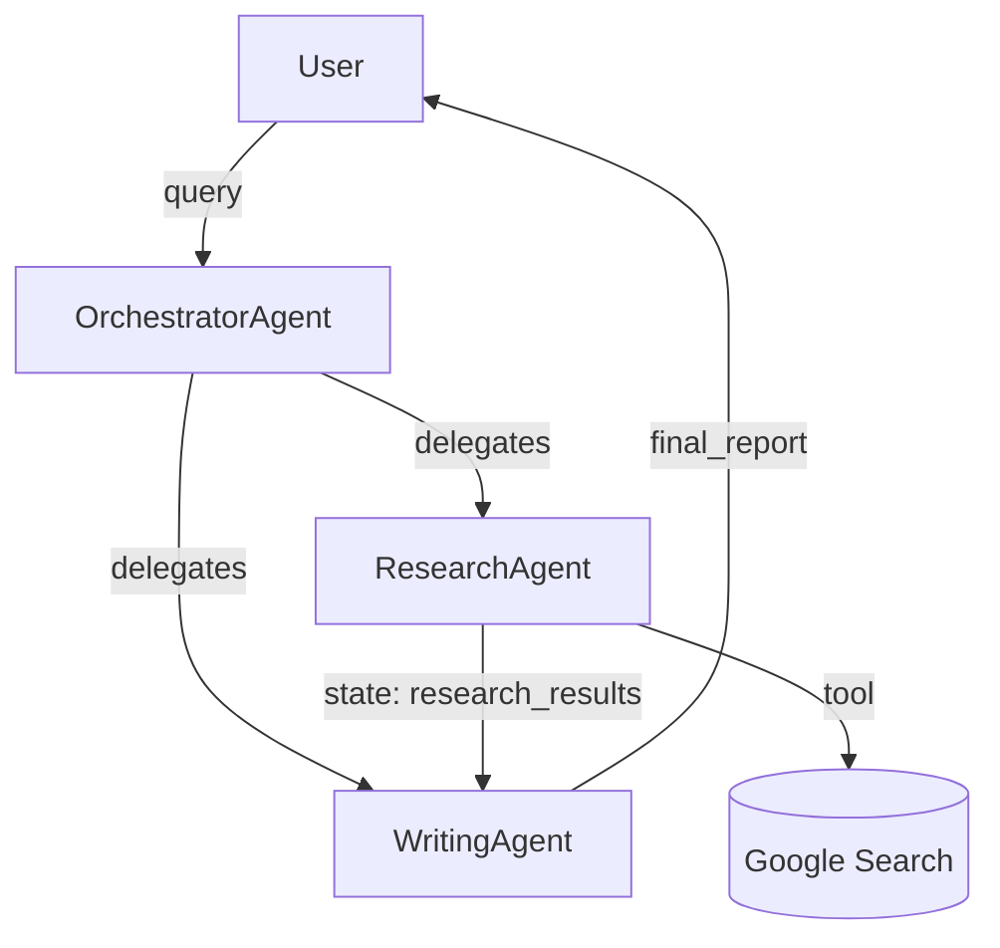

# Google ADK Multi-Agent Architect

This skill designs and generates complete Google ADK multi-agent architectures from a user's
task or requirement description. The output includes an architecture diagram, agent breakdown,
communication strategy, and full Python scaffold code.

---

## Step 1 — Understand the Requirement

Before designing anything, extract:

1. **Core task / goal** — what end-to-end outcome should the system achieve?
2. **Sub-tasks** — can you naturally decompose the work into distinct responsibilities?
3. **Data flow** — is processing sequential, parallel, iterative, or a mix?
4. **External integrations** — APIs, databases, search, code execution, MCP servers?
5. **Human oversight** — does any step require human approval or input?
6. **Scale / latency needs** — real-time streaming vs. batch?

If any of these are ambiguous, ask one focused clarifying question before proceeding.

---

## Step 2 — Select the Architecture Pattern(s)

Choose from the ADK primitive patterns below. A real system often **combines** multiple patterns.

| Pattern | ADK Primitive | When to Use |
|---|---|---|
| Sequential Pipeline | `SequentialAgent` | Ordered steps where each feeds the next |
| Parallel Fan-Out | `ParallelAgent` | Independent sub-tasks that can run concurrently |
| Coordinator/Dispatcher | `LlmAgent` + `sub_agents` (LLM transfer) | Dynamic routing; triage/classification first |
| Hierarchical Decomposition | Nested `LlmAgent` trees | Complex domains with specialist sub-teams |
| Iterative Refinement / Loop | `LoopAgent` | Generate → evaluate → refine cycles |
| Generator-Critic (Review) | Two `LlmAgent`s in sequence/loop | Quality assurance, validation, red-teaming |
| Human-in-the-Loop | `LlmAgent` + callback / tool pause | Approval gates, escalation paths |
| Agent-as-Tool | `AgentTool` wrapping an `LlmAgent` | Calling a sub-agent like a function |

**Decision heuristics:**
- Steps must happen in order? → `SequentialAgent`
- Steps are independent and slow? → `ParallelAgent`
- Which agent should run depends on content? → LLM-driven delegation via `sub_agents` + `description`
- A step needs to loop until a condition is met? → `LoopAgent`
- Need quality checks? → Generator + Critic in a `SequentialAgent` or `LoopAgent`

Read `adk-patterns.md` for detailed code examples of each pattern.

---

## Step 3 — Design the Agent Roster

For each agent in the system define:

```
Agent Name       : <descriptive name, snake_case>
Type             : LlmAgent | SequentialAgent | ParallelAgent | LoopAgent | CustomAgent
Model            : gemini-2.0-flash (default) | gemini-1.5-pro | other LiteLLM model
Responsibility   : One-sentence job description
Inputs           : What it receives (from session.state keys or user turn)
Outputs          : What it writes to session.state (output_key) or returns
Tools            : google_search | built_in_code_execution | custom FunctionTool | MCP | none
sub_agents       : List of child agents (if orchestrator)
```

**Naming convention:** Use `{Domain}{Role}Agent` e.g. `ResearchFetchAgent`, `SummaryWriterAgent`.

---

## Step 4 — Design the Communication Strategy

Pick the right inter-agent communication mechanism:

| Mechanism | How | Best For |
|---|---|---|
| Shared Session State | `output_key="state_key"` on sender; `{state_key}` in receiver instruction | Sequential data passing |
| LLM-Driven Transfer | Parent LlmAgent with `sub_agents=[...]`; each sub-agent has a clear `description` | Dynamic dispatch |
| AgentTool | `tools=[AgentTool(agent=my_agent)]` on the calling agent | Calling sub-agent like a function, getting return value |
| Temp State | `temp:key` prefix in state | Data scoped to current turn only |

---

## Step 5 — Generate the Architecture Diagram

Produce a text-based or Mermaid diagram showing:
- All agents as nodes
- Data/control flow as directed edges with labels
- Orchestrator agents clearly marked
- External tools/APIs shown as leaf nodes

Example Mermaid format:


---

## Step 6 — Generate Python Scaffold Code

Produce a complete, runnable Python project scaffold. Follow this structure:

```
my_adk_project/
├── agents/
│   ├── __init__.py
│   ├── orchestrator.py      # Root/coordinator agent
│   ├── <specialist_1>.py    # Each specialist agent in its own file
│   └── <specialist_2>.py
├── tools/
│   ├── __init__.py
│   └── custom_tools.py      # FunctionTool definitions
├── main.py                  # Entry point with Runner
└── requirements.txt
```

### Code Standards

**Agent definition pattern:**
```python
from google.adk.agents import LlmAgent, SequentialAgent, ParallelAgent, LoopAgent
from google.adk.tools import google_search, built_in_code_execution
from google.adk.tools.agent_tool import AgentTool

specialist_agent = LlmAgent(
    name="SpecialistAgent",
    model="gemini-2.0-flash",
    description="One-line description used by parent for routing decisions.",
    instruction="""
    You are a specialist in X. 
    Your input is available in: {input_state_key}
    Complete task Y and write results to output_key.
    """,
    output_key="specialist_output",  # writes to session.state
    tools=[google_search],
)
```

**Orchestrator with LLM delegation:**
```python
orchestrator = LlmAgent(
    name="OrchestratorAgent",
    model="gemini-2.0-flash",
    description="Routes tasks to the right specialist.",
    instruction="""
    You are the coordinator. Analyze the user's request and delegate to the 
    appropriate specialist agent. Always confirm task completion.
    """,
    sub_agents=[specialist_a, specialist_b, specialist_c],
)
```

**Sequential pipeline:**
```python
pipeline = SequentialAgent(
    name="ProcessingPipeline",
    sub_agents=[step1_agent, step2_agent, step3_agent],
)
```

**Parallel fan-out:**
```python
parallel = ParallelAgent(
    name="ParallelResearch",
    sub_agents=[research_a, research_b, research_c],
)
```

**Loop with termination:**
```python
loop = LoopAgent(
    name="RefinementLoop",
    sub_agents=[generator_agent, critic_agent],
    max_iterations=5,
)
# critic_agent sets `actions.escalate = True` in output to break the loop
```

**Runner / entry point:**
```python
from google.adk.runners import Runner
from google.adk.sessions import InMemorySessionService
import asyncio

async def main():
    session_service = InMemorySessionService()
    runner = Runner(
        agent=root_agent,
        app_name="my_multi_agent_app",
        session_service=session_service,
    )
    session = await session_service.create_session(
        app_name="my_multi_agent_app", user_id="user_1"
    )
    async for event in runner.run_async(
        user_id="user_1",
        session_id=session.id,
        new_message=types.Content(role="user", parts=[types.Part(text=USER_QUERY)]),
    ):
        if event.is_final_response():
            print(event.content.parts[0].text)

if __name__ == "__main__":
    asyncio.run(main())
```

**requirements.txt:**
```
google-adk>=0.5.0
google-generativeai>=0.8.0
```

---

## Step 7 — Output Checklist

Before presenting to the user, verify your design:

- [ ] Every agent has a single, clear responsibility
- [ ] Agent `description` fields are distinct enough for LLM routing
- [ ] `output_key` names don't collide between parallel agents
- [ ] Loop agents have a defined exit condition
- [ ] Human-in-the-loop gates are at the right decision points
- [ ] External tools/APIs are modeled as `FunctionTool` or built-ins
- [ ] No agent is doing too many things (split if > 2–3 distinct duties)
- [ ] The root agent / entry point is clearly identified

---

## Delivery Format

Always deliver in this order:

1. **Architecture Summary** — 2–3 sentences on the overall approach and chosen patterns
2. **Agent Roster Table** — one row per agent with name, type, responsibility, tools
3. **Architecture Diagram** — Mermaid `graph TD` block
4. **Python Code** — full scaffold, one code block per file, with filename headers
5. **Next Steps** — what to implement next (custom tools, environment variables, deployment)

For complex systems (6+ agents), offer to deep-dive into any single component.

---

## Reference Files

- `adk-patterns.md` — Detailed code examples for all 8 patterns with explanation
- `adk-tools.md` — Built-in tools, FunctionTool, MCP, and AgentTool reference
