# WSBCC → Spring Boot Microservices: Final Architecture (v3)

> **Revision history**
> - v1: Initial proposed architecture
> - v2: ADK primitive corrections, roster/diagram reconciliation, hash-check mechanism,
>   idempotency rules, `XmlCompatibilityAgent`, `CommonLibBuildAgent`, 4 approval gates,
>   LiteLLM `requirements.txt`
> - v3 (this document): Nine additional fixes applied — Tag Semantics Normalization Layer
>   (Phase 2.5), Context Model Transformation rules, Format→XML Serializer strategy,
>   immutable artifact enforcement, granular checkpoint types, LLM/tool responsibility
>   boundary rule, Behavioral Equivalence Testing (Phase 6), DB Repository Layer strategy,
>   GPU/memory-aware parallelization safety limits

---

## Architecture Summary

### Goal

Migrate an IBM WebSphere Business Component Composer (WSBCC) monolith — containing 1000+
XML-defined service operations — into independent Spring Boot microservices deployable on
OpenShift as Kubernetes objects. Each generated microservice must accept the exact legacy
XML request format, execute equivalent business logic with no IBM dependencies, and return
the exact legacy XML response format, making it a transparent drop-in replacement.

### Approach

The system is a **Google ADK multi-agent pipeline** running fully offline against a local
LLM via LiteLLM. Rather than letting agents explore the codebase freely, every agent
receives a deterministic task packet with explicit inputs and expected outputs. The
fundamental division of responsibility is strict: **Python tools handle all deterministic
work** (XML parsing, file I/O, dependency graphing, hashing, DB state, Maven compilation)
while **LLM agents handle only semantic work** (interpreting tag behavior, generating Java
from XML structure, reviewing code correctness). This keeps the migration stable,
reproducible, and debuggable across a codebase of this scale.

The pipeline processes the entire operation set in batches, using a shared component
registry to ensure that any XML tag, format, or Java class used by multiple operations
is converted exactly once and reused — preventing duplicate implementations across
hundreds of operations. All progress is persisted to a local database so any cancelled
or failed run can resume from its last completed checkpoint.

### Architecture Structure

The pipeline is organized into **eight sequential phases**, each with a distinct
responsibility boundary:

- **Phase 0 — Inventory:** Pure Python tools scan all XML operation files, `dse.ini`
  tag-to-class mappings, and existing Java source. Builds a complete operation inventory
  and flags unresolvable tags as blockers before any generation work begins.

- **Phase 1 — Dependency Graph:** For every operation, constructs a full dependency graph
  covering its opSteps, format definitions, context, and implClass Java files. This graph
  is the source of truth for all downstream generation — agents never scan files directly.

- **Phase 2 — Shared Component Conversion:** Converts all reusable WSBCC artifacts once:
  IBM implClass Java → native Java, `fmtDef` → Java DTO + XML serializer, `context` tag →
  strongly-typed context class, DB-bound steps → Spring Data repository interfaces. Each
  converted artifact is hash-registered so it is never regenerated.

- **Phase 2b — Common-Lib Build:** Compiles and installs the shared component JAR via
  Maven. This is a hard gate — no per-operation microservice can compile until the
  common-lib build is clean.

- **Phase 2.5 — Tag Semantics Normalization:** Extracts a behavioral contract for every
  unique WSBCC XML tag (inputs, context fields read/written, return codes, native Java
  equivalent). These contracts are stored in a registry that operation flow agents
  read directly, ensuring generated Java reflects actual tag behavior rather than guesses.

- **Phase 3 — Operation Flow Conversion:** Converts each operation's opStep return-code
  flow graph into native Java switch-on-rc orchestration, running up to
  `MAX_PARALLEL_OPERATIONS` operations concurrently in GPU-aware bounded batches. Each
  converted flow goes through a generate → critic → compile retry loop.

- **Phase 4 — Spring Boot Service Generation:** Assembles the full microservice project
  per operation: REST controller, service class, flow wiring, OpenShift deployment
  manifests.

- **Phase 5 & 6 — Validation:** Phase 5 compiles, unit-tests, and runs golden XML
  compatibility tests (exact request/response schema match). Phase 6 performs behavioral
  equivalence testing — sending the same XML input to both the legacy WSBCC endpoint and
  the new microservice and comparing responses, catching any semantic errors that survived
  compilation and unit tests.

Four **Human-in-the-Loop approval gates** sit between phases 0→1, 2→2b, 3→4, and 5→6,
giving operators checkpoints to review inventory quality, sample generated components,
approve a pilot batch of operations, and sign off the final migration report before
deployment manifests are finalized.

---

## LLM / Tool Responsibility Boundary Rule

This rule governs every agent and tool decision in the architecture:

```
IF the operation is deterministic (parsing, file read/write, hashing,
   DB lookup, XML validation, Maven compile, graph traversal)
   → implement as a Python FunctionTool — NO LLM

IF the operation requires semantic understanding (interpreting tag behavior,
   generating Java from XML structure, reviewing code correctness,
   converting opStep flow to switch logic)
   → implement as an LlmAgent

NEVER use an LlmAgent to do what a Python function can do deterministically.
```

Application to Phase 0 (fixes v2 issue #6):

| Task | v2 assignment | Correct assignment |
|---|---|---|
| Parse XML files | `LlmAgent` | Pure Python tool (`xml_parser_tool`) |
| Parse `dse.ini` | `LlmAgent` | Pure Python tool (`dse_ini_parser_tool`) |
| Scan Java source files | `LlmAgent` | Pure Python tool (`java_source_scanner_tool`) |
| Validate ambiguous metadata | `LlmAgent` | `LlmAgent` ✔ (only this remains) |
| Cross-validate tag registry vs dse_mapping | `LlmAgent` | Pure Python tool |

Phase 0 agents are now replaced by **Python-only coordinator tools** wrapped in thin
`LlmAgent` shells only for exception/ambiguity handling.

---

## Top-Level Constants

```python
# constants.py

APP_NAME = "composer_migration_adk"

# LiteLLM / local model — no cloud, offline-only
AGENT_MODEL      = "openai/local-model"
LITELLM_BASE_URL = "http://localhost:4000/v1"
LITELLM_API_KEY  = "local"

# Loop / retry limits
MAX_LOOP_RETRIES = 5

# Parallelization — GPU-aware (see Parallelization Safety section)
MAX_PARALLEL_OPERATIONS  = 4    # bounded ParallelAgent batch size
LLM_REQUEST_QUEUE_SIZE   = 4    # max concurrent LLM requests in-flight
LLM_CONTEXT_WINDOW_LIMIT = 8192 # tokens; tune per local model
INTER_BATCH_DELAY_SECS   = 2    # pause between batches to avoid GPU OOM

# Paths
COMPOSER_ROOT = "C:/wsbcc/source"
OUTPUT_ROOT   = "C:/migration/generated"

# Database (SQLite for local; swap to PostgreSQL for team use)
MIGRATION_DB_URL = "sqlite:///C:/migration/state/migration.db"

# Java / Maven
COMMON_LIB_GROUP_ID    = "com.company.migration"
COMMON_LIB_ARTIFACT_ID = "composer-common-lib"
JAVA_PACKAGE_BASE      = "com.company.generated"
SPRING_BOOT_VERSION    = "3.3.0"
JAVA_VERSION           = "17"

# Dependency guard — any import of these in generated code = hard failure
FORBIDDEN_DEPENDENCIES = [
    "com.ibm",
    "javax.ejb",
    "com.ibm.websphere",
    "com.ibm.wsbcc",
    "com.ibm.ws",
]

# Artifact immutability — generated artifacts keyed by (source_hash, schema_version)
ARTIFACT_SCHEMA_VERSION = "1"

# Behavioral equivalence test
GOLDEN_TESTS_ROOT       = "C:/migration/golden_tests"
LEGACY_SERVICE_BASE_URL = "http://legacy-wsbcc-host:8080"  # for golden capture only
```

---

## Migration Phases Overview

```
Phase 0 — Inventory & Index
          (Pure Python tools: XML parse, dse.ini parse, Java scan)
          (LlmAgent only for ambiguity resolution)
          ↓  [Human Approval Gate 0 — validate inventory + blockers]

Phase 1 — Dependency Graph
          (Pure Python tools: graph construction, cross-file ref resolution)
          ↓

Phase 2 — Shared Component Conversion
          (LlmAgent: Java class conversion, format DTO generation, context class generation)
          (LoopAgent: critic → compile retry per component)
          ↓  [Human Approval Gate 2 — sample shared components + common-lib build]

Phase 2b — Common-Lib Build
           (Maven tool only — hard gate, no LLM)
           ↓

Phase 2.5 — Tag Semantics Normalization   ← NEW in v3
            (LlmAgent: extract behavioral contracts for all WSBCC tags)
            (Output: tag_semantics_registry in DB)
            ↓

Phase 3 — Operation Flow Conversion
          (LlmAgent: opStep graph → Java switch-on-rc, informed by tag semantics)
          (LoopAgent: critic → compile retry per operation)
          ↓  [Human Approval Gate 3 — sample batch of 20 operations]

Phase 4 — Spring Boot Service Generation
          (LlmAgent: controller, service, XML serializer, OpenShift manifests)
          ↓

Phase 5 — Compile / Test / XML Golden Test / Final Review
          ↓  [Human Approval Gate 5 — full migration report]

Phase 6 — Behavioral Equivalence Testing   ← NEW in v3
          (Run legacy op + new microservice, compare XML responses)
          ↓  [Final sign-off]

Generated Spring Boot Microservices + OpenShift Manifests
```

---

## Checkpoint Types (Granular Resume Support)

Every DB state record carries a `checkpoint_type` so a resumed run knows exactly
where to re-enter the pipeline:

```python
class CheckpointType(str, Enum):
    # Phase 0
    INVENTORY_XML_SCANNED       = "inventory_xml_scanned"
    INVENTORY_DSE_MAPPED        = "inventory_dse_mapped"
    INVENTORY_JAVA_SCANNED      = "inventory_java_scanned"
    INVENTORY_DONE              = "inventory_done"          # Gate 0 entry point
    # Phase 1
    DEPENDENCY_GRAPH_DONE       = "dependency_graph_done"
    # Phase 2
    SHARED_COMPONENT_CONVERTED  = "shared_component_converted"
    SHARED_COMPONENT_COMPILED   = "shared_component_compiled"
    SHARED_COMPONENTS_DONE      = "shared_components_done"  # Gate 2 entry point
    # Phase 2b
    COMMON_LIB_BUILT            = "common_lib_built"
    # Phase 2.5
    TAG_SEMANTICS_EXTRACTED     = "tag_semantics_extracted"
    TAG_SEMANTICS_DONE          = "tag_semantics_done"
    # Phase 3
    OPERATION_FLOW_CONVERTED    = "operation_flow_converted"
    OPERATION_FLOW_COMPILED     = "operation_flow_compiled"
    OPERATION_FLOWS_DONE        = "operation_flows_done"    # Gate 3 entry point
    # Phase 4
    SERVICE_CONTROLLER_DONE     = "service_controller_done"
    SERVICE_LOGIC_DONE          = "service_logic_done"
    SERVICE_XML_SERIALIZER_DONE = "service_xml_serializer_done"
    SERVICE_OPENSHIFT_DONE      = "service_openshift_done"
    SERVICE_GENERATED           = "service_generated"
    # Phase 5
    SERVICE_COMPILED            = "service_compiled"
    SERVICE_TESTED              = "service_tested"
    SERVICE_XML_COMPAT_PASSED   = "service_xml_compat_passed"
    MIGRATION_REVIEW_DONE       = "migration_review_done"   # Gate 5 entry point
    # Phase 6
    BEHAVIORAL_TEST_CAPTURED    = "behavioral_test_captured"
    BEHAVIORAL_TEST_PASSED      = "behavioral_test_passed"
    MIGRATION_COMPLETE          = "migration_complete"
```

Resume logic in every agent:

```python
existing = state_store_tool.get_checkpoint(task_id)
if existing["checkpoint_type"] >= required_checkpoint:
    return existing["cached_output"]   # skip, return prior result
```


---

## Agent Roster (v3 — 38 agents)

Every agent that performs deterministic work calls a Python tool directly.
LLM agents are called only when semantic reasoning is required.
All agents check `get_checkpoint(task_id)` first — if `COMPLETED`, return cached output.

| # | Agent Name | ADK Type | Phase | LLM? | Responsibility | Tools |
|---|---|---|---|---|---|---|
| 1 | `RootMigrationOrchestratorAgent` | `SequentialAgent` | all | No | Sequences all phases and approval gates | — |
| **Phase 0 — Inventory** |
| 2 | `InventoryCoordinatorAgent` | `SequentialAgent` | 0 | No | Sequences the three inventory tools; writes combined inventory to DB | — |
| 3 | `XmlInventoryToolAgent` | `LlmAgent` | 0 | **No*** | Calls `xml_parser_tool` to scan all XML; flags structurally ambiguous files for human review | `xml_parser_tool`, `state_store_tool` |
| 4 | `DseIniInventoryToolAgent` | `LlmAgent` | 0 | **No*** | Calls `dse_ini_parser_tool`; cross-validates tag_registry vs dse_mapping; writes blocker_tags | `dse_ini_parser_tool`, `cross_validate_tool`, `state_store_tool` |
| 5 | `JavaInventoryToolAgent` | `LlmAgent` | 0 | **No*** | Calls `java_source_scanner_tool`; records implClass locations and setter signatures | `java_source_scanner_tool`, `state_store_tool` |
| 6 | `InventoryAmbiguityResolverAgent` | `LlmAgent` | 0 | **Yes** | Reviews flagged ambiguous files; classifies edge cases; updates inventory records | `xml_parser_tool`, `state_store_tool` |
| 7 | `HumanApprovalAgent` | `LlmAgent` | 0,2,3,5 | Yes | Presents gate summary; awaits operator decision; records to DB | `human_approval_tool` |
| **Phase 1 — Dependency Graph** |
| 8 | `DependencyGraphCoordinatorAgent` | `LlmAgent` | 1 | No | Iterates operation list from DB; calls per-operation dependency tools via AgentTool | `state_store_tool`, `AgentTool(OperationDependencyAgent)` |
| 9 | `OperationDependencyAgent` | `LlmAgent` | 1 | No | Builds one operation's dependency graph (opSteps, formats, contexts, implClasses) via tools | `xml_parser_tool`, `dependency_graph_tool`, `state_store_tool` |
| 10 | `FormatDependencyAgent` | `LlmAgent` | 1 | No | Resolves `refFormat`→`fmtDef` chains including cross-file; records all leaf tag types | `xml_parser_tool`, `state_store_tool` |
| 11 | `ContextDependencyAgent` | `LlmAgent` | 1 | No | Maps `operationContext`→`context`→parent chain; records all context field names | `xml_parser_tool`, `state_store_tool` |
| 12 | `JavaImplDependencyAgent` | `LlmAgent` | 1 | No | For each implClass: locates source, records setters, return-codes, and side-effects | `java_source_scanner_tool`, `state_store_tool` |
| **Phase 2 — Shared Component Conversion** |
| 13 | `SharedComponentCoordinatorAgent` | `SequentialAgent` | 2 | No | Reads unique components from DB; hash-checks registry; dispatches unconverted only | `component_registry_tool`, `AgentTool(JavaClassConverterAgent)`, `AgentTool(FormatConverterAgent)`, `AgentTool(ContextConverterAgent)` |
| 14 | `JavaClassConverterAgent` | `LlmAgent` | 2 | **Yes** | Converts one IBM implClass to native Java; removes all IBM deps; uses tag semantics if available | `read_file_tool`, `write_file_tool`, `component_registry_tool`, `dependency_check_tool` |
| 15 | `FormatConverterAgent` | `LlmAgent` | 2 | **Yes** | Converts one WSBCC `fmtDef` to Java DTO; delegates XML serializer generation to `XmlSerializerGeneratorAgent` | `read_file_tool`, `write_file_tool`, `xml_parser_tool`, `component_registry_tool` |
| 16 | `XmlSerializerGeneratorAgent` | `LlmAgent` | 2 | **Yes** | Generates `XmlBuilder`/`XmlParser` classes for one format using the XML serializer strategy | `read_file_tool`, `write_file_tool`, `xml_serializer_strategy_tool` |
| 17 | `ContextConverterAgent` | `LlmAgent` | 2 | **Yes** | Converts one WSBCC `context` tag to a strongly-typed Java context class (see Context Model rules) | `read_file_tool`, `write_file_tool`, `component_registry_tool` |
| 18 | `DbRepositoryGeneratorAgent` | `LlmAgent` | 2 | **Yes** | For each DB-bound implClass (stored procs, DB accessors): generates Spring Data `@Repository` interface and implementation | `read_file_tool`, `write_file_tool`, `java_source_scanner_tool`, `component_registry_tool` |
| 19 | `ConversionCriticAgent` | `LlmAgent` | 2,3 | **Yes** | Reviews generated Java: IBM dep removal, setter naming, return-code coverage, context field coverage, XML serializer correctness | `dependency_check_tool`, `state_store_tool` |
| 20 | `ConversionCompileAgent` | `LlmAgent` | 2,3 | No | Runs `mvn compile` on one unit; returns stdout/stderr; sets `escalate=True` on success | `maven_compile_tool`, `state_store_tool` |
| 21 | `SharedComponentRefinementLoopAgent` | `LoopAgent` | 2 | — | Wraps `[ConversionCriticAgent → ConversionCompileAgent]` per component; exits on escalate or MAX_LOOP_RETRIES | — |
| **Phase 2b — Common-Lib Build** |
| 22 | `CommonLibBuildAgent` | `LlmAgent` | 2b | No | Runs `mvn install` on common-lib; verifies zero errors; writes build status; halts pipeline on failure | `maven_compile_tool`, `state_store_tool` |
| **Phase 2.5 — Tag Semantics Normalization** |
| 23 | `TagSemanticsCoordinatorAgent` | `SequentialAgent` | 2.5 | No | Reads all unique tag types from tag_registry; dispatches `TagSemanticExtractorAgent` per tag type | `state_store_tool`, `AgentTool(TagSemanticExtractorAgent)` |
| 24 | `TagSemanticExtractorAgent` | `LlmAgent` | 2.5 | **Yes** | For one tag type: reads its Java source, dse.ini entry, and XML usage examples; produces a semantic contract record | `read_file_tool`, `java_source_scanner_tool`, `xml_parser_tool`, `state_store_tool` |
| 25 | `TagSemanticCriticAgent` | `LlmAgent` | 2.5 | **Yes** | Reviews semantic contract for completeness: inputs, outputs, side-effects, behavior_type, context fields written | `state_store_tool` |
| **Phase 3 — Operation Flow Conversion** |
| 26 | `OperationBatchDispatcherAgent` | `LlmAgent` | 3 | No | Pages operation list from DB; dispatches bounded batches via AgentTool | `state_store_tool`, `AgentTool(OperationBatchAgent)` |
| 27 | `OperationBatchAgent` | `ParallelAgent` | 3 | — | Runs MAX_PARALLEL_OPERATIONS OperationFlowConverterAgent slots concurrently | — |
| 28 | `OperationFlowConverterAgent` | `LlmAgent` | 3 | **Yes** | Converts one operation's opStep graph to Java switch-on-rc; reads tag_semantics_registry to correctly wire each step | `read_file_tool`, `write_file_tool`, `dependency_graph_tool`, `component_registry_tool`, `tag_semantics_tool` |
| 29 | `OperationRefinementLoopAgent` | `LoopAgent` | 3 | — | Wraps `[ConversionCriticAgent → ConversionCompileAgent]` per operation flow | — |
| **Phase 4 — Spring Boot Service Generation** |
| 30 | `SpringBootServiceGeneratorAgent` | `SequentialAgent` | 4 | No | Per-operation: sequences Controller → Service → OpenShift generation | — |
| 31 | `ControllerGeneratorAgent` | `LlmAgent` | 4 | **Yes** | Generates `@RestController` accepting legacy XML; delegates to service layer | `write_file_tool`, `component_registry_tool` |
| 32 | `ServiceGeneratorAgent` | `LlmAgent` | 4 | **Yes** | Generates `@Service` wiring operation flow, DTOs, context, and repository layer | `write_file_tool`, `component_registry_tool` |
| 33 | `OpenShiftManifestAgent` | `LlmAgent` | 4 | **Yes** | Generates deployment, service, route, and configmap YAML | `write_file_tool`, `yaml_validator_tool` |
| **Phase 5 — Compile / Test / XML Compat** |
| 34 | `ServiceCompileTestAgent` | `LlmAgent` | 5 | No | Runs `mvn test` on one generated service; writes pass/fail to DB | `maven_compile_tool`, `state_store_tool` |
| 35 | `XmlCompatibilityAgent` | `LlmAgent` | 5 | No | Sends golden request XML; compares response to golden response XML; writes diff to DB | `xml_golden_test_tool`, `state_store_tool` |
| 36 | `FinalReviewAgent` | `LlmAgent` | 5 | **Yes** | Aggregates all results; produces migration completion report with pass/fail per operation | `state_store_tool`, `read_file_tool` |
| **Phase 6 — Behavioral Equivalence Testing** |
| 37 | `BehavioralEquivalenceCoordinatorAgent` | `SequentialAgent` | 6 | No | Sequences: capture legacy response → run new service → compare | — |
| 38 | `BehavioralEquivalenceAgent` | `LlmAgent` | 6 | No | For one operation: sends same XML input to both legacy endpoint and new service; compares XML output byte-by-byte and schema-level | `behavioral_test_tool`, `xml_diff_tool`, `state_store_tool` |

*Agents 3–5 are thin shells calling Python tools; they use LLM only if a tool returns an
ambiguity flag — see InventoryAmbiguityResolverAgent for that path.*

---

## Phase 2.5 — Tag Semantics Normalization Layer (NEW)

### Problem it solves

WSBCC tags are Java classes with setters + `execute()`. Without knowing what a tag
**does** (writes to context, reads from context, formats output, queries DB, etc.),
the `OperationFlowConverterAgent` will guess behavior and generate incorrect Java.

### Semantic Contract Record

```python
# Stored in DB table: tag_semantics
{
  "tag_name":       "CCDate",
  "java_class":     "com.ibm.composer.CCDate",
  "source_path":    "C:/wsbcc/source/impl/CCDate.java",
  "source_hash":    "a3f9b2c1d4e5",
  "behavior_type":  "formatter",           # formatter | db_accessor | validator |
                                           # flow_control | error_mapper | collector
  "inputs": [
    {"attribute": "dataName",    "type": "String", "maps_to": "context_field"},
    {"attribute": "pattern",     "type": "String", "maps_to": "format_pattern"},
    {"attribute": "useSep",      "type": "String", "maps_to": "flag"},
    {"attribute": "fourDigYear", "type": "String", "maps_to": "flag"}
  ],
  "context_reads":  ["dataName"],          # context fields this tag reads
  "context_writes": ["dataName_formatted"],# context fields this tag writes/mutates
  "side_effects":   ["formats date string in context"],
  "return_codes": {
    "0": "success",
    "other": "format_failed"
  },
  "native_java_equivalent": "DateTimeFormatter pattern; format context field",
  "extraction_confidence": "high"          # high | medium | low
}
```

### Low-confidence handling

If `extraction_confidence == "low"`:
- Record is flagged in DB as `NEEDS_REVIEW`
- `HumanApprovalAgent` at Gate 3 presents all low-confidence tags
- Operator can provide a correction before bulk Phase 3 runs

### `TagSemanticExtractorAgent` instruction pattern

```
You receive:
  tag_name:      {tag_name}
  java_source:   {java_source}
  dse_entry:     {dse_entry}
  xml_examples:  {xml_usage_examples}   ← from operations that use this tag

Produce a semantic contract JSON with these exact fields:
  behavior_type, inputs, context_reads, context_writes,
  side_effects, return_codes, native_java_equivalent, extraction_confidence

Rules:
- behavior_type must be one of: formatter | db_accessor | validator |
  flow_control | error_mapper | collector
- Every XML attribute must appear in inputs
- context_reads and context_writes must be field names only (no types)
- native_java_equivalent is a 1-2 sentence description of the
  idiomatic Java replacement (no IBM code)
- If you cannot determine something with confidence, set
  extraction_confidence to "low" — do NOT guess
```

---

## Context Model Transformation Rules (NEW)

### Problem it solves

WSBCC context is global mutable state shared across all opSteps in one operation.
Converting it to a plain DTO loses the lifecycle semantics (what gets set when,
what persists to the response). Every operation **must** have a generated strongly-typed
Context class.

### Rules

1. **One Context class per operation** — never shared between operations.
2. **Context class is the single state carrier** — all generated flow steps receive
   and return it; no raw DTO passing between steps.
3. **Fields come from two sources:**
   - `context_reads` / `context_writes` in tag_semantics_registry for every tag used
   - `fmtDef` field names for request and response formats
4. **Field naming** — preserve original `dataName` values from XML as Java field names
   (camelCase conversion applied).
5. **Context class is in `common-lib`** if used by more than one operation; otherwise
   in the per-service package.

### Generated context class pattern

```java
// Generated by ContextConverterAgent for operation: GetLinksOp
// Source context tag: GetLinksCtxt (parent: nil, type: op)
// Fields derived from: tag_semantics_registry + GetLinksRQFmt + GetLinksRSFmt

package com.company.migration.context;

public class GetLinksContext {
    // From request format (GetLinksRQFmt)
    private String clientId;
    private String clientName;

    // Written by GetClientLinks step (db_accessor)
    private List<LinkRecord> links;

    // Written by error-mapping steps
    private String errorCategory;
    private String errorNumber;
    private boolean operationFailed;

    // Getters and setters omitted for brevity
}
```

### `ContextConverterAgent` instruction pattern

```
You receive:
  operation_id:        {operation_id}
  context_tag:         {context_tag_xml}
  request_format:      {request_fmtDef_xml}
  response_format:     {response_fmtDef_xml}
  tag_semantics:       {tag_semantics_for_all_steps_in_this_operation}

Generate a Java class named {ContextClassName} with:
  1. One private field per dataName in the request format (camelCase)
  2. One private field per context_writes entry in tag_semantics (camelCase)
  3. One private field per dataName in the response format not already declared
  4. Standard getters and setters
  5. No IBM imports
  6. Package: {java_package_base}.context

The context class is the ONLY object passed between flow steps — not raw DTOs.
```

---

## Format → XML Serializer Strategy (NEW)

### Problem it solves

WSBCC formats contain nested `CCXML`, `CCTcoll`, decorators, transparent wrappers,
and table lookups. A simple DTO does not reproduce the exact legacy XML structure.
Without a deterministic XML builder, the generated services will fail the golden test.

### Strategy

For every `fmtDef`, two artifacts are generated:

| Artifact | Purpose |
|---|---|
| `{FormatName}Dto.java` | Plain Java POJO with all fields |
| `{FormatName}XmlSerializer.java` | Builds / parses exact legacy XML |

### XML Serializer Generator Rules

The `XmlSerializerGeneratorAgent` applies these rules deterministically:

```
CCXML(transparent=false)    → create wrapper element with dataName
CCXML(transparent=true)     → do not create wrapper; inline children directly
CCString                    → simple text element
CCDate(pattern, useSep ...) → format date using pattern before writing element
CCTcoll(times="*")          → write a list, one child element per item
CCTcoll(times=N)            → write exactly N child elements
CCTableFormat               → lookup from repository; write looked-up string value
NumberFormat(showThousandsSep, showDecimalsSep) → format number before writing
nilDecorator                → write empty element if value is null
```

### Generated serializer pattern

```java
// Generated by XmlSerializerGeneratorAgent for: GetLinksRSFmt
package com.company.migration.xml;

public class GetLinksRSFmtXmlSerializer {

    public String serialize(GetLinksContext context) {
        StringBuilder xml = new StringBuilder();
        // CCXML transparent=true → no wrapper
        //   CCXML transparent=true → no wrapper
        //     CCXML transparent=true → no wrapper (ReqParams)
        xml.append("<ClientId>").append(escape(context.getClientId()))
           .append("</ClientId>");
        xml.append("<ClientName>").append(escape(context.getClientName()))
           .append("</ClientName>");
        //     CCTcoll dataName=LinksBlock times=*
        for (LinkRecord link : context.getLinks()) {
            //       CCXML unnamed=false dataName=DocData
            xml.append("<DocData>");
            xml.append("<DocId>").append(escape(link.getDocId())).append("</DocId>");
            xml.append("<Flag>").append(escape(link.getFlag())).append("</Flag>");
            // CCTableFormat → repository lookup already in context
            xml.append("<LinkDescription>")
               .append(escape(link.getLinkDescription()))
               .append("</LinkDescription>");
            // nilDecorator → empty element if null
            // CCDate pattern=yyyyMMdd useSep=no fourDigYear=yes
            String writtenAt = formatDate(link.getWrittenAt(), "yyyyMMdd");
            xml.append("<WrittenAt>").append(writtenAt).append("</WrittenAt>");
            xml.append("</DocData>");
        }
        return xml.toString();
    }

    public GetLinksContext deserialize(String xmlInput) {
        // Reverse mapping using same structural rules
        // ...
    }
}
```

### `xml_serializer_strategy_tool` (pure Python)

```python
# tools/composer/xml_serializer_strategy_tool.py
# Pure Python — no LLM.
# Reads a fmtDef XML tree and produces a serializer_plan dict that
# XmlSerializerGeneratorAgent uses as its precise code generation spec.

def build_serializer_plan(fmt_def_xml: str) -> dict:
    """
    Walks the fmtDef tag tree deterministically.
    Returns:
    {
      "format_id": str,
      "steps": [
        {"tag": "CCXML", "dataName": "Response", "transparent": True,  "action": "inline"},
        {"tag": "CCString","dataName": "ClientId",                      "action": "text_element"},
        {"tag": "CCTcoll", "dataName": "LinksBlock", "times": "*",      "action": "list_loop"},
        {"tag": "CCDate",  "dataName": "WrittenAt",  "pattern": "yyyyMMdd", "action": "date_format"},
        ...
      ]
    }
    """
```

---

## DB Repository Layer Strategy (NEW)

### Problem it solves

Many WSBCC implClasses are DB accessors (stored procedures, JDBC calls). Converting
them to plain Java classes loses the clean separation needed for Spring Boot testing
and future maintenance.

### Rule

For every implClass whose `behavior_type == "db_accessor"` in the tag_semantics_registry:

1. Generate a Spring Data `@Repository` interface.
2. Generate an implementation using `JdbcTemplate` or `@StoredProcedure`.
3. Store both in `common-lib/db/` if reused across operations; else in service package.
4. The generated Flow class injects the repository via constructor injection — never
   instantiates DB classes directly.

### Generated repository pattern

```java
// Generated by DbRepositoryGeneratorAgent for: db.GetClientLinksSP
// Source behavior_type: db_accessor

// --- Interface (in common-lib) ---
package com.company.migration.db;

public interface GetClientLinksRepository {
    /**
     * Maps to stored procedure: GetClientLinksSP
     * Returns:
     *   0 = success (links populated)
     *   4 = data not found
     *   5 = invalid links
     *   other = operation failed
     */
    int execute(GetLinksContext context);
}

// --- Implementation ---
package com.company.migration.db;

@Repository
public class GetClientLinksRepositoryImpl implements GetClientLinksRepository {

    private final JdbcTemplate jdbc;

    public GetClientLinksRepositoryImpl(JdbcTemplate jdbc) {
        this.jdbc = jdbc;
    }

    @Override
    public int execute(GetLinksContext context) {
        // Generated from original stored procedure call
        // context.getClientId() → SP input param
        // result rows → context.setLinks(...)
        try {
            List<LinkRecord> rows = jdbc.query(
                "CALL GetClientLinks(?)",
                new Object[]{ context.getClientId() },
                new LinkRecordRowMapper()
            );
            context.setLinks(rows);
            return 0;
        } catch (EmptyResultDataAccessException e) {
            return 4;
        } catch (InvalidDataAccessApiUsageException e) {
            return 5;
        } catch (DataAccessException e) {
            return -1;
        }
    }
}
```

### `DbRepositoryGeneratorAgent` is called from `SharedComponentCoordinatorAgent`

In the agent roster above, `DbRepositoryGeneratorAgent` (agent #18) is dispatched
in parallel with `JavaClassConverterAgent` for all components where
`behavior_type == "db_accessor"`. Its output is registered in `component_registry`
under `kind="repository"`.

---

## Phase 6 — Behavioral Equivalence Testing (NEW)

### Problem it solves

Phase 5 validates XML structure (golden test). Phase 6 validates **runtime behavior** —
the new microservice must produce the same XML response as the legacy WSBCC operation
when given the same XML input. This catches semantic errors that compile and even
pass unit tests.

### Mechanism

```
For each operation (or representative sample):
  1. Send XML request to legacy WSBCC endpoint → capture response_legacy.xml
  2. Send same XML request to new Spring Boot service → capture response_new.xml
  3. Compare:
       a. Schema equivalence (element names, hierarchy, types) — MUST pass
       b. Value equivalence (same data values) — MUST pass for non-time fields
       c. Date/number formatting — MUST match exactly (pattern-level)
  4. Write result to DB: behavioral_equivalence table
  5. On mismatch: write diff, set operation status=BEHAVIORAL_MISMATCH
```

### `behavioral_test_tool` (pure Python)

```python
# tools/validation/behavioral_test_tool.py

def run_behavioral_equivalence_test(
    operation_id: str,
    request_xml: str,
    legacy_base_url: str,
    new_service_base_url: str,
    run_id: str
) -> dict:
    """
    Returns:
    {
      "passed": bool,
      "schema_match": bool,
      "value_match": bool,
      "format_match": bool,
      "diff": str | None,
      "legacy_response_path": str,
      "new_response_path": str
    }
    """
```

### Offline fallback

If `LEGACY_SERVICE_BASE_URL` is not reachable (fully offline environment):
- Phase 6 uses golden XML files from `GOLDEN_TESTS_ROOT` as the legacy response
- Same comparison logic applies
- This is the default for fully-offline runs; set `BEHAVIORAL_TEST_MODE = "offline"`
  in `constants.py`

```python
# constants.py addition
BEHAVIORAL_TEST_MODE = "offline"   # "offline" | "live"
```

---

## Artifact Immutability Enforcement (NEW)

### Rule

Generated artifacts are **immutable** per `(source_hash, ARTIFACT_SCHEMA_VERSION)`.
If an artifact already exists for a given hash+version, it is never regenerated — the
existing file is reused.

### Enforcement in `component_registry_tool`

```python
def get_or_create_artifact(
    component_id: str,   # "{kind}:{source_hash}:{logical_name}"
    run_id: str,
    generate_fn: callable,   # called only if not already generated
) -> dict:
    """
    1. Check if artifact exists for (component_id, ARTIFACT_SCHEMA_VERSION)
    2. If yes → return {"artifact_path": existing_path, "generated": False}
    3. If no  → call generate_fn(), store result, return {"artifact_path": new_path, "generated": True}
    """
    existing = check_if_converted(component_id, run_id)
    if existing["already_converted"]:
        return {"artifact_path": existing["generated_path"], "generated": False}
    result = generate_fn()
    register_converted(component_id, run_id, result["path"], component_id.split(":")[1])
    return {"artifact_path": result["path"], "generated": True}
```

This function is called by all converter agents before invoking the LLM.
The LLM is **never called** if the artifact already exists.

### Artifact path structure

```
generated/
├── common-lib/
│   └── src/main/java/com/company/migration/
│       └── {kind}/
│           └── {logical_name}__{source_hash[:8]}_v{ARTIFACT_SCHEMA_VERSION}.java
└── services/
    └── {operation_id}-service/
        └── ...
```

The `source_hash` in the filename ensures two different source files that happen
to have the same logical name never collide.

---

## Parallelization Safety Limits (NEW)

### Problem

Running MAX_PARALLEL_OPERATIONS=4 LLM requests simultaneously against a single
local GPU (e.g., RTX 3090 with 24GB VRAM) can cause:
- GPU OOM if multiple large-context requests overlap
- LLM queue starvation
- Corrupted responses from context truncation

### Safety controls added to `constants.py`

```python
MAX_PARALLEL_OPERATIONS  = 4
LLM_REQUEST_QUEUE_SIZE   = 4     # hard cap on concurrent requests
LLM_CONTEXT_WINDOW_LIMIT = 8192  # tokens; tune for your model
INTER_BATCH_DELAY_SECS   = 2     # pause between batches; prevents GPU spike
```

### `llm_queue_tool` (pure Python, wraps LiteLLM calls)

```python
# tools/llm/llm_queue_tool.py
import asyncio
from constants import LLM_REQUEST_QUEUE_SIZE, INTER_BATCH_DELAY_SECS

_semaphore = asyncio.Semaphore(LLM_REQUEST_QUEUE_SIZE)

async def queued_llm_call(prompt: str, model: str, max_tokens: int) -> str:
    """
    Wraps every LiteLLM call with a semaphore to prevent concurrent GPU overload.
    All LlmAgent tool calls that involve large context should route through this.
    """
    async with _semaphore:
        result = await litellm.acompletion(
            model=model,
            messages=[{"role": "user", "content": prompt}],
            max_tokens=max_tokens,
        )
        await asyncio.sleep(INTER_BATCH_DELAY_SECS)
        return result.choices[0].message.content
```

### Context size guard

Before any agent constructs its input prompt, `context_size_guard_tool` estimates
token count and truncates / splits if it exceeds `LLM_CONTEXT_WINDOW_LIMIT`:

```python
# tools/llm/context_size_guard_tool.py

def guard_context_size(text: str, label: str) -> dict:
    """
    Estimates token count (chars/4 approximation).
    Returns: {"ok": bool, "estimated_tokens": int, "truncated_text": str | None}
    If over limit: truncates and logs a warning to DB.
    """
    estimated = len(text) // 4
    if estimated > LLM_CONTEXT_WINDOW_LIMIT:
        truncated = text[:LLM_CONTEXT_WINDOW_LIMIT * 4]
        log_warning(f"{label} truncated: {estimated} → {LLM_CONTEXT_WINDOW_LIMIT} tokens")
        return {"ok": False, "estimated_tokens": estimated, "truncated_text": truncated}
    return {"ok": True, "estimated_tokens": estimated, "truncated_text": None}
```


---

## Database Schema (v3)

```sql
-- db/schema.sql

CREATE TABLE runs (
    run_id        TEXT PRIMARY KEY,
    status        TEXT NOT NULL,        -- RUNNING | PAUSED | COMPLETED | FAILED
    composer_root TEXT NOT NULL,
    output_root   TEXT NOT NULL,
    created_at    TIMESTAMP DEFAULT CURRENT_TIMESTAMP,
    updated_at    TIMESTAMP DEFAULT CURRENT_TIMESTAMP
);

CREATE TABLE operations (
    run_id             TEXT NOT NULL,
    operation_id       TEXT NOT NULL,
    source_xml         TEXT NOT NULL,
    operation_context  TEXT,
    status             TEXT NOT NULL,   -- PENDING | IN_PROGRESS | COMPLETED | FAILED | BLOCKED
    checkpoint_type    TEXT,            -- latest CheckpointType value reached
    dependency_hash    TEXT,
    PRIMARY KEY (run_id, operation_id)
);

CREATE TABLE components (
    run_id              TEXT NOT NULL,
    component_id        TEXT NOT NULL,  -- "{kind}:{source_hash}:{logical_name}"
    component_type      TEXT NOT NULL,  -- format | context | implclass | repository | serializer
    logical_name        TEXT NOT NULL,
    source_path         TEXT,
    source_hash         TEXT,
    artifact_schema_ver TEXT,
    generated_path      TEXT,
    status              TEXT NOT NULL,  -- PENDING | COMPLETED | FAILED
    checkpoint_type     TEXT,
    PRIMARY KEY (run_id, component_id)
);

CREATE TABLE tag_semantics (
    run_id               TEXT NOT NULL,
    tag_name             TEXT NOT NULL,
    java_class           TEXT,
    source_path          TEXT,
    source_hash          TEXT,
    behavior_type        TEXT,          -- formatter|db_accessor|validator|flow_control|error_mapper|collector
    inputs_json          TEXT,          -- JSON array of {attribute, type, maps_to}
    context_reads_json   TEXT,          -- JSON array of field names
    context_writes_json  TEXT,          -- JSON array of field names
    side_effects_json    TEXT,
    return_codes_json    TEXT,          -- JSON {"0":"success", ...}
    native_java_equiv    TEXT,
    extraction_confidence TEXT,         -- high | medium | low
    status               TEXT NOT NULL, -- PENDING | COMPLETED | NEEDS_REVIEW | FAILED
    PRIMARY KEY (run_id, tag_name)
);

CREATE TABLE blocker_tags (
    run_id       TEXT NOT NULL,
    tag_name     TEXT NOT NULL,
    source_xml   TEXT,
    operation_id TEXT,
    status       TEXT NOT NULL,         -- UNRESOLVED | WAIVED
    PRIMARY KEY (run_id, tag_name)
);

CREATE TABLE agent_tasks (
    task_id         TEXT PRIMARY KEY,
    run_id          TEXT NOT NULL,
    operation_id    TEXT,
    agent_name      TEXT NOT NULL,
    status          TEXT NOT NULL,      -- PENDING | IN_PROGRESS | COMPLETED | FAILED
    checkpoint_type TEXT,
    attempt         INTEGER DEFAULT 1,
    input_json      TEXT,
    output_json     TEXT,
    error_text      TEXT,
    created_at      TIMESTAMP DEFAULT CURRENT_TIMESTAMP,
    updated_at      TIMESTAMP DEFAULT CURRENT_TIMESTAMP
);

CREATE TABLE artifacts (
    artifact_id          TEXT PRIMARY KEY,
    run_id               TEXT NOT NULL,
    operation_id         TEXT,
    artifact_type        TEXT NOT NULL,  -- java_class | dto | serializer | context | repository |
                                         -- controller | service | flow | openshift | xml_compat |
                                         -- behavioral_equiv | test
    path                 TEXT NOT NULL,
    sha256               TEXT,
    artifact_schema_ver  TEXT,
    status               TEXT NOT NULL   -- PENDING | PASSED | FAILED
);

CREATE TABLE approval_gates (
    gate_id     TEXT PRIMARY KEY,        -- "{run_id}:gate_{N}"
    run_id      TEXT NOT NULL,
    gate_name   TEXT NOT NULL,
    decision    TEXT,                    -- approve | reject | modify
    instruction TEXT,
    decided_at  TIMESTAMP
);

CREATE TABLE behavioral_equivalence (
    run_id               TEXT NOT NULL,
    operation_id         TEXT NOT NULL,
    schema_match         BOOLEAN,
    value_match          BOOLEAN,
    format_match         BOOLEAN,
    diff_path            TEXT,
    legacy_response_path TEXT,
    new_response_path    TEXT,
    status               TEXT NOT NULL,  -- PENDING | PASSED | BEHAVIORAL_MISMATCH
    PRIMARY KEY (run_id, operation_id)
);
```

---

## State Key Design

All durable state lives in the DB. ADK `output_key` values are intra-turn only.
Parallel agent instances use **DB keys only** — never shared ADK session state.

**DB state key hierarchy:**
```
runs/{run_id}/status
runs/{run_id}/inventory/operation_count
runs/{run_id}/inventory/blocker_count
runs/{run_id}/approval/gate_{N}

runs/{run_id}/operations/{operation_id}/checkpoint
runs/{run_id}/operations/{operation_id}/dependency_graph
runs/{run_id}/operations/{operation_id}/flow_conversion/status
runs/{run_id}/operations/{operation_id}/xml_compat/status
runs/{run_id}/operations/{operation_id}/behavioral_equiv/status

runs/{run_id}/components/{component_id}/status
runs/{run_id}/components/{component_id}/generated_path
runs/{run_id}/components/{component_id}/compile_status

runs/{run_id}/tag_semantics/{tag_name}/status
runs/{run_id}/tag_semantics/{tag_name}/confidence

runs/{run_id}/services/{operation_id}/controller/status
runs/{run_id}/services/{operation_id}/service/status
runs/{run_id}/services/{operation_id}/openshift/status

runs/{run_id}/build/common_lib/status
```

**ADK `output_key` names (intra-pipeline, non-colliding):**
```
inventory_scan_result
dse_mapping_result
java_registry_result
approval_gate_0_result
approval_gate_2_result
approval_gate_3_result
approval_gate_5_result
common_lib_build_status
tag_semantics_done
operation_batch_dispatch_status
final_review_report
behavioral_equiv_summary
flow_result_{slot_index}    ← unique per parallel slot (0..MAX_PARALLEL_OPERATIONS-1)
```

---

## Mermaid Architecture Diagram

```mermaid
graph TD
    START([Operator]) -->|run_id| ROOT

    ROOT["RootMigrationOrchestratorAgent\nSequentialAgent — ROOT ORCHESTRATOR"]

    ROOT -->|phase 0| INV
    subgraph PHASE0["Phase 0 — Inventory & Index  (Python tools only)"]
        INV["InventoryCoordinatorAgent\nSequentialAgent"]
        INV --> XMLTOOL["XmlInventoryToolAgent\nLlmAgent — calls xml_parser_tool"]
        INV --> DSETOOL["DseIniInventoryToolAgent\nLlmAgent — calls dse_ini_parser_tool"]
        INV --> JAVATOOL["JavaInventoryToolAgent\nLlmAgent — calls java_source_scanner_tool"]
        INV --> AMBIG["InventoryAmbiguityResolverAgent\nLlmAgent — semantic only"]
        XMLTOOL --> T_XML[(xml_parser_tool\nPure Python)]
        DSETOOL --> T_DSE[(dse_ini_parser_tool\nPure Python)]
        DSETOOL --> T_CROSS[(cross_validate_tool\nPure Python)]
        T_CROSS -->|blockers| BLKDB[(blocker_tags DB)]
        JAVATOOL --> T_JAVASRC[(java_source_scanner_tool\nPure Python)]
        AMBIG -->|LLM resolves edge cases| T_DB[(state_store_tool / DB)]
        XMLTOOL --> T_DB
        DSETOOL --> T_DB
        JAVATOOL --> T_DB
    end

    ROOT -->|gate 0| GATE0["HumanApprovalAgent gate_0\nReview: inventory + blockers"]
    GATE0 -->|approve| ROOT
    GATE0 -->|reject| PAUSE[(Pipeline paused in DB)]

    ROOT -->|phase 1| DEPCOORD
    subgraph PHASE1["Phase 1 — Dependency Graph  (Python tools only)"]
        DEPCOORD["DependencyGraphCoordinatorAgent\nLlmAgent — iterates via AgentTool"]
        DEPCOORD -->|AgentTool per op| OPDEP["OperationDependencyAgent"]
        DEPCOORD -->|AgentTool per op| FMTDEP["FormatDependencyAgent"]
        DEPCOORD -->|AgentTool per op| CTXDEP["ContextDependencyAgent"]
        DEPCOORD -->|AgentTool per op| JAVAIMP["JavaImplDependencyAgent"]
        OPDEP --> T_GRAPH[(dependency_graph_tool\nPure Python)]
        FMTDEP --> T_GRAPH
        CTXDEP --> T_GRAPH
        JAVAIMP --> T_JAVASRC2[(java_source_scanner_tool)]
        OPDEP --> T_DB
        FMTDEP --> T_DB
        CTXDEP --> T_DB
        JAVAIMP --> T_DB
    end

    ROOT -->|phase 2| SHAREDCOORD
    subgraph PHASE2["Phase 2 — Shared Component Conversion"]
        SHAREDCOORD["SharedComponentCoordinatorAgent\nSequentialAgent"]
        SHAREDCOORD -->|check_if_converted| COMPREG[(component_registry_tool\nPure Python)]
        SHAREDCOORD -->|AgentTool unconverted only| JAVACONV["JavaClassConverterAgent\nLlmAgent"]
        SHAREDCOORD -->|AgentTool unconverted only| FMTCONV["FormatConverterAgent\nLlmAgent"]
        FMTCONV -->|delegates| XMLSERIAGEN["XmlSerializerGeneratorAgent\nLlmAgent"]
        XMLSERIAGEN --> T_SERIASTRAT[(xml_serializer_strategy_tool\nPure Python)]
        SHAREDCOORD -->|AgentTool unconverted only| CTXCONV["ContextConverterAgent\nLlmAgent"]
        SHAREDCOORD -->|AgentTool db_accessor only| DBREPOAGENT["DbRepositoryGeneratorAgent\nLlmAgent"]
        JAVACONV --> REFLOOP1["SharedComponentRefinementLoopAgent\nLoopAgent max=MAX_LOOP_RETRIES"]
        FMTCONV --> REFLOOP1
        CTXCONV --> REFLOOP1
        DBREPOAGENT --> REFLOOP1
        REFLOOP1 --> CRITIC["ConversionCriticAgent\nLlmAgent"]
        REFLOOP1 --> COMPILE["ConversionCompileAgent\nLlmAgent — calls mvn"]
        CRITIC --> T_DEPCHECK[(dependency_check_tool)]
        COMPILE --> T_MVN[(maven_compile_tool\nPure Python)]
        JAVACONV -->|register_converted| COMPREG
        FMTCONV -->|register_converted| COMPREG
        CTXCONV -->|register_converted| COMPREG
        DBREPOAGENT -->|register_converted| COMPREG
    end

    ROOT -->|gate 2| GATE2["HumanApprovalAgent gate_2\nReview: sample components + low-confidence tags"]
    GATE2 -->|approve| ROOT
    GATE2 -->|reject| PAUSE

    ROOT -->|phase 2b| CLBUILD["CommonLibBuildAgent\nLlmAgent — calls mvn install"]
    CLBUILD --> T_MVN2[(maven_compile_tool)]
    CLBUILD -->|fail: halt| PAUSE

    ROOT -->|phase 2.5| SEMCOORD
    subgraph PHASE25["Phase 2.5 — Tag Semantics Normalization  NEW"]
        SEMCOORD["TagSemanticsCoordinatorAgent\nSequentialAgent"]
        SEMCOORD -->|AgentTool per tag| SEMEXT["TagSemanticExtractorAgent\nLlmAgent"]
        SEMCOORD -->|AgentTool review| SEMCRIT["TagSemanticCriticAgent\nLlmAgent"]
        SEMEXT --> T_JAVASRC3[(java_source_scanner_tool)]
        SEMEXT --> T_XML2[(xml_parser_tool)]
        SEMEXT --> T_DB
        SEMCRIT --> T_DB
        SEMCRIT -->|low_confidence flag| BLKDB
    end

    ROOT -->|phase 3| BATCHDISP
    subgraph PHASE3["Phase 3 — Operation Flow Conversion"]
        BATCHDISP["OperationBatchDispatcherAgent\nLlmAgent — pages DB list"]
        BATCHDISP -->|AgentTool per batch| OPBATCH["OperationBatchAgent\nParallelAgent — bounded MAX_PARALLEL_OPERATIONS"]
        OPBATCH --> OPFLOW1["OperationFlowConverterAgent slot 0\nLlmAgent"]
        OPBATCH --> OPFLOW2["OperationFlowConverterAgent slot 1\nLlmAgent"]
        OPBATCH --> OPFLOW3["OperationFlowConverterAgent slot 2\nLlmAgent"]
        OPBATCH --> OPFLOW4["OperationFlowConverterAgent slot 3\nLlmAgent"]
        OPFLOW1 -->|reads tag semantics| SEMDB[(tag_semantics DB)]
        OPFLOW2 --> SEMDB
        OPFLOW3 --> SEMDB
        OPFLOW4 --> SEMDB
        OPFLOW1 --> REFLOOP2["OperationRefinementLoopAgent\nLoopAgent max=MAX_LOOP_RETRIES"]
        OPFLOW2 --> REFLOOP2
        OPFLOW3 --> REFLOOP2
        OPFLOW4 --> REFLOOP2
        REFLOOP2 --> CRITIC
        REFLOOP2 --> COMPILE
        OPFLOW1 --> T_DB
        OPFLOW2 --> T_DB
        OPFLOW3 --> T_DB
        OPFLOW4 --> T_DB
    end

    ROOT -->|gate 3: first 20 ops| GATE3["HumanApprovalAgent gate_3\nReview: sample flows + low-confidence semantics"]
    GATE3 -->|approve| ROOT
    GATE3 -->|reject| PAUSE

    ROOT -->|phase 4 per operation| SBGEN
    subgraph PHASE4["Phase 4 — Spring Boot Service Generation"]
        SBGEN["SpringBootServiceGeneratorAgent\nSequentialAgent per operation"]
        SBGEN --> CTRL["ControllerGeneratorAgent\nLlmAgent"]
        SBGEN --> SVC["ServiceGeneratorAgent\nLlmAgent — wires flow + repo + context"]
        SBGEN --> OSMANIFEST["OpenShiftManifestAgent\nLlmAgent"]
        CTRL --> T_RW[(read_file / write_file tools)]
        SVC --> T_RW
        OSMANIFEST --> T_YAML[(yaml_validator_tool\nPure Python)]
        OSMANIFEST --> T_RW
    end

    ROOT -->|phase 5| SVCCOMPILE
    subgraph PHASE5["Phase 5 — Compile / Test / XML Compat"]
        SVCCOMPILE["ServiceCompileTestAgent\nLlmAgent — calls mvn test"]
        XMLCOMP["XmlCompatibilityAgent\nLlmAgent — golden XML test"]
        FINALREV["FinalReviewAgent\nLlmAgent — migration report"]
        SVCCOMPILE --> T_MVN3[(maven_compile_tool)]
        XMLCOMP --> T_GOLDEN[(xml_golden_test_tool\nPure Python)]
        XMLCOMP -->|fail: block| T_DB
        SVCCOMPILE --> T_DB
        FINALREV --> T_DB
    end

    ROOT -->|gate 5| GATE5["HumanApprovalAgent gate_5\nReview: full migration report"]
    GATE5 -->|approve| ROOT
    GATE5 -->|reject| PAUSE

    ROOT -->|phase 6| BECOORD
    subgraph PHASE6["Phase 6 — Behavioral Equivalence Testing  NEW"]
        BECOORD["BehavioralEquivalenceCoordinatorAgent\nSequentialAgent"]
        BECOORD --> BEAGENT["BehavioralEquivalenceAgent\nLlmAgent — calls behavioral_test_tool"]
        BEAGENT --> T_BETEST[(behavioral_test_tool\nPure Python)]
        BEAGENT --> T_XMLDIFF[(xml_diff_tool\nPure Python)]
        BEAGENT --> T_DB
    end

    BECOORD -->|all passed| OUTPUT([Generated Spring Boot\nMicroservices +\nOpenShift Manifests])
    BECOORD -->|mismatches| PAUSE
```



---

## Folder Structure (v3)

```
composer_migration_adk/
├── constants.py
├── main.py
├── requirements.txt
│
├── agents/
│   ├── __init__.py
│   │
│   ├── root/
│   │   └── root_migration_orchestrator.py     # Agent #1
│   │
│   ├── inventory/                             # Phase 0
│   │   ├── __init__.py
│   │   ├── inventory_coordinator.py           # Agent #2
│   │   ├── xml_inventory_tool_agent.py        # Agent #3  (calls tool, no LLM)
│   │   ├── dse_ini_inventory_tool_agent.py    # Agent #4  (calls tool, no LLM)
│   │   ├── java_inventory_tool_agent.py       # Agent #5  (calls tool, no LLM)
│   │   └── inventory_ambiguity_resolver.py    # Agent #6  (LLM — edge cases only)
│   │
│   ├── dependency/                            # Phase 1
│   │   ├── __init__.py
│   │   ├── dependency_graph_coordinator.py    # Agent #8
│   │   ├── operation_dependency_agent.py      # Agent #9
│   │   ├── format_dependency_agent.py         # Agent #10
│   │   ├── context_dependency_agent.py        # Agent #11
│   │   └── java_impl_dependency_agent.py      # Agent #12
│   │
│   ├── conversion/                            # Phase 2
│   │   ├── __init__.py
│   │   ├── shared_component_coordinator.py    # Agent #13
│   │   ├── java_class_converter_agent.py      # Agent #14
│   │   ├── format_converter_agent.py          # Agent #15
│   │   ├── xml_serializer_generator_agent.py  # Agent #16
│   │   ├── context_converter_agent.py         # Agent #17
│   │   ├── db_repository_generator_agent.py   # Agent #18
│   │   ├── conversion_critic_agent.py         # Agent #19 (shared phases 2+3)
│   │   ├── conversion_compile_agent.py        # Agent #20 (shared phases 2+3)
│   │   └── shared_refinement_loop.py          # Agent #21
│   │
│   ├── build/                                 # Phase 2b
│   │   ├── __init__.py
│   │   └── common_lib_build_agent.py          # Agent #22
│   │
│   ├── semantics/                             # Phase 2.5 — NEW
│   │   ├── __init__.py
│   │   ├── tag_semantics_coordinator.py       # Agent #23
│   │   ├── tag_semantic_extractor_agent.py    # Agent #24
│   │   └── tag_semantic_critic_agent.py       # Agent #25
│   │
│   ├── operation/                             # Phase 3
│   │   ├── __init__.py
│   │   ├── operation_batch_dispatcher.py      # Agent #26
│   │   ├── operation_batch_agent.py           # Agent #27 (ParallelAgent)
│   │   ├── operation_flow_converter.py        # Agent #28 (factory: one per slot)
│   │   └── operation_refinement_loop.py       # Agent #29
│   │
│   ├── generation/                            # Phase 4
│   │   ├── __init__.py
│   │   ├── spring_boot_service_generator.py   # Agent #30
│   │   ├── controller_generator_agent.py      # Agent #31
│   │   ├── service_generator_agent.py         # Agent #32
│   │   └── openshift_manifest_agent.py        # Agent #33
│   │
│   ├── review/                                # Phase 5
│   │   ├── __init__.py
│   │   ├── service_compile_test_agent.py      # Agent #34
│   │   ├── xml_compatibility_agent.py         # Agent #35
│   │   ├── final_review_agent.py              # Agent #36
│   │   └── human_approval_agent.py            # Agent #7 (all 4 gates)
│   │
│   └── behavioral/                            # Phase 6 — NEW
│       ├── __init__.py
│       ├── behavioral_equivalence_coordinator.py  # Agent #37
│       └── behavioral_equivalence_agent.py        # Agent #38
│
├── tools/
│   ├── __init__.py
│   │
│   ├── filesystem/
│   │   ├── __init__.py
│   │   ├── read_file_tool.py
│   │   ├── write_file_tool.py
│   │   └── hash_file_tool.py
│   │
│   ├── composer/
│   │   ├── __init__.py
│   │   ├── xml_parser_tool.py                 # Pure Python — lxml
│   │   ├── dse_ini_parser_tool.py             # Pure Python — configparser
│   │   ├── cross_validate_tool.py             # Pure Python — tag registry vs dse mapping
│   │   ├── dependency_graph_tool.py           # Pure Python — networkx graph
│   │   ├── component_registry_tool.py         # Pure Python — hash + DB
│   │   ├── xml_serializer_strategy_tool.py    # Pure Python — serializer plan builder
│   │   └── tag_semantics_tool.py              # Pure Python — reads tag_semantics table
│   │
│   ├── java/
│   │   ├── __init__.py
│   │   ├── java_source_scanner_tool.py        # Pure Python — javalang / regex
│   │   ├── maven_compile_tool.py              # Pure Python — subprocess mvn
│   │   └── dependency_check_tool.py           # Pure Python — scans for FORBIDDEN_DEPENDENCIES
│   │
│   ├── db/
│   │   ├── __init__.py
│   │   ├── migration_db_tool.py               # DB init, schema creation
│   │   └── state_store_tool.py                # get/set checkpoint, task status
│   │
│   ├── llm/
│   │   ├── __init__.py
│   │   ├── llm_queue_tool.py                  # Semaphore-gated LiteLLM calls
│   │   └── context_size_guard_tool.py         # Token limit enforcement
│   │
│   └── validation/
│       ├── __init__.py
│       ├── xml_golden_test_tool.py             # Pure Python — XML schema comparison
│       ├── xml_diff_tool.py                    # Pure Python — element-level XML diff
│       ├── behavioral_test_tool.py             # Pure Python — HTTP + XML compare
│       ├── yaml_validator_tool.py              # Pure Python — yamllint
│       └── human_approval_tool.py             # Pure Python — stdin gate
│
├── prompts/
│   ├── java_class_converter.txt
│   ├── format_converter.txt
│   ├── xml_serializer_generator.txt
│   ├── context_converter.txt
│   ├── db_repository_generator.txt
│   ├── tag_semantic_extractor.txt
│   ├── tag_semantic_critic.txt
│   ├── operation_flow_converter.txt
│   ├── controller_generator.txt
│   ├── service_generator.txt
│   └── conversion_critic.txt
│
├── db/
│   └── schema.sql
│
└── generated/
    ├── common-lib/
    │   ├── pom.xml
    │   └── src/main/java/com/company/migration/
    │       ├── context/        ← generated Context classes
    │       ├── formats/        ← generated DTOs
    │       ├── xml/            ← generated XmlSerializer classes
    │       ├── db/             ← generated Repository interfaces + impls
    │       ├── steps/          ← converted implClass Java
    │       └── validation/
    └── services/
        └── {operation-id}-service/
            ├── pom.xml
            ├── src/main/java/.../
            │   ├── {OpName}Application.java
            │   ├── controller/{OpName}Controller.java
            │   ├── service/{OpName}Service.java
            │   └── flow/{OpName}Flow.java
            ├── src/test/java/.../
            │   ├── {OpName}FlowTest.java
            │   └── {OpName}XmlCompatTest.java
            ├── src/main/resources/application.yml
            ├── golden_tests/
            │   ├── request.xml
            │   └── response.xml
            └── openshift/
                ├── deployment.yaml
                ├── service.yaml
                ├── route.yaml
                └── configmap.yaml
```


---

## Python Scaffold — Key Files

### `requirements.txt`

```
google-adk>=0.5.0
litellm>=1.40.0
sqlalchemy>=2.0.0
lxml>=5.0.0
networkx>=3.0
configparser2>=5.0.0
javalang>=0.13.0
yamllint>=1.35.0
requests>=2.31.0
```

> `google-generativeai` is NOT required. LiteLLM handles all model calls.
> `networkx` powers the dependency graph tool. `javalang` parses Java source for setter extraction.

---

### `main.py`

```python
# main.py
import asyncio
from google.adk.runners import Runner
from google.adk.sessions import DatabaseSessionService
from google.genai import types
from constants import APP_NAME, MIGRATION_DB_URL
from agents.root.root_migration_orchestrator import root_migration_orchestrator
from tools.db.migration_db_tool import init_db

RUN_ID = "run_20260501_001"

async def main():
    init_db()   # create tables if not exist
    session_service = DatabaseSessionService(db_url=MIGRATION_DB_URL)
    runner = Runner(
        agent=root_migration_orchestrator,
        app_name=APP_NAME,
        session_service=session_service,
    )
    session = await session_service.create_session(
        app_name=APP_NAME, user_id="operator_1"
    )
    async for event in runner.run_async(
        user_id="operator_1",
        session_id=session.id,
        new_message=types.Content(
            role="user",
            parts=[types.Part(text=f"Start migration run_id={RUN_ID}")]
        ),
    ):
        if event.is_final_response():
            print(event.content.parts[0].text)

if __name__ == "__main__":
    asyncio.run(main())
```

---

### `agents/root/root_migration_orchestrator.py`

```python
# agents/root/root_migration_orchestrator.py
from google.adk.agents import SequentialAgent
from agents.inventory.inventory_coordinator import inventory_coordinator
from agents.dependency.dependency_graph_coordinator import dependency_graph_coordinator
from agents.conversion.shared_component_coordinator import shared_component_coordinator
from agents.build.common_lib_build_agent import common_lib_build_agent
from agents.semantics.tag_semantics_coordinator import tag_semantics_coordinator
from agents.operation.operation_batch_dispatcher import operation_batch_dispatcher
from agents.generation.spring_boot_service_generator import spring_boot_service_generator
from agents.review.service_compile_test_agent import service_compile_test_agent
from agents.review.xml_compatibility_agent import xml_compatibility_agent
from agents.review.final_review_agent import final_review_agent
from agents.behavioral.behavioral_equivalence_coordinator import behavioral_equivalence_coordinator
from agents.review.human_approval_agent import (
    human_approval_gate_0,
    human_approval_gate_2,
    human_approval_gate_3,
    human_approval_gate_5,
)

root_migration_orchestrator = SequentialAgent(
    name="RootMigrationOrchestratorAgent",
    sub_agents=[
        inventory_coordinator,               # Phase 0
        human_approval_gate_0,               # Gate 0
        dependency_graph_coordinator,        # Phase 1
        shared_component_coordinator,        # Phase 2
        human_approval_gate_2,               # Gate 2
        common_lib_build_agent,              # Phase 2b
        tag_semantics_coordinator,           # Phase 2.5
        operation_batch_dispatcher,          # Phase 3
        human_approval_gate_3,               # Gate 3
        spring_boot_service_generator,       # Phase 4
        service_compile_test_agent,          # Phase 5
        xml_compatibility_agent,             # Phase 5
        final_review_agent,                  # Phase 5
        human_approval_gate_5,               # Gate 5
        behavioral_equivalence_coordinator,  # Phase 6
    ],
)
```

---

### `agents/inventory/inventory_coordinator.py`

```python
# agents/inventory/inventory_coordinator.py
from google.adk.agents import SequentialAgent
from agents.inventory.xml_inventory_tool_agent import xml_inventory_tool_agent
from agents.inventory.dse_ini_inventory_tool_agent import dse_ini_inventory_tool_agent
from agents.inventory.java_inventory_tool_agent import java_inventory_tool_agent
from agents.inventory.inventory_ambiguity_resolver import inventory_ambiguity_resolver

inventory_coordinator = SequentialAgent(
    name="InventoryCoordinatorAgent",
    sub_agents=[
        xml_inventory_tool_agent,        # pure tool call
        dse_ini_inventory_tool_agent,    # pure tool call + cross-validate
        java_inventory_tool_agent,       # pure tool call
        inventory_ambiguity_resolver,    # LLM: only for flagged ambiguities
    ],
)
```

---

### `agents/inventory/xml_inventory_tool_agent.py`

```python
# agents/inventory/xml_inventory_tool_agent.py
# LLM is not invoked for happy-path; it only handles the tool call and writes results.
# The actual parsing is 100% Python (xml_parser_tool).
from google.adk.agents import LlmAgent
from google.adk.tools import FunctionTool
from constants import AGENT_MODEL
from tools.composer.xml_parser_tool import scan_all_xml_operations
from tools.db.state_store_tool import get_checkpoint, set_checkpoint

scan_tool      = FunctionTool(func=scan_all_xml_operations)
checkpoint_get = FunctionTool(func=get_checkpoint)
checkpoint_set = FunctionTool(func=set_checkpoint)

xml_inventory_tool_agent = LlmAgent(
    name="XmlInventoryToolAgent",
    model=AGENT_MODEL,
    description="Scans all WSBCC XML files and writes operation inventory to DB.",
    instruction="""
    run_id: {run_id}
    task_id: {run_id}:XmlInventoryToolAgent:scan:1

    1. Call get_checkpoint(task_id) — if status is COMPLETED, return cached output.
    2. Call scan_all_xml_operations(composer_root="{composer_root}",
                                     run_id="{run_id}")
       This tool returns: {{"operations": [...], "ambiguous_files": [...], "total": N}}
    3. Call set_checkpoint(task_id, checkpoint_type="inventory_xml_scanned",
                           status="COMPLETED", output_json=<result as json string>)
    4. Write the list of ambiguous_files to output_key so the next agent can review them.
    5. Return: "XML inventory complete. Total operations: <N>. Ambiguous: <M>."
    """,
    output_key="inventory_scan_result",
    tools=[scan_tool, checkpoint_get, checkpoint_set],
)
```

---

### `agents/semantics/tag_semantic_extractor_agent.py`

```python
# agents/semantics/tag_semantic_extractor_agent.py
from google.adk.agents import LlmAgent
from google.adk.tools import FunctionTool
from constants import AGENT_MODEL
from tools.filesystem.read_file_tool import read_file
from tools.composer.xml_parser_tool import get_tag_usage_examples
from tools.composer.tag_semantics_tool import write_tag_semantics
from tools.db.state_store_tool import get_checkpoint, set_checkpoint
from tools.java.java_source_scanner_tool import get_class_source

tag_semantic_extractor_agent = LlmAgent(
    name="TagSemanticExtractorAgent",
    model=AGENT_MODEL,
    description="Extracts the behavioral semantic contract for one WSBCC XML tag.",
    instruction="""
    You receive in state key: temp:tag_task
    {
      "tag_name": "...",
      "java_class": "...",
      "source_path": "...",
      "dse_entry": "...",
      "run_id": "..."
    }

    task_id: {run_id}:TagSemanticExtractorAgent:{tag_name}:1

    1. Call get_checkpoint(task_id) — if COMPLETED, return cached output immediately.
    2. Call get_class_source(source_path) to load the Java source.
    3. Call get_tag_usage_examples(tag_name, run_id) to get real XML usage from operations.
    4. Analyze the Java class:
       - What attributes does it have? (→ inputs)
       - What does execute() do? (→ behavior_type, side_effects)
       - What context fields does it read and write?
       - What return codes does it use and what do they mean?
    5. Produce a JSON semantic contract with these exact fields:
       behavior_type, inputs, context_reads, context_writes,
       side_effects, return_codes, native_java_equivalent, extraction_confidence
    6. behavior_type MUST be one of:
       formatter | db_accessor | validator | flow_control | error_mapper | collector
    7. If you cannot determine something with confidence, set extraction_confidence="low".
       Do NOT guess — a low-confidence record is better than a wrong one.
    8. Call write_tag_semantics(tag_name, run_id, contract_json)
    9. Call set_checkpoint(task_id, checkpoint_type="tag_semantics_extracted",
                           status="COMPLETED", output_json=contract_json)
    """,
    output_key="temp:tag_semantic_result",
    tools=[
        FunctionTool(func=get_checkpoint),
        FunctionTool(func=set_checkpoint),
        FunctionTool(func=get_class_source),
        FunctionTool(func=get_tag_usage_examples),
        FunctionTool(func=write_tag_semantics),
    ],
)
```

---

### `agents/operation/operation_flow_converter.py`

```python
# agents/operation/operation_flow_converter.py
from google.adk.agents import LlmAgent
from google.adk.tools import FunctionTool
from constants import AGENT_MODEL

def make_operation_flow_converter(slot_index: int) -> LlmAgent:
    from tools.filesystem.read_file_tool import read_file
    from tools.filesystem.write_file_tool import write_file
    from tools.composer.dependency_graph_tool import query_dependency_graph
    from tools.composer.component_registry_tool import get_generated_path
    from tools.composer.tag_semantics_tool import get_tag_semantics
    from tools.db.state_store_tool import get_checkpoint, set_checkpoint
    from tools.java.dependency_check_tool import scan_for_forbidden_imports

    return LlmAgent(
        name=f"OperationFlowConverterAgent_slot{slot_index}",
        model=AGENT_MODEL,
        description=f"Converts one WSBCC operation opStep flow to native Java "
                     f"switch-on-rc pattern (parallel slot {slot_index}).",
        instruction=f"""
    You receive a task packet in state key: temp:flow_task_{slot_index}
    {{
      "run_id": "...",
      "task_id": "...",
      "operation_id": "...",
      "opSteps": [...],          // from dependency graph
      "component_ids": {{...}},  // pre-resolved context/format/repo component IDs
      "allowed_output_paths": [...]
    }}

    1. Call get_checkpoint(task_id) — if COMPLETED, return cached output immediately.

    2. For EACH opStep in the dependency graph:
       a. Call get_tag_semantics(run_id, implClass_tag_name)
       b. Use the semantic contract to understand:
          - What Java repository/class to call (behavior_type + native_java_equivalent)
          - What context fields it reads/writes
          - What return codes mean what

    3. Generate a Java flow class with this exact pattern:
       ```java
       public class {{OperationId}}Flow {{
           private final {{RepoClass}} repo;   // injected via constructor
           private final {{ContextClass}} ctx;

           public void execute({{ContextClass}} context) {{
               int rc = repo.execute(context);
               switch (rc) {{
                   case 0  -> finishSuccess(context);
                   case 4  -> errorDataNotFound(context);
                   default -> operationFailed(context);
               }}
           }}
       }}
       ```

    4. Use get_generated_path(component_id, run_id) for each referenced component
       to get correct import paths.

    5. Call scan_for_forbidden_imports(generated_code) — FAIL if any match found.

    6. Call write_file(path, content) to save the flow class.

    7. Call set_checkpoint(task_id, checkpoint_type="operation_flow_converted",
                           status="COMPLETED", output_json={{"path": path}})

    8. Write result to output_key: flow_result_{slot_index}
    """,
        output_key=f"flow_result_{slot_index}",
        tools=[
            FunctionTool(func=read_file),
            FunctionTool(func=write_file),
            FunctionTool(func=query_dependency_graph),
            FunctionTool(func=get_generated_path),
            FunctionTool(func=get_tag_semantics),
            FunctionTool(func=get_checkpoint),
            FunctionTool(func=set_checkpoint),
            FunctionTool(func=scan_for_forbidden_imports),
        ],
    )
```

---

### `tools/composer/xml_serializer_strategy_tool.py`

```python
# tools/composer/xml_serializer_strategy_tool.py
# Pure Python — NO LLM. Deterministically builds a serializer plan from fmtDef XML.
from lxml import etree
from typing import Any

# Maps each WSBCC format tag to its serializer action
TAG_ACTION_MAP = {
    "CCXML":        _handle_ccxml,
    "CCString":     lambda el, _: {"tag": "CCString",     "dataName": el.get("dataName"), "action": "text_element"},
    "CCDate":       lambda el, _: {"tag": "CCDate",       "dataName": el.get("dataName"),
                                    "pattern": el.get("pattern"), "useSep": el.get("useSep"),
                                    "fourDigYear": el.get("fourDigYear"), "onFailed": el.get("onFailed"),
                                    "action": "date_format"},
    "CCBoolean":    lambda el, _: {"tag": "CCBoolean",    "dataName": el.get("dataName"), "action": "bool_element"},
    "CCTcoll":      lambda el, _: {"tag": "CCTcoll",      "dataName": el.get("dataName"),
                                    "times": el.get("times", "*"),
                                    "transparentSource": el.get("transparentSource", "false"),
                                    "action": "list_loop"},
    "CCTableFormat":lambda el, _: {"tag": "CCTableFormat","dataName": el.get("dataName"),
                                    "fromTable": el.get("fromTable"), "fromColumn": el.get("fromColumn"),
                                    "keyValue": el.get("keyValue"), "action": "table_lookup"},
    "NumberFormat": lambda el, _: {"tag": "NumberFormat", "dataName": el.get("dataName"),
                                    "showThousandsSep": el.get("showThousandsSep"),
                                    "showDecimalsSep": el.get("showDecimalsSep"), "action": "number_format"},
    "nilDecorator": lambda el, _: {"tag": "nilDecorator", "action": "nil_if_null"},
}

def _handle_ccxml(el: etree._Element, depth: int) -> dict:
    transparent = el.get("transparent", "false").lower() == "true"
    unnamed     = el.get("unnamed", "false").lower() == "true"
    return {
        "tag": "CCXML", "dataName": el.get("dataName"),
        "transparent": transparent, "unnamed": unnamed,
        "action": "inline" if transparent else "wrapper_element",
        "depth": depth,
    }

def build_serializer_plan(fmt_def_xml: str) -> dict:
    """
    Pure Python. Walks the fmtDef element tree and returns a serializer_plan dict.
    XmlSerializerGeneratorAgent uses this as its exact code generation spec.
    """
    root  = etree.fromstring(fmt_def_xml.encode())
    steps = []
    _walk(root, steps, depth=0)
    return {"format_id": root.get("id"), "steps": steps}

def _walk(el: etree._Element, steps: list, depth: int) -> None:
    tag = el.tag
    handler = TAG_ACTION_MAP.get(tag)
    if handler:
        step = handler(el, depth)
        step["depth"] = depth
        steps.append(step)
    for child in el:
        _walk(child, steps, depth + 1)
```

---

### `tools/composer/component_registry_tool.py`

```python
# tools/composer/component_registry_tool.py
import hashlib
from sqlalchemy import create_engine, text
from constants import MIGRATION_DB_URL, ARTIFACT_SCHEMA_VERSION

engine = create_engine(MIGRATION_DB_URL)

def make_component_id(kind: str, source_path: str, logical_name: str) -> str:
    """
    Stable component_id: "{kind}:{sha256[:12]}:{logical_name}"
    Same source file content + same logical name = same ID = generate only once.
    """
    with open(source_path, "rb") as f:
        h = hashlib.sha256(f.read()).hexdigest()[:12]
    return f"{kind}:{h}:{logical_name}"

def check_if_converted(component_id: str, run_id: str) -> dict:
    """Returns {"already_converted": bool, "generated_path": str | None}"""
    with engine.connect() as conn:
        row = conn.execute(
            text("SELECT status, generated_path, artifact_schema_ver FROM components "
                 "WHERE run_id=:r AND component_id=:c"),
            {"r": run_id, "c": component_id}
        ).fetchone()
    if row and row.status == "COMPLETED" and row.artifact_schema_ver == ARTIFACT_SCHEMA_VERSION:
        return {"already_converted": True, "generated_path": row.generated_path}
    return {"already_converted": False, "generated_path": None}

def register_converted(
    component_id: str, run_id: str, generated_path: str, source_hash: str
) -> dict:
    """Upsert component as COMPLETED. Stores artifact_schema_ver for immutability."""
    with engine.begin() as conn:
        conn.execute(
            text("""
                INSERT INTO components
                    (run_id, component_id, component_type, logical_name,
                     source_hash, generated_path, artifact_schema_ver, status)
                VALUES (:r, :cid, :ctype, :lname, :hash, :path, :ver, 'COMPLETED')
                ON CONFLICT(run_id, component_id) DO UPDATE
                    SET generated_path=excluded.generated_path,
                        artifact_schema_ver=excluded.artifact_schema_ver,
                        status='COMPLETED'
            """),
            {
                "r": run_id, "cid": component_id,
                "ctype": component_id.split(":")[0],
                "lname": component_id.split(":")[-1],
                "hash": source_hash, "path": generated_path,
                "ver": ARTIFACT_SCHEMA_VERSION,
            }
        )
    return {"registered": True}

def get_generated_path(component_id: str, run_id: str) -> str | None:
    r = check_if_converted(component_id, run_id)
    return r["generated_path"]

def get_or_create_artifact(
    component_id: str, run_id: str, generate_fn: callable
) -> dict:
    """
    Immutability enforcement: calls generate_fn() only if artifact doesn't exist.
    Returns {"artifact_path": str, "generated": bool}
    """
    existing = check_if_converted(component_id, run_id)
    if existing["already_converted"]:
        return {"artifact_path": existing["generated_path"], "generated": False}
    result = generate_fn()
    register_converted(
        component_id, run_id, result["path"],
        component_id.split(":")[1]
    )
    return {"artifact_path": result["path"], "generated": True}
```

---

### `tools/db/state_store_tool.py`

```python
# tools/db/state_store_tool.py
from sqlalchemy import create_engine, text
from datetime import datetime
from constants import MIGRATION_DB_URL

engine = create_engine(MIGRATION_DB_URL)

def get_checkpoint(task_id: str) -> dict:
    """
    Returns {"status": str, "checkpoint_type": str | None, "cached_output": str | None}
    All agents call this first. If status=="COMPLETED", skip re-execution.
    """
    with engine.connect() as conn:
        row = conn.execute(
            text("SELECT status, checkpoint_type, output_json FROM agent_tasks "
                 "WHERE task_id=:t"),
            {"t": task_id}
        ).fetchone()
    if row:
        return {"status": row.status, "checkpoint_type": row.checkpoint_type,
                "cached_output": row.output_json}
    return {"status": "NOT_FOUND", "checkpoint_type": None, "cached_output": None}

def set_checkpoint(
    task_id: str, run_id: str, agent_name: str,
    checkpoint_type: str, status: str,
    output_json: str = None, error_text: str = None,
    operation_id: str = None, attempt: int = 1
) -> dict:
    """Upsert task record with checkpoint_type."""
    with engine.begin() as conn:
        conn.execute(
            text("""
                INSERT INTO agent_tasks
                    (task_id, run_id, operation_id, agent_name, status,
                     checkpoint_type, attempt, output_json, error_text, updated_at)
                VALUES (:tid, :r, :oid, :an, :s, :ct, :att, :out, :err, :now)
                ON CONFLICT(task_id) DO UPDATE
                    SET status=excluded.status,
                        checkpoint_type=excluded.checkpoint_type,
                        output_json=excluded.output_json,
                        error_text=excluded.error_text,
                        updated_at=excluded.updated_at
            """),
            {"tid": task_id, "r": run_id, "oid": operation_id,
             "an": agent_name, "s": status, "ct": checkpoint_type,
             "att": attempt, "out": output_json,
             "err": error_text, "now": datetime.utcnow()}
        )
    return {"ok": True}

def get_pending_operations(run_id: str) -> dict:
    """Return all operation_ids with status PENDING."""
    with engine.connect() as conn:
        rows = conn.execute(
            text("SELECT operation_id FROM operations "
                 "WHERE run_id=:r AND status='PENDING'"),
            {"r": run_id}
        ).fetchall()
    return {"pending": [r.operation_id for r in rows]}

def mark_batch_dispatched(run_id: str, operation_ids: list[str]) -> dict:
    """Mark a list of operation_ids as IN_PROGRESS."""
    with engine.begin() as conn:
        for oid in operation_ids:
            conn.execute(
                text("UPDATE operations SET status='IN_PROGRESS', "
                     "checkpoint_type='operation_flow_converted' "
                     "WHERE run_id=:r AND operation_id=:o"),
                {"r": run_id, "o": oid}
            )
    return {"marked": len(operation_ids)}
```

---

## Next Steps for Implementation

1. **Start with tools, not agents.** Implement and unit-test all Pure Python tools
   independently before writing a single agent: `xml_parser_tool`, `dse_ini_parser_tool`,
   `cross_validate_tool`, `dependency_graph_tool`, `component_registry_tool`.

2. **Build the DB schema and `state_store_tool`** next — everything depends on them.

3. **Capture golden XML pairs** for ~20 representative operations before Phase 2.
   `XmlCompatibilityAgent` and `BehavioralEquivalenceAgent` require these.

4. **Run Phase 0 + Gate 0 on 5–10 operations** as a dry run to validate inventory
   quality before any code generation begins.

5. **Tag Semantics Phase (2.5) is the most important LLM quality gate.**
   Run it on all unique tags before any Phase 3 work. Low-confidence tags should
   be manually reviewed before bulk operation conversion.

6. **Tune parallelization constants** for your hardware:
   - 24GB VRAM (RTX 3090): start with `MAX_PARALLEL_OPERATIONS=2`, `INTER_BATCH_DELAY_SECS=3`
   - Monitor GPU memory; increase only if stable

7. **Set environment:**
   ```bash
   export LITELLM_BASE_URL="http://localhost:4000/v1"
   export LITELLM_API_KEY="local"
   ```

8. **Deep-dive candidates** (available on request):
   - Full `xml_parser_tool` with WSBCC-specific extraction logic
   - `DseIniInventoryToolAgent` cross-validation implementation
   - `OperationFlowConverterAgent` prompt for complex multi-branch opStep graphs
   - Maven `pom.xml` templates for common-lib and per-service projects
   - OpenShift manifest templates with configmap injection
   - `BehavioralEquivalenceAgent` offline mode with XML schema diffing
