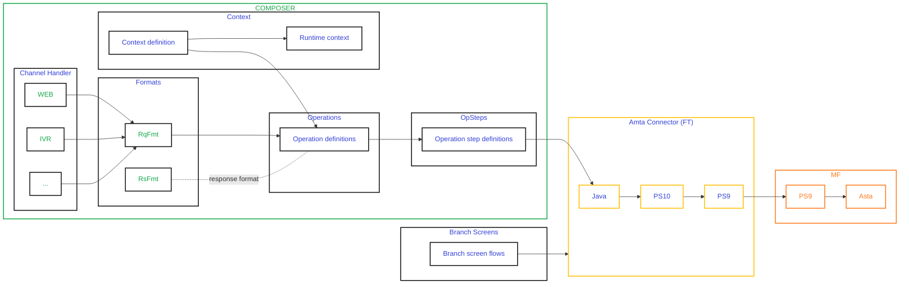

# IBM WebSphere Server Business Component Composer (WSBCC) Developer Manual

## Table of Contents
1. [Overview](#overview)
2. [Architecture](#architecture)
3. [Tag-to-Class Mapping](#tag-to-class-mapping)
4. [Tag Execution Flow](#tag-execution-flow)
5. [XML Operation Structure](#xml-operation-structure)
6. [Available Tags Reference](#available-tags-reference)
7. [Example Implementation](#example-implementation)
8. [Best Practices](#best-practices)

---

## Overview

IBM WebSphere Server Business Component Composer (WSBCC) is a framework for creating XML-based service operations. Each operation receives XML input, performs defined logic steps, and returns XML output as a response.

### Key Concepts

- **Operations**: Services defined in XML that process requests and generate responses
- **Tags**: XML elements that map to Java classes implementing business logic
- **Context**: A shared data structure for passing information between tags
- **Formats**: XML structure definitions for requests and responses

---

## Architecture

### Composer Internals Architecture



### Component Interaction

```
XML Operation File
    ↓
Tag Parser (WSBCC)
    ↓
Reflection-based Class Instantiation
    ↓
Attribute Setters (via Reflection)
    ↓
Execute Method
    ↓
Result/Output
```

### Core Principles

1. Each XML tag represents a Java object with instance members and an `execute()` method
2. Tag attributes are mapped to Java class properties via reflection-based setters
3. Child tags are passed to parent instances for recursive parsing
4. Operations execute sequentially based on step results

---

## Tag-to-Class Mapping

### Mapping Methods

There are two ways to map XML tags to Java implementation classes:

#### 1. Central Mapping File (dse.ini)
A centralized XML mapping file that defines tag-to-class relationships for the entire system.

#### 2. Inline Mapping (implClass Attribute)
Specify the implementing class directly in the XML tag using the `implClass` attribute:

```xml
<opStep id="GetClientLinks" implClass="db.GetClientLinksSP" />
```

Format: `implClass="package.ClassName"`

---

## Tag Execution Flow

### Instantiation and Execution Process

When the WSBCC parser encounters a tag, it follows this sequence:

1. **Class Instantiation**: The mapped Java class is instantiated using reflection
2. **Attribute Setting**: Each XML attribute value is set on the instance using setter methods
3. **Child Tag Assignment**: If present, child tags are passed to the instance
4. **Execution**: The `execute()` method is called
5. **Result Handling**: The return value determines the next execution step

### Implementation Example

Given this XML tag:

```xml
<CCDate dataName="WrittenAt" 
        pattern="yyyyMMdd" 
        useSep="no" 
        fourDigYear="yes" />
```

The corresponding Java class must implement:

```java
public class CCDate {
    private String dataName;
    private String pattern;
    private String useSep;
    private String fourDigYear;
    
    // Setter methods - names must match attribute names
    public void setDataName(String name) {
        this.dataName = name;
    }
    
    public void setPattern(String pattern) {
        this.pattern = pattern;
    }
    
    public void setUseSep(String flag) {
        this.useSep = flag;
    }
    
    public void setFourDigYear(String shouldUse4DigitsYear) {
        this.fourDigYear = shouldUse4DigitsYear;
    }
    
    // Execute method performs the tag logic
    public int execute() {
        // Implementation logic here
        return 0; // Return code
    }
}
```

### Key Requirements

- Setter method names must match attribute names (case-sensitive)
- Setter methods use reflection, so naming conventions are critical
- The `execute()` method returns an integer result code
- All attributes are passed as String types

---

## XML Operation Structure

An operation file is structured as follows:

```
XML (root)
├── CCDSEServerOperation (operation definition)
│   ├── opStep (logic steps)
│   ├── refFormat (format references)
│   └── fmtDef (format definitions)
├── fmtDef (reusable formats)
└── context (data context)
```

---

## Available Tags Reference

### 1. XML Tag

**Purpose**: Root wrapper element for the entire XML document

**Child Tags**: 
- `CCDSEServerOperation`
- `fmtDef`
- `context`

**Attributes**: None

**Example**:
```xml
<?xml version="1.0" encoding="ISO-8859-1"?>
<XML>
    <!-- Operation content -->
</XML>
```

---

### 2. CCDSEServerOperation Tag

**Purpose**: Defines the complete operation and wraps all operation logic

**Child Tags**:
- `opStep` - Logic steps to execute
- `refFormat` - References to format definitions
- `fmtDef` - Inline format definitions

**Attributes**:

| Attribute | Required | Description |
|-----------|----------|-------------|
| `id` | Yes | Unique identifier for the operation |
| `operationContext` | Yes | Name of the context tag that defines the data structure |

**Example**:
```xml
<CCDSEServerOperation id="GetLinksOp" operationContext="GetLinksCtxt">
    <!-- Operation steps and formats -->
</CCDSEServerOperation>
```

---

### 3. opStep Tag

**Purpose**: Defines individual logic steps (actions) that execute sequentially

**Child Tags**: None

**Attributes**:

| Attribute | Required | Description |
|-----------|----------|-------------|
| `id` | Yes | Unique identifier for the operation step |
| `implClass` | No | Fully qualified class name implementing this step's logic |
| `on{X}Do` | No | Dynamic attribute where {X} is an integer return code. Specifies the next step ID to execute if this return code is received |
| `onOtherDo` | No | Specifies the default next step ID if no `on{X}Do` matches |

**Return Code Flow**:

The `execute()` method returns an integer. The operation uses this value to determine the next step:

1. Check if an `on{X}Do` attribute matches the return code
2. If matched, execute the specified step
3. If no match, execute the step specified in `onOtherDo`

**Example**:
```xml
<opStep id="GetClientLinks" 
        implClass="db.GetClientLinksSP" 
        on0Do="end" 
        on4Do="ErrorDataNotFound" 
        on5Do="ErrorInvalidLinks" 
        onOtherDo="OperationFailed"/>
```

In this example:
- Return code 0 → go to "end"
- Return code 4 → go to "ErrorDataNotFound"
- Return code 5 → go to "ErrorInvalidLinks"
- Any other code → go to "OperationFailed"

**Custom Attributes**:

Any additional attributes defined in the tag are passed to the implementing class via setter methods:

```xml
<opStep id="ErrorDataNotFound" 
        implClass="operations.MapErrorByValueAlways" 
        ErrorCategory="10" 
        ErrorNumber="0" 
        onOtherDo="OperationFailed" />
```

The class must implement:
```java
public void setErrorCategory(String category);
public void setErrorNumber(String number);
```

---

### 4. fmtDef Tag

**Purpose**: Defines XML structure templates for requests and responses

Format definitions describe the structure of XML data, including element names, types, and formatting rules. They contain tags representing XML elements with specific data types.

**Child Tags**: Various format tags (CCString, CCDate, CCXML, CCTcoll, etc.)

**Attributes**:

| Attribute | Required | Description |
|-----------|----------|-------------|
| `id` | Yes | Unique identifier for the format definition |

**Common Format Tags**:

- `CCXML` - XML element container
- `CCString` - String value element
- `CCDate` - Date value element with formatting
- `CCBoolean` - Boolean value element
- `CCTcoll` - Collection/array element
- `CCTableFormat` - Database table lookup element
- `NumberFormat` - Numeric value element

**Example**:
```xml
<fmtDef id="GetLinksRQFmt">
    <CCXML dataName="GetLinks">
        <CCString dataName="ClientId"/>
        <CCString dataName="ClientName"/>
    </CCXML>
</fmtDef>
```

**Complex Format Example**:
```xml
<fmtDef id="GetLinksRSFmt">
    <CCXML dataName="Response" transparent="true">
        <CCXML dataName="GetLinks" transparent="true">
            <CCXML dataName="ReqParams" transparent="true">
                <CCString dataName="ClientId"/>
                <CCString dataName="ClientName"/>
            </CCXML>
            <CCTcoll dataName="LinksBlock" transparentSource="true" append="true" times="*">
                <CCXML dataName="DocData" unnamed="false">
                    <CCString dataName="DocId"/>
                    <CCString dataName="Flag"/>
                    <CCTableFormat dataName="LinkDescription" 
                                   fromTable="some_table" 
                                   fromColumn="some_column" 
                                   keyValue="link_id"/>
                    <CCString dataName="StoreDate"/>
                    <NumberFormat dataName="MaxAccess" 
                                  showThousandsSep="no" 
                                  showDecimalsSep="no"/>
                    <CCDate dataName="WrittenAt" 
                            pattern="yyyyMMdd" 
                            useSep="no" 
                            fourDigYear="yes" 
                            ordering="ymd" 
                            usePattern="yes" 
                            onFailed="current" />
                </CCXML>
            </CCTcoll>
        </CCXML>
    </CCXML>
</fmtDef>
```

---

### 5. refFormat Tag

**Purpose**: References existing format definitions for reusability

Instead of duplicating format structures, use `refFormat` to reference a `fmtDef` by its ID. The referenced format can be in the same file or in external files.

**Child Tags**: None

**Attributes**:

| Attribute | Required | Description |
|-----------|----------|-------------|
| `name` | Yes | Local name for this format reference within the operation scope |
| `refid` | Yes | The `id` of the `fmtDef` being referenced |

**Example**:
```xml
<refFormat name="requestFormat" refid="GetLinksRQFmt" />
<refFormat name="csRequestFormat" refid="GetLinksRQFmt" />
<refFormat name="csReplyFormat" refid="GetLinksRSFmt" />
```

This creates a reference named "csRequestFormat" that uses the structure defined in "GetLinksRQFmt".

---

### 6. context Tag

**Purpose**: Defines a shared data structure for passing information between operation components

The context acts as a static, operation-scoped data store. Tags can read from and write to the context, enabling data flow between operation steps. For example:
- Parse input XML and store it in context
- Operation steps read values from context
- Store results in context for response formatting

**Child Tags**: None

**Attributes**:

| Attribute | Required | Description |
|-----------|----------|-------------|
| `id` | Yes | Unique identifier for the context |
| `parent` | Yes | Parent context ID, or "nil" if no parent exists |
| `type` | Yes | Context attachment type. Currently only "op" (operation) is valid |

**Example**:
```xml
<context id="GetLinksCtxt" parent="nil" type="op" />
```

**Usage Notes**:
- Only `CCDSEServerOperation` tags can use contexts (when `type="op"`)
- The context is referenced by the operation via the `operationContext` attribute
- Data stored in context persists throughout the operation lifecycle

---

## Example Implementation

### Complete Operation Example

This example demonstrates a complete operation that retrieves client links from a database:

```xml
<?xml version="1.0" encoding="ISO-8859-1"?>
<XML>
    <!-- Main Operation Definition -->
    <CCDSEServerOperation id="GetLinksOp" operationContext="GetLinksCtxt">
    
        <!-- Operation Steps -->
        <opStep id="GetClientLinks" 
                implClass="db.GetClientLinksSP" 
                on0Do="end" 
                on4Do="ErrorDataNotFound" 
                on5Do="ErrorInvalidLinks" 
                onOtherDo="OperationFailed"/>
                
        <opStep id="ErrorDataNotFound" 
                implClass="operations.MapErrorByValueAlways" 
                ErrorCategory="10" 
                ErrorNumber="0" 
                onOtherDo="OperationFailed" />
                
        <opStep id="ErrorInvalidLinks" 
                implClass="operations.MapErrorByValueAlways" 
                ErrorCategory="20" 
                ErrorNumber="0" 
                onOtherDo="OperationFailed" />
                
        <opStep id="OperationFailed" 
                onOtherDo="end" />
        
        <!-- Format References -->
        <refFormat name="csRequestFormat" refid="GetLinksRQFmt" />
        <refFormat name="csReplyFormat" refid="GetLinksRSFmt" />
    </CCDSEServerOperation>
    
    <!-- Request Format Definition -->
    <fmtDef id="GetLinksRQFmt">
        <CCXML dataName="GetLinks">
            <CCString dataName="ClientId"/>
            <CCString dataName="ClientName"/>
        </CCXML>
    </fmtDef>
    
    <!-- Response Format Definition -->
    <fmtDef id="GetLinksRSFmt">
        <CCXML dataName="Response" transparent="true">
            <CCXML dataName="GetLinks" transparent="true">
                <CCXML dataName="ReqParams" transparent="true">
                    <CCString dataName="ClientId"/>
                    <CCString dataName="ClientName"/>
                </CCXML>
                <CCTcoll dataName="LinksBlock" 
                         transparentSource="true" 
                         append="true" 
                         times="*">
                    <CCXML dataName="DocData" unnamed="false">
                        <CCString dataName="DocId"/>
                        <CCString dataName="Flag"/>
                        <CCTableFormat dataName="LinkDescription" 
                                       fromTable="some_table" 
                                       fromColumn="some_column" 
                                       keyValue="link_id"/>
                        <nilDecorator/>
                        <CCString dataName="StoreDate"/>
                        <NumberFormat dataName="MaxAccess" 
                                      showThousandsSep="no" 
                                      showDecimalsSep="no"/>
                        <CCDate dataName="WrittenAt" 
                                pattern="yyyyMMdd" 
                                useSep="no" 
                                fourDigYear="yes" 
                                ordering="ymd" 
                                usePattern="yes" 
                                onFailed="current" />
                    </CCXML>
                </CCTcoll>
            </CCXML>
        </CCXML>
    </fmtDef>
    
    <!-- Context Definition -->
    <context id="GetLinksCtxt" parent="nil" type="op" />
</XML>
```

### Operation Flow Explanation

1. **Request Reception**: Operation receives XML matching `GetLinksRQFmt` format
2. **Data Parsing**: Request is parsed and stored in context `GetLinksCtxt`
3. **Step Execution**: `GetClientLinks` step executes (calls database stored procedure)
4. **Result Handling**:
   - If return code = 0: Operation completes successfully (go to "end")
   - If return code = 4: Data not found error (go to `ErrorDataNotFound`)
   - If return code = 5: Invalid links error (go to `ErrorInvalidLinks`)
   - Other codes: General operation failure (go to `OperationFailed`)
5. **Error Mapping**: Error steps map specific error categories and numbers
6. **Response Generation**: Response is formatted according to `GetLinksRSFmt`
7. **Response Return**: XML response is returned to the caller

---

## Best Practices

### 1. Naming Conventions

- Use descriptive, clear IDs for operations, steps, and formats
- Follow consistent naming patterns across your operations
- Use camelCase for attribute names to match Java setter conventions

### 2. Error Handling

- Always provide comprehensive `on{X}Do` mappings for expected return codes
- Use `onOtherDo` as a catch-all for unexpected errors
- Create dedicated error-handling operation steps
- Define clear error categories and numbers

### 3. Format Definitions

- Create reusable format definitions and reference them with `refFormat`
- Keep format definitions separate from operation logic for maintainability
- Document complex format structures with XML comments
- Use meaningful `dataName` attributes that reflect the business domain

### 4. Context Usage

- Define one context per operation for clarity
- Use contexts to share data between operation steps
- Avoid complex context hierarchies unless necessary

### 5. Java Implementation

- Ensure setter method names exactly match XML attribute names
- Implement robust error handling in `execute()` methods
- Return meaningful integer codes from `execute()` methods
- Document return codes in your Java class comments

### 6. Code Organization

**Recommended File Structure**:
```
operations/
├── dse.ini                    # Tag-to-class mappings
├── dseoperation.xml           # Operation definitions
├── dseformat.xml              # Format definitions
└── dsecontext.xml             # Context definitions
```

Or use a single file approach for simpler operations:
```
operations/
└── GetLinksOperation.xml      # All-in-one operation file
```

### 7. Testing

- Test each operation step independently
- Verify all return code paths
- Test error scenarios thoroughly
- Validate XML format compliance for requests and responses

### 8. Documentation

- Comment complex format structures
- Document custom attributes and their purposes
- Maintain a registry of return codes and their meanings
- Document operation dependencies and prerequisites

### 9. Performance

- Minimize context size and complexity
- Reuse format definitions where possible
- Keep operation step logic focused and efficient
- Consider caching frequently-used data

### 10. Security

- Validate all input data in operation steps
- Sanitize data before database operations
- Implement appropriate access controls
- Log security-relevant operations

---

## Appendix: Common Format Tag Attributes

### CCDate Attributes
- `dataName`: Element name in XML
- `pattern`: Date format pattern (e.g., "yyyyMMdd")
- `useSep`: Use separators in date (yes/no)
- `fourDigYear`: Use four-digit year (yes/no)
- `ordering`: Date component order (ymd, dmy, mdy)
- `usePattern`: Apply the pattern (yes/no)
- `onFailed`: Behavior on parse failure

### CCXML Attributes
- `dataName`: Element name in XML
- `transparent`: Pass through without creating wrapper element (true/false)
- `unnamed`: Create element without name (true/false)

### CCTcoll Attributes
- `dataName`: Collection element name
- `transparentSource`: Source is transparent (true/false)
- `append`: Append to existing collection (true/false)
- `times`: Number of iterations or "*" for unlimited

### NumberFormat Attributes
- `dataName`: Element name in XML
- `showThousandsSep`: Show thousands separator (yes/no)
- `showDecimalsSep`: Show decimal separator (yes/no)

### CCTableFormat Attributes
- `dataName`: Element name in XML
- `fromTable`: Database table name
- `fromColumn`: Database column name
- `keyValue`: Key value for lookup

---

## Version History

| Version | Date | Author | Changes |
|---------|------|--------|---------|
| 1.0 | 2026-01-27 | Development Team | Initial release |

---

## Support and Resources

For additional support and resources:
- Consult IBM WebSphere documentation
- Review sample operations in your installation
- Contact your system administrator for environment-specific guidance

---

*End of Developer Manual*
