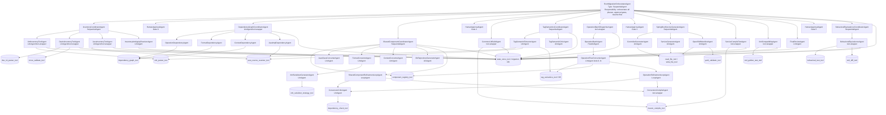

```mermaid id="top-level"
flowchart TD
    ROOT["RootMigrationOrchestratorAgent<br/>Type: SequentialAgent<br/>Responsibility: orchestrates all phases, approval gates, resume flow"]

    ROOT --> INV["InventoryCoordinatorAgent<br/>SequentialAgent"]
    INV --> XML["XmlInventoryToolAgent<br/>LlmAgent/tool-wrapper"]
    XML --> XMLT[("xml_parser_tool")]
    INV --> DSE["DseIniInventoryToolAgent<br/>LlmAgent/tool-wrapper"]
    DSE --> DSET[("dse_ini_parser_tool")]
    DSE --> CROSS[("cross_validate_tool")]
    INV --> JAVA["JavaInventoryToolAgent<br/>LlmAgent/tool-wrapper"]
    JAVA --> JAVAT[("java_source_scanner_tool")]
    INV --> AMBIG["InventoryAmbiguityResolverAgent<br/>LlmAgent"]

    ROOT --> G0["HumanApprovalAgent<br/>Gate 0"]

    ROOT --> DEP["DependencyGraphCoordinatorAgent<br/>LlmAgent/tool-wrapper"]
    DEP --> OPDEP["OperationDependencyAgent"]
    DEP --> FMTDEP["FormatDependencyAgent"]
    DEP --> CTXDEP["ContextDependencyAgent"]
    DEP --> JDEP["JavaImplDependencyAgent"]
    OPDEP --> GRAPHT[("dependency_graph_tool")]
    FMTDEP --> GRAPHT
    CTXDEP --> GRAPHT
    JDEP --> JAVAT

    ROOT --> SHARED["SharedComponentCoordinatorAgent<br/>SequentialAgent"]
    SHARED --> COMPREG[("component_registry_tool")]
    SHARED --> JCONV["JavaClassConverterAgent<br/>LlmAgent"]
    SHARED --> FCONV["FormatConverterAgent<br/>LlmAgent"]
    FCONV --> XMLSER["XmlSerializerGeneratorAgent<br/>LlmAgent"]
    XMLSER --> SERPLAN[("xml_serializer_strategy_tool")]
    SHARED --> CCONV["ContextConverterAgent<br/>LlmAgent"]
    SHARED --> DBREPO["DbRepositoryGeneratorAgent<br/>LlmAgent"]
    SHARED --> LOOP1["SharedComponentRefinementLoopAgent<br/>LoopAgent"]
    LOOP1 --> CRITIC["ConversionCriticAgent<br/>LlmAgent"]
    LOOP1 --> COMPILE["ConversionCompileAgent<br/>tool-wrapper"]
    CRITIC --> DEPCHECK[("dependency_check_tool")]
    COMPILE --> MVN[("maven_compile_tool")]

    ROOT --> G2["HumanApprovalAgent<br/>Gate 2"]

    ROOT --> CLB["CommonLibBuildAgent<br/>tool-wrapper"]
    CLB --> MVN

    ROOT --> SEM["TagSemanticsCoordinatorAgent<br/>SequentialAgent"]
    SEM --> SEMEXT["TagSemanticExtractorAgent<br/>LlmAgent"]
    SEM --> SEMCRIT["TagSemanticCriticAgent<br/>LlmAgent"]
    SEMEXT --> XMLT
    SEMEXT --> JAVAT
    SEMEXT --> SEMDB[("tag_semantics_tool / DB")]

    ROOT --> BATCH["OperationBatchDispatcherAgent<br/>tool-wrapper"]
    BATCH --> PAR["OperationBatchAgent<br/>ParallelAgent"]
    PAR --> FLOW["OperationFlowConverterAgent<br/>LlmAgent slots 0..N"]
    FLOW --> SEMDB
    FLOW --> COMPREG
    FLOW --> LOOP2["OperationRefinementLoopAgent<br/>LoopAgent"]
    LOOP2 --> CRITIC
    LOOP2 --> COMPILE

    ROOT --> G3["HumanApprovalAgent<br/>Gate 3"]

    ROOT --> SB["SpringBootServiceGeneratorAgent<br/>SequentialAgent"]
    SB --> CTRL["ControllerGeneratorAgent<br/>LlmAgent"]
    SB --> SVC["ServiceGeneratorAgent<br/>LlmAgent"]
    SB --> OS["OpenShiftManifestAgent<br/>LlmAgent"]
    CTRL --> RW[("read_file_tool / write_file_tool")]
    SVC --> RW
    OS --> RW
    OS --> YAML[("yaml_validator_tool")]

    ROOT --> TEST["ServiceCompileTestAgent<br/>tool-wrapper"]
    TEST --> MVN

    ROOT --> XMLCOMP["XmlCompatibilityAgent<br/>tool-wrapper"]
    XMLCOMP --> GOLDEN[("xml_golden_test_tool")]

    ROOT --> FINAL["FinalReviewAgent<br/>LlmAgent"]

    ROOT --> G5["HumanApprovalAgent<br/>Gate 5"]

    ROOT --> BECOORD["BehavioralEquivalenceCoordinatorAgent<br/>SequentialAgent"]
    BECOORD --> BE["BehavioralEquivalenceAgent<br/>tool-wrapper"]
    BE --> BETEST[("behavioral_test_tool")]
    BE --> XMLDIFF[("xml_diff_tool")]

    ROOT --> DB[("state_store_tool / migration DB")]

    XML --> DB
    DSE --> DB
    JAVA --> DB
    AMBIG --> DB
    DEP --> DB
    SHARED --> DB
    CLB --> DB
    SEM --> DB
    BATCH --> DB
    TEST --> DB
    XMLCOMP --> DB
    FINAL --> DB
    BE --> DB
```