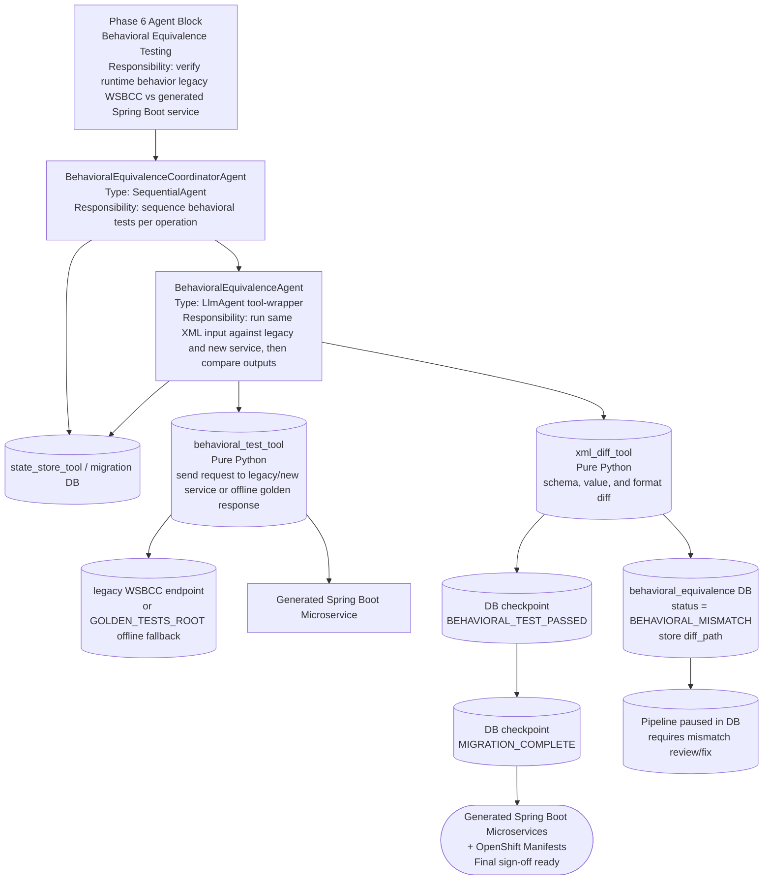

```mermaid id="phase6-internal"
flowchart TD
    P6["Phase 6 Agent Block<br/>Behavioral Equivalence Testing<br/>Responsibility: verify runtime behavior legacy WSBCC vs generated Spring Boot service"]

    P6 --> COORD["BehavioralEquivalenceCoordinatorAgent<br/>Type: SequentialAgent<br/>Responsibility: sequence behavioral tests per operation"]

    COORD --> DB[("state_store_tool / migration DB")]
    COORD --> BE["BehavioralEquivalenceAgent<br/>Type: LlmAgent tool-wrapper<br/>Responsibility: run same XML input against legacy and new service, then compare outputs"]

    BE --> BETEST[("behavioral_test_tool<br/>Pure Python<br/>send request to legacy/new service or offline golden response")]
    BE --> XMLDIFF[("xml_diff_tool<br/>Pure Python<br/>schema, value, and format diff")]
    BE --> DB

    BETEST --> LEGACY[("legacy WSBCC endpoint<br/>or GOLDEN_TESTS_ROOT offline fallback")]
    BETEST --> NEW["Generated Spring Boot Microservice"]

    XMLDIFF --> PASS[("DB checkpoint<br/>BEHAVIORAL_TEST_PASSED")]
    XMLDIFF --> FAIL[("behavioral_equivalence DB<br/>status = BEHAVIORAL_MISMATCH<br/>store diff_path")]

    PASS --> COMPLETE[("DB checkpoint<br/>MIGRATION_COMPLETE")]
    COMPLETE --> OUT([Generated Spring Boot Microservices<br/>+ OpenShift Manifests<br/>Final sign-off ready])

    FAIL --> PAUSE[("Pipeline paused in DB<br/>requires mismatch review/fix")]
```
