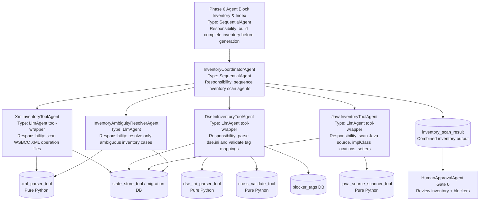

```mermaid id="phase0-internal"
flowchart TD
    P0["Phase 0 Agent Block<br/>Inventory & Index<br/>Type: SequentialAgent<br/>Responsibility: build complete inventory before generation"]

    P0 --> INV["InventoryCoordinatorAgent<br/>Type: SequentialAgent<br/>Responsibility: sequence inventory scan agents"]

    INV --> XML["XmlInventoryToolAgent<br/>Type: LlmAgent tool-wrapper<br/>Responsibility: scan WSBCC XML operation files"]
    XML --> XMLT[("xml_parser_tool<br/>Pure Python")]
    XML --> DB[("state_store_tool / migration DB")]

    INV --> DSE["DseIniInventoryToolAgent<br/>Type: LlmAgent tool-wrapper<br/>Responsibility: parse dse.ini and validate tag mappings"]
    DSE --> DSET[("dse_ini_parser_tool<br/>Pure Python")]
    DSE --> CROSS[("cross_validate_tool<br/>Pure Python")]
    DSE --> BLOCKERS[("blocker_tags DB")]
    DSE --> DB

    INV --> JAVA["JavaInventoryToolAgent<br/>Type: LlmAgent tool-wrapper<br/>Responsibility: scan Java source, implClass locations, setters"]
    JAVA --> JAVAT[("java_source_scanner_tool<br/>Pure Python")]
    JAVA --> DB

    INV --> AMBIG["InventoryAmbiguityResolverAgent<br/>Type: LlmAgent<br/>Responsibility: resolve only ambiguous inventory cases"]
    AMBIG --> XMLT
    AMBIG --> DB

    INV --> RESULT[("inventory_scan_result<br/>Combined inventory output")]
    RESULT --> G0["HumanApprovalAgent Gate 0<br/>Review inventory + blockers"]
```