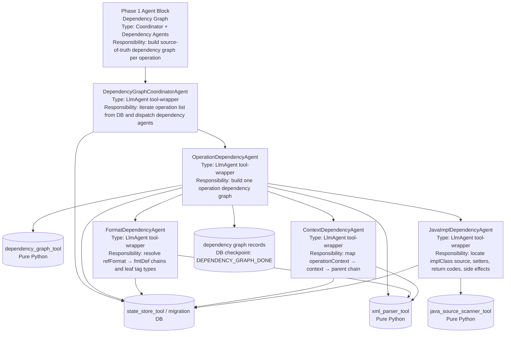

```mermaid id="phase1-internal"
flowchart TD
    P1["Phase 1 Agent Block<br/>Dependency Graph<br/>Type: Coordinator + Dependency Agents<br/>Responsibility: build source-of-truth dependency graph per operation"]

    P1 --> DEP["DependencyGraphCoordinatorAgent<br/>Type: LlmAgent tool-wrapper<br/>Responsibility: iterate operation list from DB and dispatch dependency agents"]

    DEP --> DB[("state_store_tool / migration DB")]
    DEP --> OPDEP["OperationDependencyAgent<br/>Type: LlmAgent tool-wrapper<br/>Responsibility: build one operation dependency graph"]

    OPDEP --> XMLT[("xml_parser_tool<br/>Pure Python")]
    OPDEP --> GRAPHT[("dependency_graph_tool<br/>Pure Python")]
    OPDEP --> DB

    OPDEP --> FMTDEP["FormatDependencyAgent<br/>Type: LlmAgent tool-wrapper<br/>Responsibility: resolve refFormat → fmtDef chains and leaf tag types"]
    FMTDEP --> XMLT
    FMTDEP --> DB

    OPDEP --> CTXDEP["ContextDependencyAgent<br/>Type: LlmAgent tool-wrapper<br/>Responsibility: map operationContext → context → parent chain"]
    CTXDEP --> XMLT
    CTXDEP --> DB

    OPDEP --> JDEP["JavaImplDependencyAgent<br/>Type: LlmAgent tool-wrapper<br/>Responsibility: locate implClass source, setters, return codes, side effects"]
    JDEP --> JAVAT[("java_source_scanner_tool<br/>Pure Python")]
    JDEP --> DB

    OPDEP --> GRAPHDB[("dependency graph records<br/>DB checkpoint: DEPENDENCY_GRAPH_DONE")]
```
