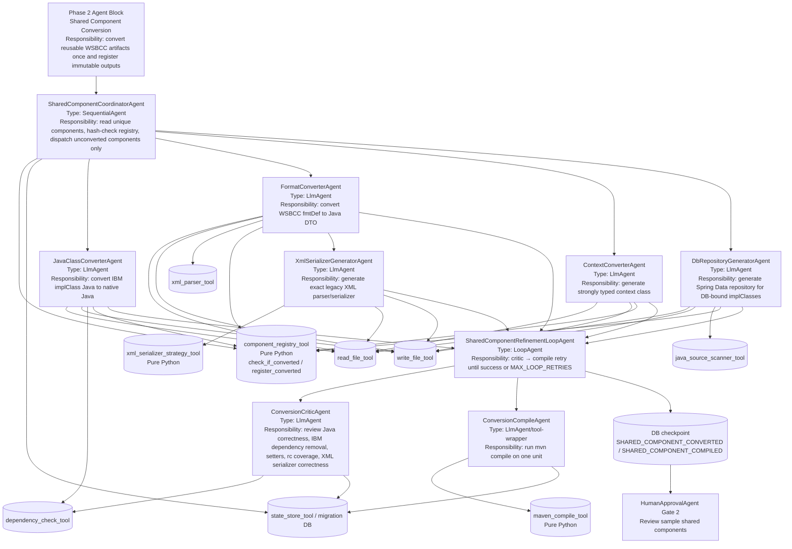

```mermaid id="phase2-internal"
flowchart TD
    P2["Phase 2 Agent Block<br/>Shared Component Conversion<br/>Responsibility: convert reusable WSBCC artifacts once and register immutable outputs"]

    P2 --> COORD["SharedComponentCoordinatorAgent<br/>Type: SequentialAgent<br/>Responsibility: read unique components, hash-check registry, dispatch unconverted components only"]

    COORD --> COMPREG[("component_registry_tool<br/>Pure Python<br/>check_if_converted / register_converted")]
    COORD --> DB[("state_store_tool / migration DB")]

    COORD --> JAVA["JavaClassConverterAgent<br/>Type: LlmAgent<br/>Responsibility: convert IBM implClass Java to native Java"]
    JAVA --> READ[("read_file_tool")]
    JAVA --> WRITE[("write_file_tool")]
    JAVA --> DEPCHECK[("dependency_check_tool")]
    JAVA --> COMPREG

    COORD --> FORMAT["FormatConverterAgent<br/>Type: LlmAgent<br/>Responsibility: convert WSBCC fmtDef to Java DTO"]
    FORMAT --> READ
    FORMAT --> WRITE
    FORMAT --> XMLP[("xml_parser_tool")]
    FORMAT --> COMPREG

    FORMAT --> XMLSER["XmlSerializerGeneratorAgent<br/>Type: LlmAgent<br/>Responsibility: generate exact legacy XML parser/serializer"]
    XMLSER --> SERPLAN[("xml_serializer_strategy_tool<br/>Pure Python")]
    XMLSER --> READ
    XMLSER --> WRITE

    COORD --> CTX["ContextConverterAgent<br/>Type: LlmAgent<br/>Responsibility: generate strongly typed context class"]
    CTX --> READ
    CTX --> WRITE
    CTX --> COMPREG

    COORD --> DBREPO["DbRepositoryGeneratorAgent<br/>Type: LlmAgent<br/>Responsibility: generate Spring Data repository for DB-bound implClasses"]
    DBREPO --> READ
    DBREPO --> WRITE
    DBREPO --> JAVASCAN[("java_source_scanner_tool")]
    DBREPO --> COMPREG

    JAVA --> LOOP["SharedComponentRefinementLoopAgent<br/>Type: LoopAgent<br/>Responsibility: critic → compile retry until success or MAX_LOOP_RETRIES"]
    FORMAT --> LOOP
    XMLSER --> LOOP
    CTX --> LOOP
    DBREPO --> LOOP

    LOOP --> CRITIC["ConversionCriticAgent<br/>Type: LlmAgent<br/>Responsibility: review Java correctness, IBM dependency removal, setters, rc coverage, XML serializer correctness"]
    CRITIC --> DEPCHECK
    CRITIC --> DB

    LOOP --> COMPILE["ConversionCompileAgent<br/>Type: LlmAgent/tool-wrapper<br/>Responsibility: run mvn compile on one unit"]
    COMPILE --> MVN[("maven_compile_tool<br/>Pure Python")]
    COMPILE --> DB

    LOOP --> DONE[("DB checkpoint<br/>SHARED_COMPONENT_CONVERTED / SHARED_COMPONENT_COMPILED")]
    DONE --> G2["HumanApprovalAgent Gate 2<br/>Review sample shared components"]
```
