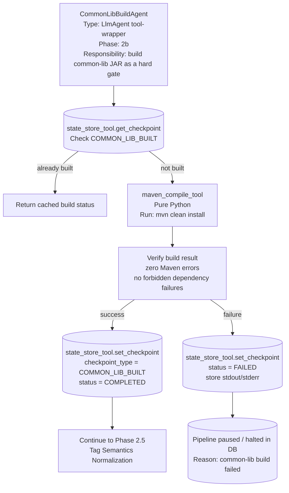

```mermaid id="common-lib-build-internal"
flowchart TD
    CLB["CommonLibBuildAgent<br/>Type: LlmAgent tool-wrapper<br/>Phase: 2b<br/>Responsibility: build common-lib JAR as a hard gate"]

    CLB --> DBGET[("state_store_tool.get_checkpoint<br/>Check COMMON_LIB_BUILT")]
    DBGET -->|already built| SKIP["Return cached build status"]

    DBGET -->|not built| MVN["maven_compile_tool<br/>Pure Python<br/>Run: mvn clean install"]

    MVN --> VERIFY["Verify build result<br/>zero Maven errors<br/>no forbidden dependency failures"]

    VERIFY -->|success| DBSET[("state_store_tool.set_checkpoint<br/>checkpoint_type = COMMON_LIB_BUILT<br/>status = COMPLETED")]

    VERIFY -->|failure| FAILDB[("state_store_tool.set_checkpoint<br/>status = FAILED<br/>store stdout/stderr")]

    DBSET --> NEXT["Continue to Phase 2.5<br/>Tag Semantics Normalization"]

    FAILDB --> HALT[("Pipeline paused / halted in DB<br/>Reason: common-lib build failed")]
```
