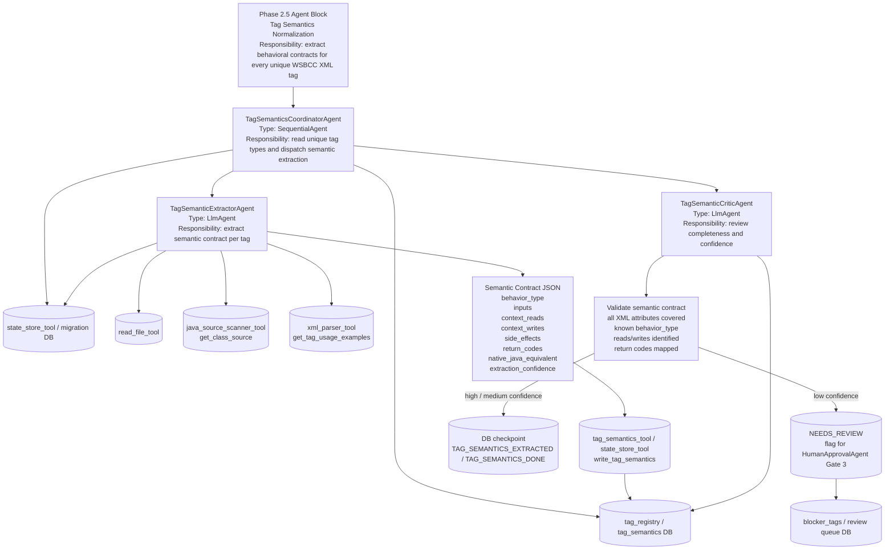

```mermaid id="phase25-internal"
flowchart TD
    P25["Phase 2.5 Agent Block<br/>Tag Semantics Normalization<br/>Responsibility: extract behavioral contracts for every unique WSBCC XML tag"]

    P25 --> COORD["TagSemanticsCoordinatorAgent<br/>Type: SequentialAgent<br/>Responsibility: read unique tag types and dispatch semantic extraction"]

    COORD --> DB[("state_store_tool / migration DB")]
    COORD --> TAGDB[("tag_registry / tag_semantics DB")]

    COORD --> EXT["TagSemanticExtractorAgent<br/>Type: LlmAgent<br/>Responsibility: extract semantic contract per tag"]

    EXT --> READ[("read_file_tool")]
    EXT --> JAVASCAN[("java_source_scanner_tool<br/>get_class_source")]
    EXT --> XMLP[("xml_parser_tool<br/>get_tag_usage_examples")]
    EXT --> DB

    EXT --> CONTRACT["Semantic Contract JSON<br/>behavior_type<br/>inputs<br/>context_reads<br/>context_writes<br/>side_effects<br/>return_codes<br/>native_java_equivalent<br/>extraction_confidence"]

    CONTRACT --> WRITESEM[("tag_semantics_tool / state_store_tool<br/>write_tag_semantics")]
    WRITESEM --> TAGDB

    COORD --> CRITIC["TagSemanticCriticAgent<br/>Type: LlmAgent<br/>Responsibility: review completeness and confidence"]

    CRITIC --> TAGDB
    CRITIC --> CHECK["Validate semantic contract<br/>all XML attributes covered<br/>known behavior_type<br/>reads/writes identified<br/>return codes mapped"]

    CHECK -->|high / medium confidence| DONE[("DB checkpoint<br/>TAG_SEMANTICS_EXTRACTED / TAG_SEMANTICS_DONE")]

    CHECK -->|low confidence| REVIEW[("NEEDS_REVIEW<br/>flag for HumanApprovalAgent Gate 3")]

    REVIEW --> BLOCKERS[("blocker_tags / review queue DB")]
```
