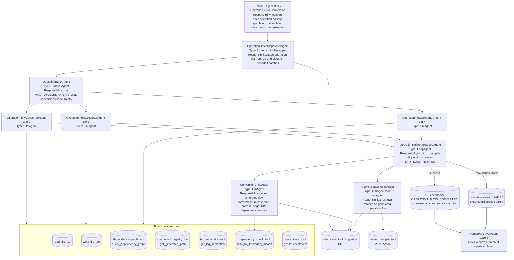

```mermaid id="phase3-internal"
flowchart TD
    P3["Phase 3 Agent Block<br/>Operation Flow Conversion<br/>Responsibility: convert each operation opStep graph into native Java switch-on-rc orchestration"]

    P3 --> DISP["OperationBatchDispatcherAgent<br/>Type: LlmAgent tool-wrapper<br/>Responsibility: page operation list from DB and dispatch bounded batches"]

    DISP --> DB[("state_store_tool / migration DB")]
    DISP --> BATCH["OperationBatchAgent<br/>Type: ParallelAgent<br/>Responsibility: run MAX_PARALLEL_OPERATIONS conversions concurrently"]

    BATCH --> SLOT0["OperationFlowConverterAgent slot 0<br/>Type: LlmAgent"]
    BATCH --> SLOT1["OperationFlowConverterAgent slot 1<br/>Type: LlmAgent"]
    BATCH --> SLOTN["OperationFlowConverterAgent slot N<br/>Type: LlmAgent"]

    SLOT0 --> FLOWTOOLS
    SLOT1 --> FLOWTOOLS
    SLOTN --> FLOWTOOLS

    subgraph FLOWTOOLS["Flow converter tools"]
        READ[("read_file_tool")]
        WRITE[("write_file_tool")]
        GRAPH[("dependency_graph_tool<br/>query_dependency_graph")]
        COMPREG[("component_registry_tool<br/>get_generated_path")]
        SEM[("tag_semantics_tool<br/>get_tag_semantics")]
        DEPCHECK[("dependency_check_tool<br/>scan_for_forbidden_imports")]
        DB2[("state_store_tool<br/>get/set checkpoint")]
    end

    SLOT0 --> LOOP["OperationRefinementLoopAgent<br/>Type: LoopAgent<br/>Responsibility: critic → compile retry until success or MAX_LOOP_RETRIES"]
    SLOT1 --> LOOP
    SLOTN --> LOOP

    LOOP --> CRITIC["ConversionCriticAgent<br/>Type: LlmAgent<br/>Responsibility: review generated flow correctness, rc coverage, context usage, IBM dependency removal"]
    CRITIC --> DEPCHECK
    CRITIC --> DB

    LOOP --> COMPILE["ConversionCompileAgent<br/>Type: LlmAgent tool-wrapper<br/>Responsibility: run mvn compile on generated operation flow"]
    COMPILE --> MVN[("maven_compile_tool<br/>Pure Python")]
    COMPILE --> DB

    LOOP -->|success| DONE[("DB checkpoint<br/>OPERATION_FLOW_CONVERTED / OPERATION_FLOW_COMPILED")]
    LOOP -->|max retries failed| FAILED[("operation status = FAILED<br/>store compiler/critic errors")]

    DONE --> G3["HumanApprovalAgent Gate 3<br/>Review sample batch of operation flows"]
    FAILED --> G3
```
