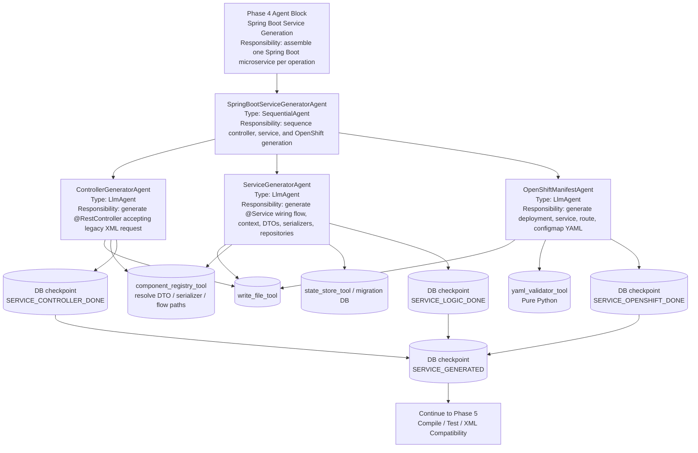

```mermaid id="phase4-internal"
flowchart TD
    P4["Phase 4 Agent Block<br/>Spring Boot Service Generation<br/>Responsibility: assemble one Spring Boot microservice per operation"]

    P4 --> SB["SpringBootServiceGeneratorAgent<br/>Type: SequentialAgent<br/>Responsibility: sequence controller, service, and OpenShift generation"]

    SB --> CTRL["ControllerGeneratorAgent<br/>Type: LlmAgent<br/>Responsibility: generate @RestController accepting legacy XML request"]
    CTRL --> WRITE[("write_file_tool")]
    CTRL --> COMPREG[("component_registry_tool<br/>resolve DTO / serializer / flow paths")]

    SB --> SVC["ServiceGeneratorAgent<br/>Type: LlmAgent<br/>Responsibility: generate @Service wiring flow, context, DTOs, serializers, repositories"]
    SVC --> WRITE
    SVC --> COMPREG
    SVC --> DB[("state_store_tool / migration DB")]

    SB --> OS["OpenShiftManifestAgent<br/>Type: LlmAgent<br/>Responsibility: generate deployment, service, route, configmap YAML"]
    OS --> WRITE
    OS --> YAML[("yaml_validator_tool<br/>Pure Python")]

    CTRL --> C_DONE[("DB checkpoint<br/>SERVICE_CONTROLLER_DONE")]
    SVC --> S_DONE[("DB checkpoint<br/>SERVICE_LOGIC_DONE")]
    OS --> O_DONE[("DB checkpoint<br/>SERVICE_OPENSHIFT_DONE")]

    C_DONE --> DONE[("DB checkpoint<br/>SERVICE_GENERATED")]
    S_DONE --> DONE
    O_DONE --> DONE

    DONE --> P5["Continue to Phase 5<br/>Compile / Test / XML Compatibility"]
```
