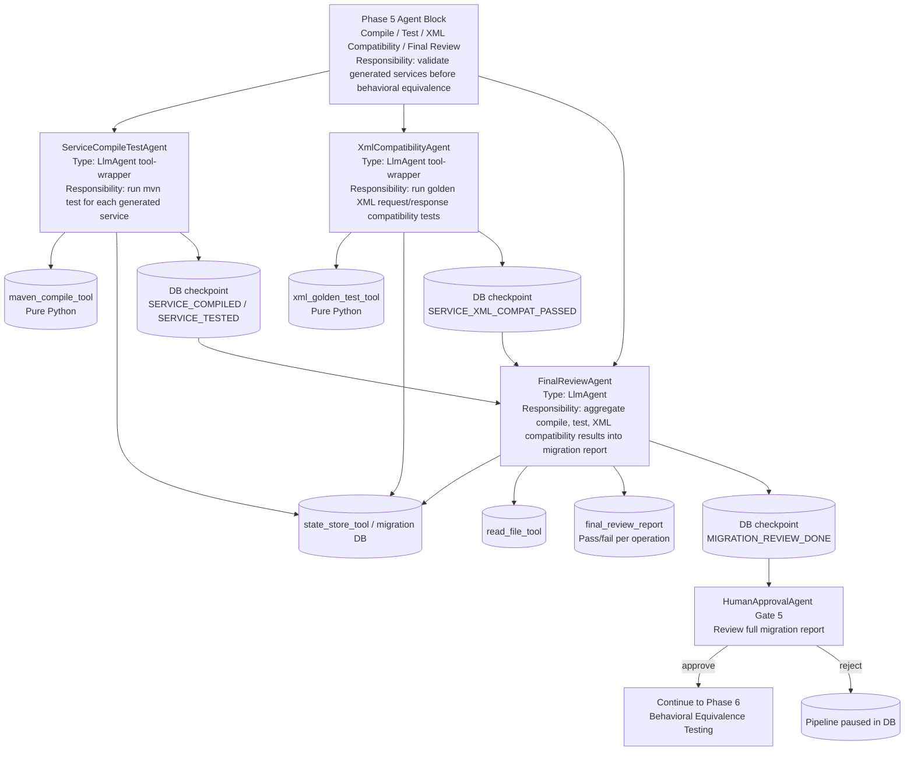

```mermaid id="phase5-internal"
flowchart TD
    P5["Phase 5 Agent Block<br/>Compile / Test / XML Compatibility / Final Review<br/>Responsibility: validate generated services before behavioral equivalence"]

    P5 --> COMPILE["ServiceCompileTestAgent<br/>Type: LlmAgent tool-wrapper<br/>Responsibility: run mvn test for each generated service"]
    COMPILE --> MVN[("maven_compile_tool<br/>Pure Python")]
    COMPILE --> DB[("state_store_tool / migration DB")]
    COMPILE --> C_DONE[("DB checkpoint<br/>SERVICE_COMPILED / SERVICE_TESTED")]

    P5 --> XMLCOMP["XmlCompatibilityAgent<br/>Type: LlmAgent tool-wrapper<br/>Responsibility: run golden XML request/response compatibility tests"]
    XMLCOMP --> GOLDEN[("xml_golden_test_tool<br/>Pure Python")]
    XMLCOMP --> DB
    XMLCOMP --> X_DONE[("DB checkpoint<br/>SERVICE_XML_COMPAT_PASSED")]

    P5 --> FINAL["FinalReviewAgent<br/>Type: LlmAgent<br/>Responsibility: aggregate compile, test, XML compatibility results into migration report"]
    FINAL --> DB
    FINAL --> READ[("read_file_tool")]
    FINAL --> REPORT[("final_review_report<br/>Pass/fail per operation")]

    C_DONE --> FINAL
    X_DONE --> FINAL

    FINAL --> REVIEW_DONE[("DB checkpoint<br/>MIGRATION_REVIEW_DONE")]

    REVIEW_DONE --> G5["HumanApprovalAgent Gate 5<br/>Review full migration report"]

    G5 -->|approve| P6["Continue to Phase 6<br/>Behavioral Equivalence Testing"]
    G5 -->|reject| PAUSE[("Pipeline paused in DB")]
```
