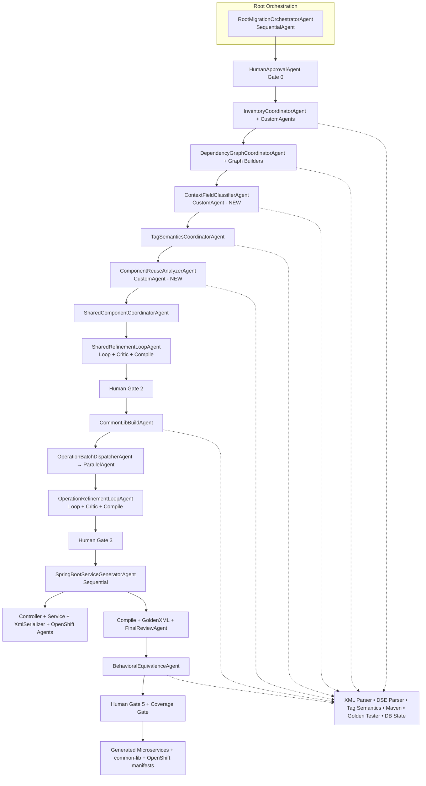

# WSBCC → Spring Boot Microservices: Final Multi-Agent Architecture (v5)

> **Revision history**
> - v1: Initial proposed architecture
> - v2: ADK primitive fixes, batch dispatcher, hash-check mechanism, LiteLLM deps, 4 approval gates
> - v3: Tag Semantics Normalization layer (Phase 2.5), strongly-typed Context transformation, deterministic XML serializer strategy, immutable artifact enforcement, granular checkpoint types, LLM-free early phases, Behavioral Equivalence Testing (Phase 6), DB Repository layer, parallelization safety limits.
> - v4: Phase ordering corrected, deterministic phases use `CustomAgent`, golden-test coverage as final gate.
> - **v5 (this document)**: Added **Phase 1.5 Context Field Classification**, stricter orchestrator dependency enforcement, `ComponentReuseAnalyzerAgent`, coverage-based production gate, refined agent roster, improved error handling & observability, and full Mermaid architecture diagram.

---

## Design Principles (Unchanged + Reinforced)

- **If deterministic → Python tool / CustomAgent.** If semantic → LLM agent.
- **LLM only generates, never discovers.**
- **One Composer operation → one Spring Boot microservice.**
- **Immutable artifacts per (source_hash, version).**
- **Every agent starts with DB idempotency check.**
- **Strong phase ordering enforcement** in the root orchestrator.

---

## Top-Level Constants (Extended)

```python
# constants.py
APP_NAME = "composer_migration_adk"

AGENT_MODEL      = "openai/local-model"
LITELLM_BASE_URL = "http://localhost:4000/v1"
LITELLM_API_KEY  = "local"

MAX_LOOP_RETRIES        = 5
MAX_PARALLEL_OPERATIONS = 4
LLM_QUEUE_CONCURRENCY   = 2
LLM_REQUEST_TIMEOUT_SEC = 120

COMPOSER_ROOT = "C:/wsbcc/source"
OUTPUT_ROOT   = "C:/migration/generated"
GOLDEN_TESTS_ROOT = "C:/migration/golden_tests"

MIGRATION_DB_URL = "sqlite:///C:/migration/state/migration.db"

COMMON_LIB_GROUP_ID    = "com.company.migration"
COMMON_LIB_ARTIFACT_ID = "composer-common-lib"
COMMON_LIB_VERSION     = "1.0.0"
JAVA_PACKAGE_BASE      = "com.company.generated"
SPRING_BOOT_VERSION    = "3.3.0"
JAVA_VERSION           = "17"

IMMUTABLE_ARTIFACTS = True

FORBIDDEN_DEPENDENCIES = ["com.ibm", "javax.ejb", "com.ibm.websphere", "com.ibm.wsbcc"]

# New in v5
MIN_GOLDEN_COVERAGE_PERCENT = 70
MIN_BEHAVIORAL_PASS_RATE    = 95
MAVEN_HOME = "/usr/share/maven"
JAVA_HOME  = "/usr/lib/jvm/java-17-openjdk"
```

---

## Migration Phases Overview (v5)

```
Phase 0 — Inventory & Index                  ← pure Python
         ↓  [Human Gate 0]
Phase 1 — Dependency Graph                   ← pure Python
         ↓
Phase 1.5 — Context Field Classification    ← deterministic (NEW)
         ↓
Phase 2.5 — Tag Semantics Normalization     ← targeted LLM for unknowns
         ↓
Phase 2 — Shared Component Conversion        ← LLM + critic loop
         ↓  [Human Gate 2]
Phase 2b — Common-Lib Build                  ← Maven (hard gate)
         ↓
Phase 3 — Operation Flow Conversion          ← LLM + critic loop
         ↓  [Human Gate 3]
Phase 4 — Spring Boot Service Generation
         ↓
Phase 5 — Compile / Test / Golden XML / Final Review
         ↓
Phase 6 — Behavioral Equivalence Testing
         ↓  [Human Gate 5 + Coverage Gate]
```

**New Phase 1.5** extracts and classifies every context field (`INPUT`, `INTERMEDIATE`, `ERROR`, `OUTPUT`) using tag semantics and graph traversal — fully deterministic.

---

## Architecture Diagram (Mermaid)



---

## Agent Roster Updates (v5)

**New / Modified Agents:**

| # | Agent | Type | Phase | LLM? | Responsibility |
|---|-------|------|-------|------|--------------|
| **New** | `ContextFieldClassifierAgent` | `CustomAgent` | 1.5 | ❌ | Deterministically classifies context fields using tag semantics + graph |
| **New** | `ComponentReuseAnalyzerAgent` | `CustomAgent` | 2 | ❌ | Analyzes sharing frequency and prioritizes common components |
| 6 | `HumanApprovalAgent` | `LlmAgent` | 0,2,3,5 | ✅ | Now includes coverage statistics in final gate |
| 12 | `TagSemanticsCoordinatorAgent` | `SequentialAgent` | 2.5 | mixed | Unchanged |
| 27 | `SpringBootServiceGeneratorAgent` | `SequentialAgent` | 4 | — | Now coordinates 4 sub-agents more cleanly |
| 33 | `FinalReviewAgent` | `LlmAgent` | 5 | ✅ | Now enforces `MIN_GOLDEN_COVERAGE_PERCENT` and pass rate |
| 34 | `BehavioralEquivalenceAgent` | `CustomAgent` | 6 | ❌ | Unchanged |

**Total agents: ~35** (net +2, with some consolidation).

---

## Key New Components (v5)

### Phase 1.5 — Context Field Classification

Fully deterministic. Uses:
- Tag semantics
- Dependency graph (reads/writes)
- Format definitions

Outputs strongly-typed `ContextObject` skeleton with proper Java annotations and comments for each field category.

### ComponentReuseAnalyzerAgent

Runs after Tag Semantics to score components by reuse count and complexity. Feeds prioritization data to Shared Component Coordinator.

### Production Readiness Gate (v5)

A migration is considered **production-ready** only if:
- All services compile
- Golden XML compatibility ≥ `MIN_GOLDEN_COVERAGE_PERCENT`
- Behavioral equivalence pass rate ≥ `MIN_BEHAVIORAL_PASS_RATE`
- No forbidden IBM dependencies
- Human final sign-off

---

## Implementation Order (Updated for v5)

1. DB schema + core tools
2. Phase 0 + 1 agents
3. **Phase 1.5 Context Classifier** (validate early)
4. Phase 2.5 Tag Semantics
5. Reuse Analyzer + Phase 2 (shared components)
6. Phase 2b Common-Lib
7. Phase 3 (batched operations)
8. Phase 4–6 with coverage gates

---

## Next Steps Recommendation

1. Implement core tools and DB first.
2. Run full inventory + Phase 1.5 on a 10-operation sample.
3. Review the generated ContextObjects — this will be the biggest quality lever.
4. Proceed to Tag Semantics.
